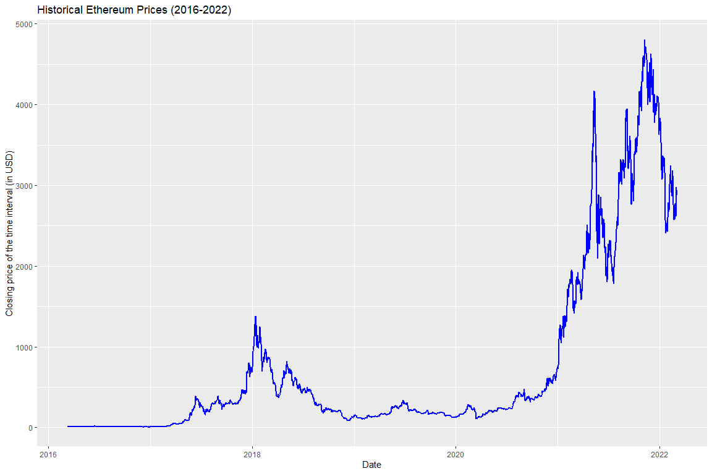
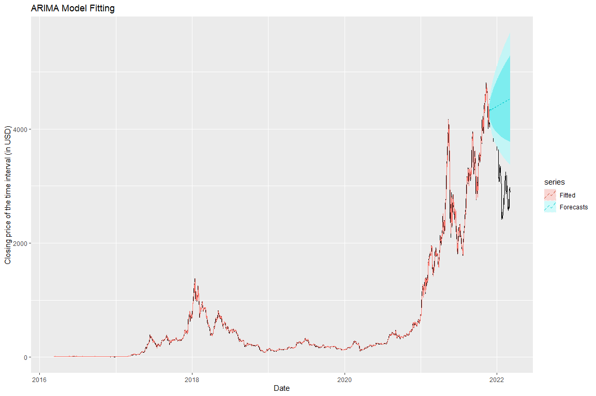
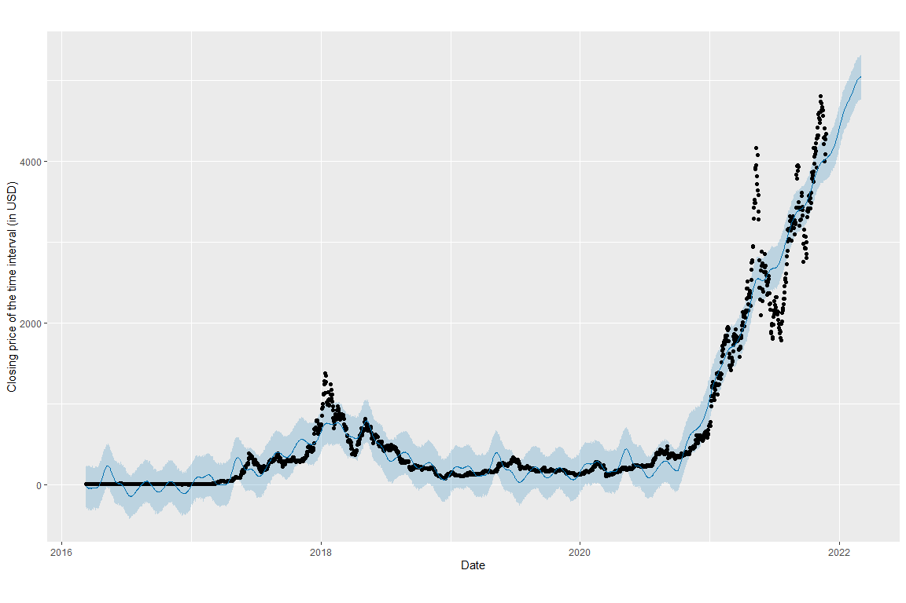
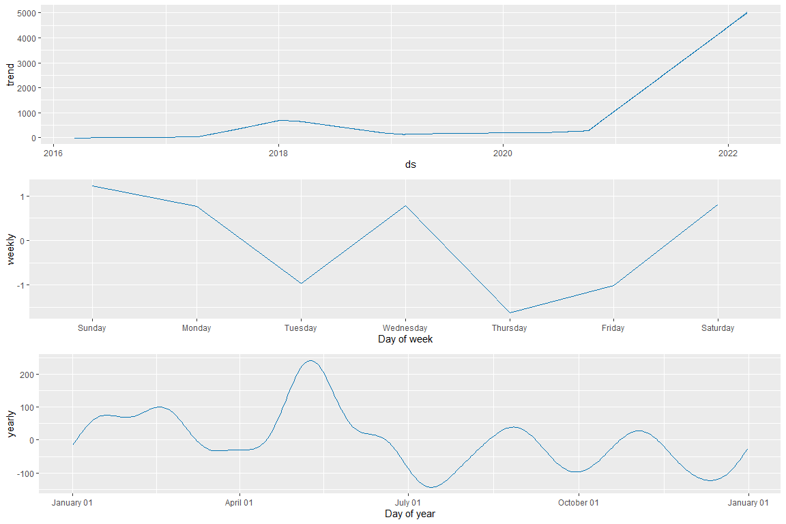
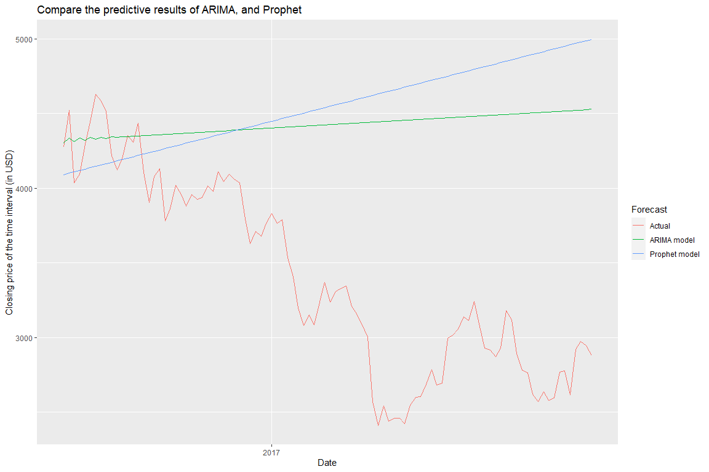

## Ethereum Time Series Forecasting

Ethereum is a decentralized, open-source blockchain with smart contract functionality. Ether (ETH or Ξ) is the native cryptocurrency of the platform. Ether is second only to Bitcoin in market capitalization.[1](https://en.wikipedia.org/wiki/Ethereum)
As with any currency/commodity on the market, Ethereum trading and financial instruments soon followed public adoption of Ethereum and continue to grow.


This Kernel is divided into three parts:-

* Data Proccesing.
* Time Series Analysis:
   * Time Series forecasting with ARIMA.
   * Time Series forecasting with Facebook Prophet.
* Model comparison.


## Data

Historical Ethereum daily data from 2016 to 2021 from Kaggle available  [here.](https://www.kaggle.com/kaushiksuresh147/ethereum-cryptocurrency-historical-dataset)


```r
# Libraries
library(magrittr) # needs to be run every time you start R and want to use %>%
library(tibble)
library(tidyverse)
library(dplyr)


# Ethereum data
data <- read.csv("Ethereum Historical Data.csv",  header = T)

head(data)
```

```
##         Date  Open  High   Low Close Volume
## 1 2016-03-10 11.20 11.85 11.07 11.75      4
## 2 2016-03-11 11.75 11.95 11.75 11.95    179
## 3 2016-03-12 11.95 13.45 11.95 12.92    833
## 4 2016-03-13 12.92 15.07 12.92 15.07   1295
## 5 2016-03-14 15.07 15.07 11.40 12.50  92183
## 6 2016-03-15 12.63 13.42 11.98 13.06  39725
```

We are interested in predicting the Closing variable at the end of each day which is represented by the column Close.

* Close: Closing price of the time interval (in USD).


```r
# Libraries
library(lubridate)

y = ts(data$Close, start=c(2016, yday("2016-03-10")), frequency=365)

# Splitting the data to train and test sets
train <- subset(y, end=length(y)-100)
test <- subset(y, start=length(y)-99)
```

For the evaluation, we divided the time series into a train and test datasets where the training series consists of the data until from 2016-03-10 to 2021-11-23.

* Total number of observations: 2185 

* Training observations: 2085

* Test observations: 101

## Time Series Analysis


<!-- -->


Now, let’s get started with our main models:


## Time Series forecasting with ARIMA

The main advantage of auto_arima is that it employs a grid search that determines the optimal parameters.
The auto.arima return the model with the smallest AIC value.


```r
# Libraries
library(FitARMA)
library(forecast)

# Setup and train model
arimafit <- auto.arima(train)

# Forecasting with ARIMA
arima <- forecast(arimafit,h=100)
```


```r
# Libraries
library(ggplot2)

# Plot ARIMA forecast
autoplot(y) +
  autolayer(arimafit$fitted, series = "Fitted")+
  autolayer(arima, series = "Forecasts", linetype = "dashed")+
  ggtitle("ARIMA Model Fitting") + xlab("Date") +
  ylab("Closing price of the time interval (in USD)")
```

<!-- -->


## Time Series forecasting with Prophet

We use the publicly available R implementation of Prophet.


```r
# Libraries
library(prophet)
library(TSstudio)

# set the ts object
df = ts_to_prophet(ts.obj = train, start = as.Date("2016-03-10"))

test_prophet = ts_to_prophet(ts.obj = test, start = as.Date("2021-11-23"))

# Forecasting with Facebook's prophet package
m <- prophet(df)
future <- make_future_dataframe(m, periods = 100)
forecast <- predict(m, future)

# Plot prophet forecast
plot(m, forecast,xlab = "Date",ylab = "Closing price of the time interval (in USD)", main = "Prophet Model Fitting")
```

<!-- -->

```r
prophet_plot_components(m, forecast)
```

<!-- -->


A deeper look into the analysis:

* plotting the components the top graph gives the prediction and then we have a day of the week pattern so you can see on Sunday the closing prices are usually high and Tuesday and Thursday they are usually low and this is based on last five years of data from 2016 to 2021.

* looking at the yearly pattern what we notice is relatively during summer months closing prices are on the higher side and in winter months like December the closing prices tend to be lower.


```r
tail(future)
```

```
##              ds
## 2180 2022-02-26
## 2181 2022-02-27
## 2182 2022-02-28
## 2183 2022-03-01
## 2184 2022-03-02
## 2185 2022-03-03
```

```r
# Interactive plot
dyplot.prophet(m, forecast)
```

```{=html}
<div id="htmlwidget-69303c6bc7173b8b9e07" style="width:1152px;height:768px;" class="dygraphs html-widget"></div>
<script type="application/json" data-for="htmlwidget-69303c6bc7173b8b9e07">{"x":{"attrs":{"labels":["day","Actual","Predicted"],"legend":"auto","retainDateWindow":false,"axes":{"x":{"pixelsPerLabel":60}},"colors":["black","blue"],"series":{"Actual":{"axis":"y","drawPoints":true,"strokeWidth":0},"Predicted":{"axis":"y"}},"customBars":true,"showRangeSelector":true,"rangeSelectorHeight":40,"rangeSelectorPlotFillColor":" #A7B1C4","rangeSelectorPlotStrokeColor":"#808FAB","interactionModel":"Dygraph.Interaction.defaultModel"},"scale":"daily","annotations":[],"shadings":[],"events":[],"format":"date","data":[["2016-03-10T00:00:00.000Z","2016-03-11T00:00:00.000Z","2016-03-12T00:00:00.000Z","2016-03-13T00:00:00.000Z","2016-03-14T00:00:00.000Z","2016-03-15T00:00:00.000Z","2016-03-16T00:00:00.000Z","2016-03-17T00:00:00.000Z","2016-03-18T00:00:00.000Z","2016-03-19T00:00:00.000Z","2016-03-20T00:00:00.000Z","2016-03-21T00:00:00.000Z","2016-03-22T00:00:00.000Z","2016-03-23T00:00:00.000Z","2016-03-24T00:00:00.000Z","2016-03-25T00:00:00.000Z","2016-03-26T00:00:00.000Z","2016-03-27T00:00:00.000Z","2016-03-28T00:00:00.000Z","2016-03-29T00:00:00.000Z","2016-03-30T00:00:00.000Z","2016-03-31T00:00:00.000Z","2016-04-01T00:00:00.000Z","2016-04-02T00:00:00.000Z","2016-04-03T00:00:00.000Z","2016-04-04T00:00:00.000Z","2016-04-05T00:00:00.000Z","2016-04-06T00:00:00.000Z","2016-04-07T00:00:00.000Z","2016-04-08T00:00:00.000Z","2016-04-09T00:00:00.000Z","2016-04-10T00:00:00.000Z","2016-04-11T00:00:00.000Z","2016-04-12T00:00:00.000Z","2016-04-13T00:00:00.000Z","2016-04-14T00:00:00.000Z","2016-04-15T00:00:00.000Z","2016-04-16T00:00:00.000Z","2016-04-17T00:00:00.000Z","2016-04-18T00:00:00.000Z","2016-04-19T00:00:00.000Z","2016-04-20T00:00:00.000Z","2016-04-21T00:00:00.000Z","2016-04-22T00:00:00.000Z","2016-04-23T00:00:00.000Z","2016-04-24T00:00:00.000Z","2016-04-25T00:00:00.000Z","2016-04-26T00:00:00.000Z","2016-04-27T00:00:00.000Z","2016-04-28T00:00:00.000Z","2016-04-29T00:00:00.000Z","2016-04-30T00:00:00.000Z","2016-05-01T00:00:00.000Z","2016-05-02T00:00:00.000Z","2016-05-03T00:00:00.000Z","2016-05-04T00:00:00.000Z","2016-05-05T00:00:00.000Z","2016-05-06T00:00:00.000Z","2016-05-07T00:00:00.000Z","2016-05-08T00:00:00.000Z","2016-05-09T00:00:00.000Z","2016-05-10T00:00:00.000Z","2016-05-11T00:00:00.000Z","2016-05-12T00:00:00.000Z","2016-05-13T00:00:00.000Z","2016-05-14T00:00:00.000Z","2016-05-15T00:00:00.000Z","2016-05-16T00:00:00.000Z","2016-05-17T00:00:00.000Z","2016-05-18T00:00:00.000Z","2016-05-19T00:00:00.000Z","2016-05-20T00:00:00.000Z","2016-05-21T00:00:00.000Z","2016-05-22T00:00:00.000Z","2016-05-23T00:00:00.000Z","2016-05-24T00:00:00.000Z","2016-05-25T00:00:00.000Z","2016-05-26T00:00:00.000Z","2016-05-27T00:00:00.000Z","2016-05-28T00:00:00.000Z","2016-05-29T00:00:00.000Z","2016-05-30T00:00:00.000Z","2016-05-31T00:00:00.000Z","2016-06-01T00:00:00.000Z","2016-06-02T00:00:00.000Z","2016-06-03T00:00:00.000Z","2016-06-04T00:00:00.000Z","2016-06-05T00:00:00.000Z","2016-06-06T00:00:00.000Z","2016-06-07T00:00:00.000Z","2016-06-08T00:00:00.000Z","2016-06-09T00:00:00.000Z","2016-06-10T00:00:00.000Z","2016-06-11T00:00:00.000Z","2016-06-12T00:00:00.000Z","2016-06-13T00:00:00.000Z","2016-06-14T00:00:00.000Z","2016-06-15T00:00:00.000Z","2016-06-16T00:00:00.000Z","2016-06-17T00:00:00.000Z","2016-06-18T00:00:00.000Z","2016-06-19T00:00:00.000Z","2016-06-20T00:00:00.000Z","2016-06-21T00:00:00.000Z","2016-06-22T00:00:00.000Z","2016-06-23T00:00:00.000Z","2016-06-24T00:00:00.000Z","2016-06-25T00:00:00.000Z","2016-06-26T00:00:00.000Z","2016-06-27T00:00:00.000Z","2016-06-28T00:00:00.000Z","2016-06-29T00:00:00.000Z","2016-06-30T00:00:00.000Z","2016-07-01T00:00:00.000Z","2016-07-02T00:00:00.000Z","2016-07-03T00:00:00.000Z","2016-07-04T00:00:00.000Z","2016-07-05T00:00:00.000Z","2016-07-06T00:00:00.000Z","2016-07-07T00:00:00.000Z","2016-07-08T00:00:00.000Z","2016-07-09T00:00:00.000Z","2016-07-10T00:00:00.000Z","2016-07-11T00:00:00.000Z","2016-07-12T00:00:00.000Z","2016-07-13T00:00:00.000Z","2016-07-14T00:00:00.000Z","2016-07-15T00:00:00.000Z","2016-07-16T00:00:00.000Z","2016-07-17T00:00:00.000Z","2016-07-18T00:00:00.000Z","2016-07-19T00:00:00.000Z","2016-07-20T00:00:00.000Z","2016-07-21T00:00:00.000Z","2016-07-22T00:00:00.000Z","2016-07-23T00:00:00.000Z","2016-07-24T00:00:00.000Z","2016-07-25T00:00:00.000Z","2016-07-26T00:00:00.000Z","2016-07-27T00:00:00.000Z","2016-07-28T00:00:00.000Z","2016-07-29T00:00:00.000Z","2016-07-30T00:00:00.000Z","2016-07-31T00:00:00.000Z","2016-08-01T00:00:00.000Z","2016-08-02T00:00:00.000Z","2016-08-03T00:00:00.000Z","2016-08-04T00:00:00.000Z","2016-08-05T00:00:00.000Z","2016-08-06T00:00:00.000Z","2016-08-07T00:00:00.000Z","2016-08-08T00:00:00.000Z","2016-08-09T00:00:00.000Z","2016-08-10T00:00:00.000Z","2016-08-11T00:00:00.000Z","2016-08-12T00:00:00.000Z","2016-08-13T00:00:00.000Z","2016-08-14T00:00:00.000Z","2016-08-15T00:00:00.000Z","2016-08-16T00:00:00.000Z","2016-08-17T00:00:00.000Z","2016-08-18T00:00:00.000Z","2016-08-19T00:00:00.000Z","2016-08-20T00:00:00.000Z","2016-08-21T00:00:00.000Z","2016-08-22T00:00:00.000Z","2016-08-23T00:00:00.000Z","2016-08-24T00:00:00.000Z","2016-08-25T00:00:00.000Z","2016-08-26T00:00:00.000Z","2016-08-27T00:00:00.000Z","2016-08-28T00:00:00.000Z","2016-08-29T00:00:00.000Z","2016-08-30T00:00:00.000Z","2016-08-31T00:00:00.000Z","2016-09-01T00:00:00.000Z","2016-09-02T00:00:00.000Z","2016-09-03T00:00:00.000Z","2016-09-04T00:00:00.000Z","2016-09-05T00:00:00.000Z","2016-09-06T00:00:00.000Z","2016-09-07T00:00:00.000Z","2016-09-08T00:00:00.000Z","2016-09-09T00:00:00.000Z","2016-09-10T00:00:00.000Z","2016-09-11T00:00:00.000Z","2016-09-12T00:00:00.000Z","2016-09-13T00:00:00.000Z","2016-09-14T00:00:00.000Z","2016-09-15T00:00:00.000Z","2016-09-16T00:00:00.000Z","2016-09-17T00:00:00.000Z","2016-09-18T00:00:00.000Z","2016-09-19T00:00:00.000Z","2016-09-20T00:00:00.000Z","2016-09-21T00:00:00.000Z","2016-09-22T00:00:00.000Z","2016-09-23T00:00:00.000Z","2016-09-24T00:00:00.000Z","2016-09-25T00:00:00.000Z","2016-09-26T00:00:00.000Z","2016-09-27T00:00:00.000Z","2016-09-28T00:00:00.000Z","2016-09-29T00:00:00.000Z","2016-09-30T00:00:00.000Z","2016-10-01T00:00:00.000Z","2016-10-02T00:00:00.000Z","2016-10-03T00:00:00.000Z","2016-10-04T00:00:00.000Z","2016-10-05T00:00:00.000Z","2016-10-06T00:00:00.000Z","2016-10-07T00:00:00.000Z","2016-10-08T00:00:00.000Z","2016-10-09T00:00:00.000Z","2016-10-10T00:00:00.000Z","2016-10-11T00:00:00.000Z","2016-10-12T00:00:00.000Z","2016-10-13T00:00:00.000Z","2016-10-14T00:00:00.000Z","2016-10-15T00:00:00.000Z","2016-10-16T00:00:00.000Z","2016-10-17T00:00:00.000Z","2016-10-18T00:00:00.000Z","2016-10-19T00:00:00.000Z","2016-10-20T00:00:00.000Z","2016-10-21T00:00:00.000Z","2016-10-22T00:00:00.000Z","2016-10-23T00:00:00.000Z","2016-10-24T00:00:00.000Z","2016-10-25T00:00:00.000Z","2016-10-26T00:00:00.000Z","2016-10-27T00:00:00.000Z","2016-10-28T00:00:00.000Z","2016-10-29T00:00:00.000Z","2016-10-30T00:00:00.000Z","2016-10-31T00:00:00.000Z","2016-11-01T00:00:00.000Z","2016-11-02T00:00:00.000Z","2016-11-03T00:00:00.000Z","2016-11-04T00:00:00.000Z","2016-11-05T00:00:00.000Z","2016-11-06T00:00:00.000Z","2016-11-07T00:00:00.000Z","2016-11-08T00:00:00.000Z","2016-11-09T00:00:00.000Z","2016-11-10T00:00:00.000Z","2016-11-11T00:00:00.000Z","2016-11-12T00:00:00.000Z","2016-11-13T00:00:00.000Z","2016-11-14T00:00:00.000Z","2016-11-15T00:00:00.000Z","2016-11-16T00:00:00.000Z","2016-11-17T00:00:00.000Z","2016-11-18T00:00:00.000Z","2016-11-19T00:00:00.000Z","2016-11-20T00:00:00.000Z","2016-11-21T00:00:00.000Z","2016-11-22T00:00:00.000Z","2016-11-23T00:00:00.000Z","2016-11-24T00:00:00.000Z","2016-11-25T00:00:00.000Z","2016-11-26T00:00:00.000Z","2016-11-27T00:00:00.000Z","2016-11-28T00:00:00.000Z","2016-11-29T00:00:00.000Z","2016-11-30T00:00:00.000Z","2016-12-01T00:00:00.000Z","2016-12-02T00:00:00.000Z","2016-12-03T00:00:00.000Z","2016-12-04T00:00:00.000Z","2016-12-05T00:00:00.000Z","2016-12-06T00:00:00.000Z","2016-12-07T00:00:00.000Z","2016-12-08T00:00:00.000Z","2016-12-09T00:00:00.000Z","2016-12-10T00:00:00.000Z","2016-12-11T00:00:00.000Z","2016-12-12T00:00:00.000Z","2016-12-13T00:00:00.000Z","2016-12-14T00:00:00.000Z","2016-12-15T00:00:00.000Z","2016-12-16T00:00:00.000Z","2016-12-17T00:00:00.000Z","2016-12-18T00:00:00.000Z","2016-12-19T00:00:00.000Z","2016-12-20T00:00:00.000Z","2016-12-21T00:00:00.000Z","2016-12-22T00:00:00.000Z","2016-12-23T00:00:00.000Z","2016-12-24T00:00:00.000Z","2016-12-25T00:00:00.000Z","2016-12-26T00:00:00.000Z","2016-12-27T00:00:00.000Z","2016-12-28T00:00:00.000Z","2016-12-29T00:00:00.000Z","2016-12-30T00:00:00.000Z","2016-12-31T00:00:00.000Z","2017-01-01T00:00:00.000Z","2017-01-02T00:00:00.000Z","2017-01-03T00:00:00.000Z","2017-01-04T00:00:00.000Z","2017-01-05T00:00:00.000Z","2017-01-06T00:00:00.000Z","2017-01-07T00:00:00.000Z","2017-01-08T00:00:00.000Z","2017-01-09T00:00:00.000Z","2017-01-10T00:00:00.000Z","2017-01-11T00:00:00.000Z","2017-01-12T00:00:00.000Z","2017-01-13T00:00:00.000Z","2017-01-14T00:00:00.000Z","2017-01-15T00:00:00.000Z","2017-01-16T00:00:00.000Z","2017-01-17T00:00:00.000Z","2017-01-18T00:00:00.000Z","2017-01-19T00:00:00.000Z","2017-01-20T00:00:00.000Z","2017-01-21T00:00:00.000Z","2017-01-22T00:00:00.000Z","2017-01-23T00:00:00.000Z","2017-01-24T00:00:00.000Z","2017-01-25T00:00:00.000Z","2017-01-26T00:00:00.000Z","2017-01-27T00:00:00.000Z","2017-01-28T00:00:00.000Z","2017-01-29T00:00:00.000Z","2017-01-30T00:00:00.000Z","2017-01-31T00:00:00.000Z","2017-02-01T00:00:00.000Z","2017-02-02T00:00:00.000Z","2017-02-03T00:00:00.000Z","2017-02-04T00:00:00.000Z","2017-02-05T00:00:00.000Z","2017-02-06T00:00:00.000Z","2017-02-07T00:00:00.000Z","2017-02-08T00:00:00.000Z","2017-02-09T00:00:00.000Z","2017-02-10T00:00:00.000Z","2017-02-11T00:00:00.000Z","2017-02-12T00:00:00.000Z","2017-02-13T00:00:00.000Z","2017-02-14T00:00:00.000Z","2017-02-15T00:00:00.000Z","2017-02-16T00:00:00.000Z","2017-02-17T00:00:00.000Z","2017-02-18T00:00:00.000Z","2017-02-19T00:00:00.000Z","2017-02-20T00:00:00.000Z","2017-02-21T00:00:00.000Z","2017-02-22T00:00:00.000Z","2017-02-23T00:00:00.000Z","2017-02-24T00:00:00.000Z","2017-02-25T00:00:00.000Z","2017-02-26T00:00:00.000Z","2017-02-27T00:00:00.000Z","2017-02-28T00:00:00.000Z","2017-03-01T00:00:00.000Z","2017-03-02T00:00:00.000Z","2017-03-03T00:00:00.000Z","2017-03-04T00:00:00.000Z","2017-03-05T00:00:00.000Z","2017-03-06T00:00:00.000Z","2017-03-07T00:00:00.000Z","2017-03-08T00:00:00.000Z","2017-03-09T00:00:00.000Z","2017-03-10T00:00:00.000Z","2017-03-11T00:00:00.000Z","2017-03-12T00:00:00.000Z","2017-03-13T00:00:00.000Z","2017-03-14T00:00:00.000Z","2017-03-15T00:00:00.000Z","2017-03-16T00:00:00.000Z","2017-03-17T00:00:00.000Z","2017-03-18T00:00:00.000Z","2017-03-19T00:00:00.000Z","2017-03-20T00:00:00.000Z","2017-03-21T00:00:00.000Z","2017-03-22T00:00:00.000Z","2017-03-23T00:00:00.000Z","2017-03-24T00:00:00.000Z","2017-03-25T00:00:00.000Z","2017-03-26T00:00:00.000Z","2017-03-27T00:00:00.000Z","2017-03-28T00:00:00.000Z","2017-03-29T00:00:00.000Z","2017-03-30T00:00:00.000Z","2017-03-31T00:00:00.000Z","2017-04-01T00:00:00.000Z","2017-04-02T00:00:00.000Z","2017-04-03T00:00:00.000Z","2017-04-04T00:00:00.000Z","2017-04-05T00:00:00.000Z","2017-04-06T00:00:00.000Z","2017-04-07T00:00:00.000Z","2017-04-08T00:00:00.000Z","2017-04-09T00:00:00.000Z","2017-04-10T00:00:00.000Z","2017-04-11T00:00:00.000Z","2017-04-12T00:00:00.000Z","2017-04-13T00:00:00.000Z","2017-04-14T00:00:00.000Z","2017-04-15T00:00:00.000Z","2017-04-16T00:00:00.000Z","2017-04-17T00:00:00.000Z","2017-04-18T00:00:00.000Z","2017-04-19T00:00:00.000Z","2017-04-20T00:00:00.000Z","2017-04-21T00:00:00.000Z","2017-04-22T00:00:00.000Z","2017-04-23T00:00:00.000Z","2017-04-24T00:00:00.000Z","2017-04-25T00:00:00.000Z","2017-04-26T00:00:00.000Z","2017-04-27T00:00:00.000Z","2017-04-28T00:00:00.000Z","2017-04-29T00:00:00.000Z","2017-04-30T00:00:00.000Z","2017-05-01T00:00:00.000Z","2017-05-02T00:00:00.000Z","2017-05-03T00:00:00.000Z","2017-05-04T00:00:00.000Z","2017-05-05T00:00:00.000Z","2017-05-06T00:00:00.000Z","2017-05-07T00:00:00.000Z","2017-05-08T00:00:00.000Z","2017-05-09T00:00:00.000Z","2017-05-10T00:00:00.000Z","2017-05-11T00:00:00.000Z","2017-05-12T00:00:00.000Z","2017-05-13T00:00:00.000Z","2017-05-14T00:00:00.000Z","2017-05-15T00:00:00.000Z","2017-05-16T00:00:00.000Z","2017-05-17T00:00:00.000Z","2017-05-18T00:00:00.000Z","2017-05-19T00:00:00.000Z","2017-05-20T00:00:00.000Z","2017-05-21T00:00:00.000Z","2017-05-22T00:00:00.000Z","2017-05-23T00:00:00.000Z","2017-05-24T00:00:00.000Z","2017-05-25T00:00:00.000Z","2017-05-26T00:00:00.000Z","2017-05-27T00:00:00.000Z","2017-05-28T00:00:00.000Z","2017-05-29T00:00:00.000Z","2017-05-30T00:00:00.000Z","2017-05-31T00:00:00.000Z","2017-06-01T00:00:00.000Z","2017-06-02T00:00:00.000Z","2017-06-03T00:00:00.000Z","2017-06-04T00:00:00.000Z","2017-06-05T00:00:00.000Z","2017-06-06T00:00:00.000Z","2017-06-07T00:00:00.000Z","2017-06-08T00:00:00.000Z","2017-06-09T00:00:00.000Z","2017-06-10T00:00:00.000Z","2017-06-11T00:00:00.000Z","2017-06-12T00:00:00.000Z","2017-06-13T00:00:00.000Z","2017-06-14T00:00:00.000Z","2017-06-15T00:00:00.000Z","2017-06-16T00:00:00.000Z","2017-06-17T00:00:00.000Z","2017-06-18T00:00:00.000Z","2017-06-19T00:00:00.000Z","2017-06-20T00:00:00.000Z","2017-06-21T00:00:00.000Z","2017-06-22T00:00:00.000Z","2017-06-23T00:00:00.000Z","2017-06-24T00:00:00.000Z","2017-06-25T00:00:00.000Z","2017-06-26T00:00:00.000Z","2017-06-27T00:00:00.000Z","2017-06-28T00:00:00.000Z","2017-06-29T00:00:00.000Z","2017-06-30T00:00:00.000Z","2017-07-01T00:00:00.000Z","2017-07-02T00:00:00.000Z","2017-07-03T00:00:00.000Z","2017-07-04T00:00:00.000Z","2017-07-05T00:00:00.000Z","2017-07-06T00:00:00.000Z","2017-07-07T00:00:00.000Z","2017-07-08T00:00:00.000Z","2017-07-09T00:00:00.000Z","2017-07-10T00:00:00.000Z","2017-07-11T00:00:00.000Z","2017-07-12T00:00:00.000Z","2017-07-13T00:00:00.000Z","2017-07-14T00:00:00.000Z","2017-07-15T00:00:00.000Z","2017-07-16T00:00:00.000Z","2017-07-17T00:00:00.000Z","2017-07-18T00:00:00.000Z","2017-07-19T00:00:00.000Z","2017-07-20T00:00:00.000Z","2017-07-21T00:00:00.000Z","2017-07-22T00:00:00.000Z","2017-07-23T00:00:00.000Z","2017-07-24T00:00:00.000Z","2017-07-25T00:00:00.000Z","2017-07-26T00:00:00.000Z","2017-07-27T00:00:00.000Z","2017-07-28T00:00:00.000Z","2017-07-29T00:00:00.000Z","2017-07-30T00:00:00.000Z","2017-07-31T00:00:00.000Z","2017-08-01T00:00:00.000Z","2017-08-02T00:00:00.000Z","2017-08-03T00:00:00.000Z","2017-08-04T00:00:00.000Z","2017-08-05T00:00:00.000Z","2017-08-06T00:00:00.000Z","2017-08-07T00:00:00.000Z","2017-08-08T00:00:00.000Z","2017-08-09T00:00:00.000Z","2017-08-10T00:00:00.000Z","2017-08-11T00:00:00.000Z","2017-08-12T00:00:00.000Z","2017-08-13T00:00:00.000Z","2017-08-14T00:00:00.000Z","2017-08-15T00:00:00.000Z","2017-08-16T00:00:00.000Z","2017-08-17T00:00:00.000Z","2017-08-18T00:00:00.000Z","2017-08-19T00:00:00.000Z","2017-08-20T00:00:00.000Z","2017-08-21T00:00:00.000Z","2017-08-22T00:00:00.000Z","2017-08-23T00:00:00.000Z","2017-08-24T00:00:00.000Z","2017-08-25T00:00:00.000Z","2017-08-26T00:00:00.000Z","2017-08-27T00:00:00.000Z","2017-08-28T00:00:00.000Z","2017-08-29T00:00:00.000Z","2017-08-30T00:00:00.000Z","2017-08-31T00:00:00.000Z","2017-09-01T00:00:00.000Z","2017-09-02T00:00:00.000Z","2017-09-03T00:00:00.000Z","2017-09-04T00:00:00.000Z","2017-09-05T00:00:00.000Z","2017-09-06T00:00:00.000Z","2017-09-07T00:00:00.000Z","2017-09-08T00:00:00.000Z","2017-09-09T00:00:00.000Z","2017-09-10T00:00:00.000Z","2017-09-11T00:00:00.000Z","2017-09-12T00:00:00.000Z","2017-09-13T00:00:00.000Z","2017-09-14T00:00:00.000Z","2017-09-15T00:00:00.000Z","2017-09-16T00:00:00.000Z","2017-09-17T00:00:00.000Z","2017-09-18T00:00:00.000Z","2017-09-19T00:00:00.000Z","2017-09-20T00:00:00.000Z","2017-09-21T00:00:00.000Z","2017-09-22T00:00:00.000Z","2017-09-23T00:00:00.000Z","2017-09-24T00:00:00.000Z","2017-09-25T00:00:00.000Z","2017-09-26T00:00:00.000Z","2017-09-27T00:00:00.000Z","2017-09-28T00:00:00.000Z","2017-09-29T00:00:00.000Z","2017-09-30T00:00:00.000Z","2017-10-01T00:00:00.000Z","2017-10-02T00:00:00.000Z","2017-10-03T00:00:00.000Z","2017-10-04T00:00:00.000Z","2017-10-05T00:00:00.000Z","2017-10-06T00:00:00.000Z","2017-10-07T00:00:00.000Z","2017-10-08T00:00:00.000Z","2017-10-09T00:00:00.000Z","2017-10-10T00:00:00.000Z","2017-10-11T00:00:00.000Z","2017-10-12T00:00:00.000Z","2017-10-13T00:00:00.000Z","2017-10-14T00:00:00.000Z","2017-10-15T00:00:00.000Z","2017-10-16T00:00:00.000Z","2017-10-17T00:00:00.000Z","2017-10-18T00:00:00.000Z","2017-10-19T00:00:00.000Z","2017-10-20T00:00:00.000Z","2017-10-21T00:00:00.000Z","2017-10-22T00:00:00.000Z","2017-10-23T00:00:00.000Z","2017-10-24T00:00:00.000Z","2017-10-25T00:00:00.000Z","2017-10-26T00:00:00.000Z","2017-10-27T00:00:00.000Z","2017-10-28T00:00:00.000Z","2017-10-29T00:00:00.000Z","2017-10-30T00:00:00.000Z","2017-10-31T00:00:00.000Z","2017-11-01T00:00:00.000Z","2017-11-02T00:00:00.000Z","2017-11-03T00:00:00.000Z","2017-11-04T00:00:00.000Z","2017-11-05T00:00:00.000Z","2017-11-06T00:00:00.000Z","2017-11-07T00:00:00.000Z","2017-11-08T00:00:00.000Z","2017-11-09T00:00:00.000Z","2017-11-10T00:00:00.000Z","2017-11-11T00:00:00.000Z","2017-11-12T00:00:00.000Z","2017-11-13T00:00:00.000Z","2017-11-14T00:00:00.000Z","2017-11-15T00:00:00.000Z","2017-11-16T00:00:00.000Z","2017-11-17T00:00:00.000Z","2017-11-18T00:00:00.000Z","2017-11-19T00:00:00.000Z","2017-11-20T00:00:00.000Z","2017-11-21T00:00:00.000Z","2017-11-22T00:00:00.000Z","2017-11-23T00:00:00.000Z","2017-11-24T00:00:00.000Z","2017-11-25T00:00:00.000Z","2017-11-26T00:00:00.000Z","2017-11-27T00:00:00.000Z","2017-11-28T00:00:00.000Z","2017-11-29T00:00:00.000Z","2017-11-30T00:00:00.000Z","2017-12-01T00:00:00.000Z","2017-12-02T00:00:00.000Z","2017-12-03T00:00:00.000Z","2017-12-04T00:00:00.000Z","2017-12-05T00:00:00.000Z","2017-12-06T00:00:00.000Z","2017-12-07T00:00:00.000Z","2017-12-08T00:00:00.000Z","2017-12-09T00:00:00.000Z","2017-12-10T00:00:00.000Z","2017-12-11T00:00:00.000Z","2017-12-12T00:00:00.000Z","2017-12-13T00:00:00.000Z","2017-12-14T00:00:00.000Z","2017-12-15T00:00:00.000Z","2017-12-16T00:00:00.000Z","2017-12-17T00:00:00.000Z","2017-12-18T00:00:00.000Z","2017-12-19T00:00:00.000Z","2017-12-20T00:00:00.000Z","2017-12-21T00:00:00.000Z","2017-12-22T00:00:00.000Z","2017-12-23T00:00:00.000Z","2017-12-24T00:00:00.000Z","2017-12-25T00:00:00.000Z","2017-12-26T00:00:00.000Z","2017-12-27T00:00:00.000Z","2017-12-28T00:00:00.000Z","2017-12-29T00:00:00.000Z","2017-12-30T00:00:00.000Z","2017-12-31T00:00:00.000Z","2018-01-01T00:00:00.000Z","2018-01-02T00:00:00.000Z","2018-01-03T00:00:00.000Z","2018-01-04T00:00:00.000Z","2018-01-05T00:00:00.000Z","2018-01-06T00:00:00.000Z","2018-01-07T00:00:00.000Z","2018-01-08T00:00:00.000Z","2018-01-09T00:00:00.000Z","2018-01-10T00:00:00.000Z","2018-01-11T00:00:00.000Z","2018-01-12T00:00:00.000Z","2018-01-13T00:00:00.000Z","2018-01-14T00:00:00.000Z","2018-01-15T00:00:00.000Z","2018-01-16T00:00:00.000Z","2018-01-17T00:00:00.000Z","2018-01-18T00:00:00.000Z","2018-01-19T00:00:00.000Z","2018-01-20T00:00:00.000Z","2018-01-21T00:00:00.000Z","2018-01-22T00:00:00.000Z","2018-01-23T00:00:00.000Z","2018-01-24T00:00:00.000Z","2018-01-25T00:00:00.000Z","2018-01-26T00:00:00.000Z","2018-01-27T00:00:00.000Z","2018-01-28T00:00:00.000Z","2018-01-29T00:00:00.000Z","2018-01-30T00:00:00.000Z","2018-01-31T00:00:00.000Z","2018-02-01T00:00:00.000Z","2018-02-02T00:00:00.000Z","2018-02-03T00:00:00.000Z","2018-02-04T00:00:00.000Z","2018-02-05T00:00:00.000Z","2018-02-06T00:00:00.000Z","2018-02-07T00:00:00.000Z","2018-02-08T00:00:00.000Z","2018-02-09T00:00:00.000Z","2018-02-10T00:00:00.000Z","2018-02-11T00:00:00.000Z","2018-02-12T00:00:00.000Z","2018-02-13T00:00:00.000Z","2018-02-14T00:00:00.000Z","2018-02-15T00:00:00.000Z","2018-02-16T00:00:00.000Z","2018-02-17T00:00:00.000Z","2018-02-18T00:00:00.000Z","2018-02-19T00:00:00.000Z","2018-02-20T00:00:00.000Z","2018-02-21T00:00:00.000Z","2018-02-22T00:00:00.000Z","2018-02-23T00:00:00.000Z","2018-02-24T00:00:00.000Z","2018-02-25T00:00:00.000Z","2018-02-26T00:00:00.000Z","2018-02-27T00:00:00.000Z","2018-02-28T00:00:00.000Z","2018-03-01T00:00:00.000Z","2018-03-02T00:00:00.000Z","2018-03-03T00:00:00.000Z","2018-03-04T00:00:00.000Z","2018-03-05T00:00:00.000Z","2018-03-06T00:00:00.000Z","2018-03-07T00:00:00.000Z","2018-03-08T00:00:00.000Z","2018-03-09T00:00:00.000Z","2018-03-10T00:00:00.000Z","2018-03-11T00:00:00.000Z","2018-03-12T00:00:00.000Z","2018-03-13T00:00:00.000Z","2018-03-14T00:00:00.000Z","2018-03-15T00:00:00.000Z","2018-03-16T00:00:00.000Z","2018-03-17T00:00:00.000Z","2018-03-18T00:00:00.000Z","2018-03-19T00:00:00.000Z","2018-03-20T00:00:00.000Z","2018-03-21T00:00:00.000Z","2018-03-22T00:00:00.000Z","2018-03-23T00:00:00.000Z","2018-03-24T00:00:00.000Z","2018-03-25T00:00:00.000Z","2018-03-26T00:00:00.000Z","2018-03-27T00:00:00.000Z","2018-03-28T00:00:00.000Z","2018-03-29T00:00:00.000Z","2018-03-30T00:00:00.000Z","2018-03-31T00:00:00.000Z","2018-04-01T00:00:00.000Z","2018-04-02T00:00:00.000Z","2018-04-03T00:00:00.000Z","2018-04-04T00:00:00.000Z","2018-04-05T00:00:00.000Z","2018-04-06T00:00:00.000Z","2018-04-07T00:00:00.000Z","2018-04-08T00:00:00.000Z","2018-04-09T00:00:00.000Z","2018-04-10T00:00:00.000Z","2018-04-11T00:00:00.000Z","2018-04-12T00:00:00.000Z","2018-04-13T00:00:00.000Z","2018-04-14T00:00:00.000Z","2018-04-15T00:00:00.000Z","2018-04-16T00:00:00.000Z","2018-04-17T00:00:00.000Z","2018-04-18T00:00:00.000Z","2018-04-19T00:00:00.000Z","2018-04-20T00:00:00.000Z","2018-04-21T00:00:00.000Z","2018-04-22T00:00:00.000Z","2018-04-23T00:00:00.000Z","2018-04-24T00:00:00.000Z","2018-04-25T00:00:00.000Z","2018-04-26T00:00:00.000Z","2018-04-27T00:00:00.000Z","2018-04-28T00:00:00.000Z","2018-04-29T00:00:00.000Z","2018-04-30T00:00:00.000Z","2018-05-01T00:00:00.000Z","2018-05-02T00:00:00.000Z","2018-05-03T00:00:00.000Z","2018-05-04T00:00:00.000Z","2018-05-05T00:00:00.000Z","2018-05-06T00:00:00.000Z","2018-05-07T00:00:00.000Z","2018-05-08T00:00:00.000Z","2018-05-09T00:00:00.000Z","2018-05-10T00:00:00.000Z","2018-05-11T00:00:00.000Z","2018-05-12T00:00:00.000Z","2018-05-13T00:00:00.000Z","2018-05-14T00:00:00.000Z","2018-05-15T00:00:00.000Z","2018-05-16T00:00:00.000Z","2018-05-17T00:00:00.000Z","2018-05-18T00:00:00.000Z","2018-05-19T00:00:00.000Z","2018-05-20T00:00:00.000Z","2018-05-21T00:00:00.000Z","2018-05-22T00:00:00.000Z","2018-05-23T00:00:00.000Z","2018-05-24T00:00:00.000Z","2018-05-25T00:00:00.000Z","2018-05-26T00:00:00.000Z","2018-05-27T00:00:00.000Z","2018-05-28T00:00:00.000Z","2018-05-29T00:00:00.000Z","2018-05-30T00:00:00.000Z","2018-05-31T00:00:00.000Z","2018-06-01T00:00:00.000Z","2018-06-02T00:00:00.000Z","2018-06-03T00:00:00.000Z","2018-06-04T00:00:00.000Z","2018-06-05T00:00:00.000Z","2018-06-06T00:00:00.000Z","2018-06-07T00:00:00.000Z","2018-06-08T00:00:00.000Z","2018-06-09T00:00:00.000Z","2018-06-10T00:00:00.000Z","2018-06-11T00:00:00.000Z","2018-06-12T00:00:00.000Z","2018-06-13T00:00:00.000Z","2018-06-14T00:00:00.000Z","2018-06-15T00:00:00.000Z","2018-06-16T00:00:00.000Z","2018-06-17T00:00:00.000Z","2018-06-18T00:00:00.000Z","2018-06-19T00:00:00.000Z","2018-06-20T00:00:00.000Z","2018-06-21T00:00:00.000Z","2018-06-22T00:00:00.000Z","2018-06-23T00:00:00.000Z","2018-06-24T00:00:00.000Z","2018-06-25T00:00:00.000Z","2018-06-26T00:00:00.000Z","2018-06-27T00:00:00.000Z","2018-06-28T00:00:00.000Z","2018-06-29T00:00:00.000Z","2018-06-30T00:00:00.000Z","2018-07-01T00:00:00.000Z","2018-07-02T00:00:00.000Z","2018-07-03T00:00:00.000Z","2018-07-04T00:00:00.000Z","2018-07-05T00:00:00.000Z","2018-07-06T00:00:00.000Z","2018-07-07T00:00:00.000Z","2018-07-08T00:00:00.000Z","2018-07-09T00:00:00.000Z","2018-07-10T00:00:00.000Z","2018-07-11T00:00:00.000Z","2018-07-12T00:00:00.000Z","2018-07-13T00:00:00.000Z","2018-07-14T00:00:00.000Z","2018-07-15T00:00:00.000Z","2018-07-16T00:00:00.000Z","2018-07-17T00:00:00.000Z","2018-07-18T00:00:00.000Z","2018-07-19T00:00:00.000Z","2018-07-20T00:00:00.000Z","2018-07-21T00:00:00.000Z","2018-07-22T00:00:00.000Z","2018-07-23T00:00:00.000Z","2018-07-24T00:00:00.000Z","2018-07-25T00:00:00.000Z","2018-07-26T00:00:00.000Z","2018-07-27T00:00:00.000Z","2018-07-28T00:00:00.000Z","2018-07-29T00:00:00.000Z","2018-07-30T00:00:00.000Z","2018-07-31T00:00:00.000Z","2018-08-01T00:00:00.000Z","2018-08-02T00:00:00.000Z","2018-08-03T00:00:00.000Z","2018-08-04T00:00:00.000Z","2018-08-05T00:00:00.000Z","2018-08-06T00:00:00.000Z","2018-08-07T00:00:00.000Z","2018-08-08T00:00:00.000Z","2018-08-09T00:00:00.000Z","2018-08-10T00:00:00.000Z","2018-08-11T00:00:00.000Z","2018-08-12T00:00:00.000Z","2018-08-13T00:00:00.000Z","2018-08-14T00:00:00.000Z","2018-08-15T00:00:00.000Z","2018-08-16T00:00:00.000Z","2018-08-17T00:00:00.000Z","2018-08-18T00:00:00.000Z","2018-08-19T00:00:00.000Z","2018-08-20T00:00:00.000Z","2018-08-21T00:00:00.000Z","2018-08-22T00:00:00.000Z","2018-08-23T00:00:00.000Z","2018-08-24T00:00:00.000Z","2018-08-25T00:00:00.000Z","2018-08-26T00:00:00.000Z","2018-08-27T00:00:00.000Z","2018-08-28T00:00:00.000Z","2018-08-29T00:00:00.000Z","2018-08-30T00:00:00.000Z","2018-08-31T00:00:00.000Z","2018-09-01T00:00:00.000Z","2018-09-02T00:00:00.000Z","2018-09-03T00:00:00.000Z","2018-09-04T00:00:00.000Z","2018-09-05T00:00:00.000Z","2018-09-06T00:00:00.000Z","2018-09-07T00:00:00.000Z","2018-09-08T00:00:00.000Z","2018-09-09T00:00:00.000Z","2018-09-10T00:00:00.000Z","2018-09-11T00:00:00.000Z","2018-09-12T00:00:00.000Z","2018-09-13T00:00:00.000Z","2018-09-14T00:00:00.000Z","2018-09-15T00:00:00.000Z","2018-09-16T00:00:00.000Z","2018-09-17T00:00:00.000Z","2018-09-18T00:00:00.000Z","2018-09-19T00:00:00.000Z","2018-09-20T00:00:00.000Z","2018-09-21T00:00:00.000Z","2018-09-22T00:00:00.000Z","2018-09-23T00:00:00.000Z","2018-09-24T00:00:00.000Z","2018-09-25T00:00:00.000Z","2018-09-26T00:00:00.000Z","2018-09-27T00:00:00.000Z","2018-09-28T00:00:00.000Z","2018-09-29T00:00:00.000Z","2018-09-30T00:00:00.000Z","2018-10-01T00:00:00.000Z","2018-10-02T00:00:00.000Z","2018-10-03T00:00:00.000Z","2018-10-04T00:00:00.000Z","2018-10-05T00:00:00.000Z","2018-10-06T00:00:00.000Z","2018-10-07T00:00:00.000Z","2018-10-08T00:00:00.000Z","2018-10-09T00:00:00.000Z","2018-10-10T00:00:00.000Z","2018-10-11T00:00:00.000Z","2018-10-12T00:00:00.000Z","2018-10-13T00:00:00.000Z","2018-10-14T00:00:00.000Z","2018-10-15T00:00:00.000Z","2018-10-16T00:00:00.000Z","2018-10-17T00:00:00.000Z","2018-10-18T00:00:00.000Z","2018-10-19T00:00:00.000Z","2018-10-20T00:00:00.000Z","2018-10-21T00:00:00.000Z","2018-10-22T00:00:00.000Z","2018-10-23T00:00:00.000Z","2018-10-24T00:00:00.000Z","2018-10-25T00:00:00.000Z","2018-10-26T00:00:00.000Z","2018-10-27T00:00:00.000Z","2018-10-28T00:00:00.000Z","2018-10-29T00:00:00.000Z","2018-10-30T00:00:00.000Z","2018-10-31T00:00:00.000Z","2018-11-01T00:00:00.000Z","2018-11-02T00:00:00.000Z","2018-11-03T00:00:00.000Z","2018-11-04T00:00:00.000Z","2018-11-05T00:00:00.000Z","2018-11-06T00:00:00.000Z","2018-11-07T00:00:00.000Z","2018-11-08T00:00:00.000Z","2018-11-09T00:00:00.000Z","2018-11-10T00:00:00.000Z","2018-11-11T00:00:00.000Z","2018-11-12T00:00:00.000Z","2018-11-13T00:00:00.000Z","2018-11-14T00:00:00.000Z","2018-11-15T00:00:00.000Z","2018-11-16T00:00:00.000Z","2018-11-17T00:00:00.000Z","2018-11-18T00:00:00.000Z","2018-11-19T00:00:00.000Z","2018-11-20T00:00:00.000Z","2018-11-21T00:00:00.000Z","2018-11-22T00:00:00.000Z","2018-11-23T00:00:00.000Z","2018-11-24T00:00:00.000Z","2018-11-25T00:00:00.000Z","2018-11-26T00:00:00.000Z","2018-11-27T00:00:00.000Z","2018-11-28T00:00:00.000Z","2018-11-29T00:00:00.000Z","2018-11-30T00:00:00.000Z","2018-12-01T00:00:00.000Z","2018-12-02T00:00:00.000Z","2018-12-03T00:00:00.000Z","2018-12-04T00:00:00.000Z","2018-12-05T00:00:00.000Z","2018-12-06T00:00:00.000Z","2018-12-07T00:00:00.000Z","2018-12-08T00:00:00.000Z","2018-12-09T00:00:00.000Z","2018-12-10T00:00:00.000Z","2018-12-11T00:00:00.000Z","2018-12-12T00:00:00.000Z","2018-12-13T00:00:00.000Z","2018-12-14T00:00:00.000Z","2018-12-15T00:00:00.000Z","2018-12-16T00:00:00.000Z","2018-12-17T00:00:00.000Z","2018-12-18T00:00:00.000Z","2018-12-19T00:00:00.000Z","2018-12-20T00:00:00.000Z","2018-12-21T00:00:00.000Z","2018-12-22T00:00:00.000Z","2018-12-23T00:00:00.000Z","2018-12-24T00:00:00.000Z","2018-12-25T00:00:00.000Z","2018-12-26T00:00:00.000Z","2018-12-27T00:00:00.000Z","2018-12-28T00:00:00.000Z","2018-12-29T00:00:00.000Z","2018-12-30T00:00:00.000Z","2018-12-31T00:00:00.000Z","2019-01-01T00:00:00.000Z","2019-01-02T00:00:00.000Z","2019-01-03T00:00:00.000Z","2019-01-04T00:00:00.000Z","2019-01-05T00:00:00.000Z","2019-01-06T00:00:00.000Z","2019-01-07T00:00:00.000Z","2019-01-08T00:00:00.000Z","2019-01-09T00:00:00.000Z","2019-01-10T00:00:00.000Z","2019-01-11T00:00:00.000Z","2019-01-12T00:00:00.000Z","2019-01-13T00:00:00.000Z","2019-01-14T00:00:00.000Z","2019-01-15T00:00:00.000Z","2019-01-16T00:00:00.000Z","2019-01-17T00:00:00.000Z","2019-01-18T00:00:00.000Z","2019-01-19T00:00:00.000Z","2019-01-20T00:00:00.000Z","2019-01-21T00:00:00.000Z","2019-01-22T00:00:00.000Z","2019-01-23T00:00:00.000Z","2019-01-24T00:00:00.000Z","2019-01-25T00:00:00.000Z","2019-01-26T00:00:00.000Z","2019-01-27T00:00:00.000Z","2019-01-28T00:00:00.000Z","2019-01-29T00:00:00.000Z","2019-01-30T00:00:00.000Z","2019-01-31T00:00:00.000Z","2019-02-01T00:00:00.000Z","2019-02-02T00:00:00.000Z","2019-02-03T00:00:00.000Z","2019-02-04T00:00:00.000Z","2019-02-05T00:00:00.000Z","2019-02-06T00:00:00.000Z","2019-02-07T00:00:00.000Z","2019-02-08T00:00:00.000Z","2019-02-09T00:00:00.000Z","2019-02-10T00:00:00.000Z","2019-02-11T00:00:00.000Z","2019-02-12T00:00:00.000Z","2019-02-13T00:00:00.000Z","2019-02-14T00:00:00.000Z","2019-02-15T00:00:00.000Z","2019-02-16T00:00:00.000Z","2019-02-17T00:00:00.000Z","2019-02-18T00:00:00.000Z","2019-02-19T00:00:00.000Z","2019-02-20T00:00:00.000Z","2019-02-21T00:00:00.000Z","2019-02-22T00:00:00.000Z","2019-02-23T00:00:00.000Z","2019-02-24T00:00:00.000Z","2019-02-25T00:00:00.000Z","2019-02-26T00:00:00.000Z","2019-02-27T00:00:00.000Z","2019-02-28T00:00:00.000Z","2019-03-01T00:00:00.000Z","2019-03-02T00:00:00.000Z","2019-03-03T00:00:00.000Z","2019-03-04T00:00:00.000Z","2019-03-05T00:00:00.000Z","2019-03-06T00:00:00.000Z","2019-03-07T00:00:00.000Z","2019-03-08T00:00:00.000Z","2019-03-09T00:00:00.000Z","2019-03-10T00:00:00.000Z","2019-03-11T00:00:00.000Z","2019-03-12T00:00:00.000Z","2019-03-13T00:00:00.000Z","2019-03-14T00:00:00.000Z","2019-03-15T00:00:00.000Z","2019-03-16T00:00:00.000Z","2019-03-17T00:00:00.000Z","2019-03-18T00:00:00.000Z","2019-03-19T00:00:00.000Z","2019-03-20T00:00:00.000Z","2019-03-21T00:00:00.000Z","2019-03-22T00:00:00.000Z","2019-03-23T00:00:00.000Z","2019-03-24T00:00:00.000Z","2019-03-25T00:00:00.000Z","2019-03-26T00:00:00.000Z","2019-03-27T00:00:00.000Z","2019-03-28T00:00:00.000Z","2019-03-29T00:00:00.000Z","2019-03-30T00:00:00.000Z","2019-03-31T00:00:00.000Z","2019-04-01T00:00:00.000Z","2019-04-02T00:00:00.000Z","2019-04-03T00:00:00.000Z","2019-04-04T00:00:00.000Z","2019-04-05T00:00:00.000Z","2019-04-06T00:00:00.000Z","2019-04-07T00:00:00.000Z","2019-04-08T00:00:00.000Z","2019-04-09T00:00:00.000Z","2019-04-10T00:00:00.000Z","2019-04-11T00:00:00.000Z","2019-04-12T00:00:00.000Z","2019-04-13T00:00:00.000Z","2019-04-14T00:00:00.000Z","2019-04-15T00:00:00.000Z","2019-04-16T00:00:00.000Z","2019-04-17T00:00:00.000Z","2019-04-18T00:00:00.000Z","2019-04-19T00:00:00.000Z","2019-04-20T00:00:00.000Z","2019-04-21T00:00:00.000Z","2019-04-22T00:00:00.000Z","2019-04-23T00:00:00.000Z","2019-04-24T00:00:00.000Z","2019-04-25T00:00:00.000Z","2019-04-26T00:00:00.000Z","2019-04-27T00:00:00.000Z","2019-04-28T00:00:00.000Z","2019-04-29T00:00:00.000Z","2019-04-30T00:00:00.000Z","2019-05-01T00:00:00.000Z","2019-05-02T00:00:00.000Z","2019-05-03T00:00:00.000Z","2019-05-04T00:00:00.000Z","2019-05-05T00:00:00.000Z","2019-05-06T00:00:00.000Z","2019-05-07T00:00:00.000Z","2019-05-08T00:00:00.000Z","2019-05-09T00:00:00.000Z","2019-05-10T00:00:00.000Z","2019-05-11T00:00:00.000Z","2019-05-12T00:00:00.000Z","2019-05-13T00:00:00.000Z","2019-05-14T00:00:00.000Z","2019-05-15T00:00:00.000Z","2019-05-16T00:00:00.000Z","2019-05-17T00:00:00.000Z","2019-05-18T00:00:00.000Z","2019-05-19T00:00:00.000Z","2019-05-20T00:00:00.000Z","2019-05-21T00:00:00.000Z","2019-05-22T00:00:00.000Z","2019-05-23T00:00:00.000Z","2019-05-24T00:00:00.000Z","2019-05-25T00:00:00.000Z","2019-05-26T00:00:00.000Z","2019-05-27T00:00:00.000Z","2019-05-28T00:00:00.000Z","2019-05-29T00:00:00.000Z","2019-05-30T00:00:00.000Z","2019-05-31T00:00:00.000Z","2019-06-01T00:00:00.000Z","2019-06-02T00:00:00.000Z","2019-06-03T00:00:00.000Z","2019-06-04T00:00:00.000Z","2019-06-05T00:00:00.000Z","2019-06-06T00:00:00.000Z","2019-06-07T00:00:00.000Z","2019-06-08T00:00:00.000Z","2019-06-09T00:00:00.000Z","2019-06-10T00:00:00.000Z","2019-06-11T00:00:00.000Z","2019-06-12T00:00:00.000Z","2019-06-13T00:00:00.000Z","2019-06-14T00:00:00.000Z","2019-06-15T00:00:00.000Z","2019-06-16T00:00:00.000Z","2019-06-17T00:00:00.000Z","2019-06-18T00:00:00.000Z","2019-06-19T00:00:00.000Z","2019-06-20T00:00:00.000Z","2019-06-21T00:00:00.000Z","2019-06-22T00:00:00.000Z","2019-06-23T00:00:00.000Z","2019-06-24T00:00:00.000Z","2019-06-25T00:00:00.000Z","2019-06-26T00:00:00.000Z","2019-06-27T00:00:00.000Z","2019-06-28T00:00:00.000Z","2019-06-29T00:00:00.000Z","2019-06-30T00:00:00.000Z","2019-07-01T00:00:00.000Z","2019-07-02T00:00:00.000Z","2019-07-03T00:00:00.000Z","2019-07-04T00:00:00.000Z","2019-07-05T00:00:00.000Z","2019-07-06T00:00:00.000Z","2019-07-07T00:00:00.000Z","2019-07-08T00:00:00.000Z","2019-07-09T00:00:00.000Z","2019-07-10T00:00:00.000Z","2019-07-11T00:00:00.000Z","2019-07-12T00:00:00.000Z","2019-07-13T00:00:00.000Z","2019-07-14T00:00:00.000Z","2019-07-15T00:00:00.000Z","2019-07-16T00:00:00.000Z","2019-07-17T00:00:00.000Z","2019-07-18T00:00:00.000Z","2019-07-19T00:00:00.000Z","2019-07-20T00:00:00.000Z","2019-07-21T00:00:00.000Z","2019-07-22T00:00:00.000Z","2019-07-23T00:00:00.000Z","2019-07-24T00:00:00.000Z","2019-07-25T00:00:00.000Z","2019-07-26T00:00:00.000Z","2019-07-27T00:00:00.000Z","2019-07-28T00:00:00.000Z","2019-07-29T00:00:00.000Z","2019-07-30T00:00:00.000Z","2019-07-31T00:00:00.000Z","2019-08-01T00:00:00.000Z","2019-08-02T00:00:00.000Z","2019-08-03T00:00:00.000Z","2019-08-04T00:00:00.000Z","2019-08-05T00:00:00.000Z","2019-08-06T00:00:00.000Z","2019-08-07T00:00:00.000Z","2019-08-08T00:00:00.000Z","2019-08-09T00:00:00.000Z","2019-08-10T00:00:00.000Z","2019-08-11T00:00:00.000Z","2019-08-12T00:00:00.000Z","2019-08-13T00:00:00.000Z","2019-08-14T00:00:00.000Z","2019-08-15T00:00:00.000Z","2019-08-16T00:00:00.000Z","2019-08-17T00:00:00.000Z","2019-08-18T00:00:00.000Z","2019-08-19T00:00:00.000Z","2019-08-20T00:00:00.000Z","2019-08-21T00:00:00.000Z","2019-08-22T00:00:00.000Z","2019-08-23T00:00:00.000Z","2019-08-24T00:00:00.000Z","2019-08-25T00:00:00.000Z","2019-08-26T00:00:00.000Z","2019-08-27T00:00:00.000Z","2019-08-28T00:00:00.000Z","2019-08-29T00:00:00.000Z","2019-08-30T00:00:00.000Z","2019-08-31T00:00:00.000Z","2019-09-01T00:00:00.000Z","2019-09-02T00:00:00.000Z","2019-09-03T00:00:00.000Z","2019-09-04T00:00:00.000Z","2019-09-05T00:00:00.000Z","2019-09-06T00:00:00.000Z","2019-09-07T00:00:00.000Z","2019-09-08T00:00:00.000Z","2019-09-09T00:00:00.000Z","2019-09-10T00:00:00.000Z","2019-09-11T00:00:00.000Z","2019-09-12T00:00:00.000Z","2019-09-13T00:00:00.000Z","2019-09-14T00:00:00.000Z","2019-09-15T00:00:00.000Z","2019-09-16T00:00:00.000Z","2019-09-17T00:00:00.000Z","2019-09-18T00:00:00.000Z","2019-09-19T00:00:00.000Z","2019-09-20T00:00:00.000Z","2019-09-21T00:00:00.000Z","2019-09-22T00:00:00.000Z","2019-09-23T00:00:00.000Z","2019-09-24T00:00:00.000Z","2019-09-25T00:00:00.000Z","2019-09-26T00:00:00.000Z","2019-09-27T00:00:00.000Z","2019-09-28T00:00:00.000Z","2019-09-29T00:00:00.000Z","2019-09-30T00:00:00.000Z","2019-10-01T00:00:00.000Z","2019-10-02T00:00:00.000Z","2019-10-03T00:00:00.000Z","2019-10-04T00:00:00.000Z","2019-10-05T00:00:00.000Z","2019-10-06T00:00:00.000Z","2019-10-07T00:00:00.000Z","2019-10-08T00:00:00.000Z","2019-10-09T00:00:00.000Z","2019-10-10T00:00:00.000Z","2019-10-11T00:00:00.000Z","2019-10-12T00:00:00.000Z","2019-10-13T00:00:00.000Z","2019-10-14T00:00:00.000Z","2019-10-15T00:00:00.000Z","2019-10-16T00:00:00.000Z","2019-10-17T00:00:00.000Z","2019-10-18T00:00:00.000Z","2019-10-19T00:00:00.000Z","2019-10-20T00:00:00.000Z","2019-10-21T00:00:00.000Z","2019-10-22T00:00:00.000Z","2019-10-23T00:00:00.000Z","2019-10-24T00:00:00.000Z","2019-10-25T00:00:00.000Z","2019-10-26T00:00:00.000Z","2019-10-27T00:00:00.000Z","2019-10-28T00:00:00.000Z","2019-10-29T00:00:00.000Z","2019-10-30T00:00:00.000Z","2019-10-31T00:00:00.000Z","2019-11-01T00:00:00.000Z","2019-11-02T00:00:00.000Z","2019-11-03T00:00:00.000Z","2019-11-04T00:00:00.000Z","2019-11-05T00:00:00.000Z","2019-11-06T00:00:00.000Z","2019-11-07T00:00:00.000Z","2019-11-08T00:00:00.000Z","2019-11-09T00:00:00.000Z","2019-11-10T00:00:00.000Z","2019-11-11T00:00:00.000Z","2019-11-12T00:00:00.000Z","2019-11-13T00:00:00.000Z","2019-11-14T00:00:00.000Z","2019-11-15T00:00:00.000Z","2019-11-16T00:00:00.000Z","2019-11-17T00:00:00.000Z","2019-11-18T00:00:00.000Z","2019-11-19T00:00:00.000Z","2019-11-20T00:00:00.000Z","2019-11-21T00:00:00.000Z","2019-11-22T00:00:00.000Z","2019-11-23T00:00:00.000Z","2019-11-24T00:00:00.000Z","2019-11-25T00:00:00.000Z","2019-11-26T00:00:00.000Z","2019-11-27T00:00:00.000Z","2019-11-28T00:00:00.000Z","2019-11-29T00:00:00.000Z","2019-11-30T00:00:00.000Z","2019-12-01T00:00:00.000Z","2019-12-02T00:00:00.000Z","2019-12-03T00:00:00.000Z","2019-12-04T00:00:00.000Z","2019-12-05T00:00:00.000Z","2019-12-06T00:00:00.000Z","2019-12-07T00:00:00.000Z","2019-12-08T00:00:00.000Z","2019-12-09T00:00:00.000Z","2019-12-10T00:00:00.000Z","2019-12-11T00:00:00.000Z","2019-12-12T00:00:00.000Z","2019-12-13T00:00:00.000Z","2019-12-14T00:00:00.000Z","2019-12-15T00:00:00.000Z","2019-12-16T00:00:00.000Z","2019-12-17T00:00:00.000Z","2019-12-18T00:00:00.000Z","2019-12-19T00:00:00.000Z","2019-12-20T00:00:00.000Z","2019-12-21T00:00:00.000Z","2019-12-22T00:00:00.000Z","2019-12-23T00:00:00.000Z","2019-12-24T00:00:00.000Z","2019-12-25T00:00:00.000Z","2019-12-26T00:00:00.000Z","2019-12-27T00:00:00.000Z","2019-12-28T00:00:00.000Z","2019-12-29T00:00:00.000Z","2019-12-30T00:00:00.000Z","2019-12-31T00:00:00.000Z","2020-01-01T00:00:00.000Z","2020-01-02T00:00:00.000Z","2020-01-03T00:00:00.000Z","2020-01-04T00:00:00.000Z","2020-01-05T00:00:00.000Z","2020-01-06T00:00:00.000Z","2020-01-07T00:00:00.000Z","2020-01-08T00:00:00.000Z","2020-01-09T00:00:00.000Z","2020-01-10T00:00:00.000Z","2020-01-11T00:00:00.000Z","2020-01-12T00:00:00.000Z","2020-01-13T00:00:00.000Z","2020-01-14T00:00:00.000Z","2020-01-15T00:00:00.000Z","2020-01-16T00:00:00.000Z","2020-01-17T00:00:00.000Z","2020-01-18T00:00:00.000Z","2020-01-19T00:00:00.000Z","2020-01-20T00:00:00.000Z","2020-01-21T00:00:00.000Z","2020-01-22T00:00:00.000Z","2020-01-23T00:00:00.000Z","2020-01-24T00:00:00.000Z","2020-01-25T00:00:00.000Z","2020-01-26T00:00:00.000Z","2020-01-27T00:00:00.000Z","2020-01-28T00:00:00.000Z","2020-01-29T00:00:00.000Z","2020-01-30T00:00:00.000Z","2020-01-31T00:00:00.000Z","2020-02-01T00:00:00.000Z","2020-02-02T00:00:00.000Z","2020-02-03T00:00:00.000Z","2020-02-04T00:00:00.000Z","2020-02-05T00:00:00.000Z","2020-02-06T00:00:00.000Z","2020-02-07T00:00:00.000Z","2020-02-08T00:00:00.000Z","2020-02-09T00:00:00.000Z","2020-02-10T00:00:00.000Z","2020-02-11T00:00:00.000Z","2020-02-12T00:00:00.000Z","2020-02-13T00:00:00.000Z","2020-02-14T00:00:00.000Z","2020-02-15T00:00:00.000Z","2020-02-16T00:00:00.000Z","2020-02-17T00:00:00.000Z","2020-02-18T00:00:00.000Z","2020-02-19T00:00:00.000Z","2020-02-20T00:00:00.000Z","2020-02-21T00:00:00.000Z","2020-02-22T00:00:00.000Z","2020-02-23T00:00:00.000Z","2020-02-24T00:00:00.000Z","2020-02-25T00:00:00.000Z","2020-02-26T00:00:00.000Z","2020-02-27T00:00:00.000Z","2020-02-28T00:00:00.000Z","2020-02-29T00:00:00.000Z","2020-03-01T00:00:00.000Z","2020-03-02T00:00:00.000Z","2020-03-03T00:00:00.000Z","2020-03-04T00:00:00.000Z","2020-03-05T00:00:00.000Z","2020-03-06T00:00:00.000Z","2020-03-07T00:00:00.000Z","2020-03-08T00:00:00.000Z","2020-03-09T00:00:00.000Z","2020-03-10T00:00:00.000Z","2020-03-11T00:00:00.000Z","2020-03-12T00:00:00.000Z","2020-03-13T00:00:00.000Z","2020-03-14T00:00:00.000Z","2020-03-15T00:00:00.000Z","2020-03-16T00:00:00.000Z","2020-03-17T00:00:00.000Z","2020-03-18T00:00:00.000Z","2020-03-19T00:00:00.000Z","2020-03-20T00:00:00.000Z","2020-03-21T00:00:00.000Z","2020-03-22T00:00:00.000Z","2020-03-23T00:00:00.000Z","2020-03-24T00:00:00.000Z","2020-03-25T00:00:00.000Z","2020-03-26T00:00:00.000Z","2020-03-27T00:00:00.000Z","2020-03-28T00:00:00.000Z","2020-03-29T00:00:00.000Z","2020-03-30T00:00:00.000Z","2020-03-31T00:00:00.000Z","2020-04-01T00:00:00.000Z","2020-04-02T00:00:00.000Z","2020-04-03T00:00:00.000Z","2020-04-04T00:00:00.000Z","2020-04-05T00:00:00.000Z","2020-04-06T00:00:00.000Z","2020-04-07T00:00:00.000Z","2020-04-08T00:00:00.000Z","2020-04-09T00:00:00.000Z","2020-04-10T00:00:00.000Z","2020-04-11T00:00:00.000Z","2020-04-12T00:00:00.000Z","2020-04-13T00:00:00.000Z","2020-04-14T00:00:00.000Z","2020-04-15T00:00:00.000Z","2020-04-16T00:00:00.000Z","2020-04-17T00:00:00.000Z","2020-04-18T00:00:00.000Z","2020-04-19T00:00:00.000Z","2020-04-20T00:00:00.000Z","2020-04-21T00:00:00.000Z","2020-04-22T00:00:00.000Z","2020-04-23T00:00:00.000Z","2020-04-24T00:00:00.000Z","2020-04-25T00:00:00.000Z","2020-04-26T00:00:00.000Z","2020-04-27T00:00:00.000Z","2020-04-28T00:00:00.000Z","2020-04-29T00:00:00.000Z","2020-04-30T00:00:00.000Z","2020-05-01T00:00:00.000Z","2020-05-02T00:00:00.000Z","2020-05-03T00:00:00.000Z","2020-05-04T00:00:00.000Z","2020-05-05T00:00:00.000Z","2020-05-06T00:00:00.000Z","2020-05-07T00:00:00.000Z","2020-05-08T00:00:00.000Z","2020-05-09T00:00:00.000Z","2020-05-10T00:00:00.000Z","2020-05-11T00:00:00.000Z","2020-05-12T00:00:00.000Z","2020-05-13T00:00:00.000Z","2020-05-14T00:00:00.000Z","2020-05-15T00:00:00.000Z","2020-05-16T00:00:00.000Z","2020-05-17T00:00:00.000Z","2020-05-18T00:00:00.000Z","2020-05-19T00:00:00.000Z","2020-05-20T00:00:00.000Z","2020-05-21T00:00:00.000Z","2020-05-22T00:00:00.000Z","2020-05-23T00:00:00.000Z","2020-05-24T00:00:00.000Z","2020-05-25T00:00:00.000Z","2020-05-26T00:00:00.000Z","2020-05-27T00:00:00.000Z","2020-05-28T00:00:00.000Z","2020-05-29T00:00:00.000Z","2020-05-30T00:00:00.000Z","2020-05-31T00:00:00.000Z","2020-06-01T00:00:00.000Z","2020-06-02T00:00:00.000Z","2020-06-03T00:00:00.000Z","2020-06-04T00:00:00.000Z","2020-06-05T00:00:00.000Z","2020-06-06T00:00:00.000Z","2020-06-07T00:00:00.000Z","2020-06-08T00:00:00.000Z","2020-06-09T00:00:00.000Z","2020-06-10T00:00:00.000Z","2020-06-11T00:00:00.000Z","2020-06-12T00:00:00.000Z","2020-06-13T00:00:00.000Z","2020-06-14T00:00:00.000Z","2020-06-15T00:00:00.000Z","2020-06-16T00:00:00.000Z","2020-06-17T00:00:00.000Z","2020-06-18T00:00:00.000Z","2020-06-19T00:00:00.000Z","2020-06-20T00:00:00.000Z","2020-06-21T00:00:00.000Z","2020-06-22T00:00:00.000Z","2020-06-23T00:00:00.000Z","2020-06-24T00:00:00.000Z","2020-06-25T00:00:00.000Z","2020-06-26T00:00:00.000Z","2020-06-27T00:00:00.000Z","2020-06-28T00:00:00.000Z","2020-06-29T00:00:00.000Z","2020-06-30T00:00:00.000Z","2020-07-01T00:00:00.000Z","2020-07-02T00:00:00.000Z","2020-07-03T00:00:00.000Z","2020-07-04T00:00:00.000Z","2020-07-05T00:00:00.000Z","2020-07-06T00:00:00.000Z","2020-07-07T00:00:00.000Z","2020-07-08T00:00:00.000Z","2020-07-09T00:00:00.000Z","2020-07-10T00:00:00.000Z","2020-07-11T00:00:00.000Z","2020-07-12T00:00:00.000Z","2020-07-13T00:00:00.000Z","2020-07-14T00:00:00.000Z","2020-07-15T00:00:00.000Z","2020-07-16T00:00:00.000Z","2020-07-17T00:00:00.000Z","2020-07-18T00:00:00.000Z","2020-07-19T00:00:00.000Z","2020-07-20T00:00:00.000Z","2020-07-21T00:00:00.000Z","2020-07-22T00:00:00.000Z","2020-07-23T00:00:00.000Z","2020-07-24T00:00:00.000Z","2020-07-25T00:00:00.000Z","2020-07-26T00:00:00.000Z","2020-07-27T00:00:00.000Z","2020-07-28T00:00:00.000Z","2020-07-29T00:00:00.000Z","2020-07-30T00:00:00.000Z","2020-07-31T00:00:00.000Z","2020-08-01T00:00:00.000Z","2020-08-02T00:00:00.000Z","2020-08-03T00:00:00.000Z","2020-08-04T00:00:00.000Z","2020-08-05T00:00:00.000Z","2020-08-06T00:00:00.000Z","2020-08-07T00:00:00.000Z","2020-08-08T00:00:00.000Z","2020-08-09T00:00:00.000Z","2020-08-10T00:00:00.000Z","2020-08-11T00:00:00.000Z","2020-08-12T00:00:00.000Z","2020-08-13T00:00:00.000Z","2020-08-14T00:00:00.000Z","2020-08-15T00:00:00.000Z","2020-08-16T00:00:00.000Z","2020-08-17T00:00:00.000Z","2020-08-18T00:00:00.000Z","2020-08-19T00:00:00.000Z","2020-08-20T00:00:00.000Z","2020-08-21T00:00:00.000Z","2020-08-22T00:00:00.000Z","2020-08-23T00:00:00.000Z","2020-08-24T00:00:00.000Z","2020-08-25T00:00:00.000Z","2020-08-26T00:00:00.000Z","2020-08-27T00:00:00.000Z","2020-08-28T00:00:00.000Z","2020-08-29T00:00:00.000Z","2020-08-30T00:00:00.000Z","2020-08-31T00:00:00.000Z","2020-09-01T00:00:00.000Z","2020-09-02T00:00:00.000Z","2020-09-03T00:00:00.000Z","2020-09-04T00:00:00.000Z","2020-09-05T00:00:00.000Z","2020-09-06T00:00:00.000Z","2020-09-07T00:00:00.000Z","2020-09-08T00:00:00.000Z","2020-09-09T00:00:00.000Z","2020-09-10T00:00:00.000Z","2020-09-11T00:00:00.000Z","2020-09-12T00:00:00.000Z","2020-09-13T00:00:00.000Z","2020-09-14T00:00:00.000Z","2020-09-15T00:00:00.000Z","2020-09-16T00:00:00.000Z","2020-09-17T00:00:00.000Z","2020-09-18T00:00:00.000Z","2020-09-19T00:00:00.000Z","2020-09-20T00:00:00.000Z","2020-09-21T00:00:00.000Z","2020-09-22T00:00:00.000Z","2020-09-23T00:00:00.000Z","2020-09-24T00:00:00.000Z","2020-09-25T00:00:00.000Z","2020-09-26T00:00:00.000Z","2020-09-27T00:00:00.000Z","2020-09-28T00:00:00.000Z","2020-09-29T00:00:00.000Z","2020-09-30T00:00:00.000Z","2020-10-01T00:00:00.000Z","2020-10-02T00:00:00.000Z","2020-10-03T00:00:00.000Z","2020-10-04T00:00:00.000Z","2020-10-05T00:00:00.000Z","2020-10-06T00:00:00.000Z","2020-10-07T00:00:00.000Z","2020-10-08T00:00:00.000Z","2020-10-09T00:00:00.000Z","2020-10-10T00:00:00.000Z","2020-10-11T00:00:00.000Z","2020-10-12T00:00:00.000Z","2020-10-13T00:00:00.000Z","2020-10-14T00:00:00.000Z","2020-10-15T00:00:00.000Z","2020-10-16T00:00:00.000Z","2020-10-17T00:00:00.000Z","2020-10-18T00:00:00.000Z","2020-10-19T00:00:00.000Z","2020-10-20T00:00:00.000Z","2020-10-21T00:00:00.000Z","2020-10-22T00:00:00.000Z","2020-10-23T00:00:00.000Z","2020-10-24T00:00:00.000Z","2020-10-25T00:00:00.000Z","2020-10-26T00:00:00.000Z","2020-10-27T00:00:00.000Z","2020-10-28T00:00:00.000Z","2020-10-29T00:00:00.000Z","2020-10-30T00:00:00.000Z","2020-10-31T00:00:00.000Z","2020-11-01T00:00:00.000Z","2020-11-02T00:00:00.000Z","2020-11-03T00:00:00.000Z","2020-11-04T00:00:00.000Z","2020-11-05T00:00:00.000Z","2020-11-06T00:00:00.000Z","2020-11-07T00:00:00.000Z","2020-11-08T00:00:00.000Z","2020-11-09T00:00:00.000Z","2020-11-10T00:00:00.000Z","2020-11-11T00:00:00.000Z","2020-11-12T00:00:00.000Z","2020-11-13T00:00:00.000Z","2020-11-14T00:00:00.000Z","2020-11-15T00:00:00.000Z","2020-11-16T00:00:00.000Z","2020-11-17T00:00:00.000Z","2020-11-18T00:00:00.000Z","2020-11-19T00:00:00.000Z","2020-11-20T00:00:00.000Z","2020-11-21T00:00:00.000Z","2020-11-22T00:00:00.000Z","2020-11-23T00:00:00.000Z","2020-11-24T00:00:00.000Z","2020-11-25T00:00:00.000Z","2020-11-26T00:00:00.000Z","2020-11-27T00:00:00.000Z","2020-11-28T00:00:00.000Z","2020-11-29T00:00:00.000Z","2020-11-30T00:00:00.000Z","2020-12-01T00:00:00.000Z","2020-12-02T00:00:00.000Z","2020-12-03T00:00:00.000Z","2020-12-04T00:00:00.000Z","2020-12-05T00:00:00.000Z","2020-12-06T00:00:00.000Z","2020-12-07T00:00:00.000Z","2020-12-08T00:00:00.000Z","2020-12-09T00:00:00.000Z","2020-12-10T00:00:00.000Z","2020-12-11T00:00:00.000Z","2020-12-12T00:00:00.000Z","2020-12-13T00:00:00.000Z","2020-12-14T00:00:00.000Z","2020-12-15T00:00:00.000Z","2020-12-16T00:00:00.000Z","2020-12-17T00:00:00.000Z","2020-12-18T00:00:00.000Z","2020-12-19T00:00:00.000Z","2020-12-20T00:00:00.000Z","2020-12-21T00:00:00.000Z","2020-12-22T00:00:00.000Z","2020-12-23T00:00:00.000Z","2020-12-24T00:00:00.000Z","2020-12-25T00:00:00.000Z","2020-12-26T00:00:00.000Z","2020-12-27T00:00:00.000Z","2020-12-28T00:00:00.000Z","2020-12-29T00:00:00.000Z","2020-12-30T00:00:00.000Z","2020-12-31T00:00:00.000Z","2021-01-01T00:00:00.000Z","2021-01-02T00:00:00.000Z","2021-01-03T00:00:00.000Z","2021-01-04T00:00:00.000Z","2021-01-05T00:00:00.000Z","2021-01-06T00:00:00.000Z","2021-01-07T00:00:00.000Z","2021-01-08T00:00:00.000Z","2021-01-09T00:00:00.000Z","2021-01-10T00:00:00.000Z","2021-01-11T00:00:00.000Z","2021-01-12T00:00:00.000Z","2021-01-13T00:00:00.000Z","2021-01-14T00:00:00.000Z","2021-01-15T00:00:00.000Z","2021-01-16T00:00:00.000Z","2021-01-17T00:00:00.000Z","2021-01-18T00:00:00.000Z","2021-01-19T00:00:00.000Z","2021-01-20T00:00:00.000Z","2021-01-21T00:00:00.000Z","2021-01-22T00:00:00.000Z","2021-01-23T00:00:00.000Z","2021-01-24T00:00:00.000Z","2021-01-25T00:00:00.000Z","2021-01-26T00:00:00.000Z","2021-01-27T00:00:00.000Z","2021-01-28T00:00:00.000Z","2021-01-29T00:00:00.000Z","2021-01-30T00:00:00.000Z","2021-01-31T00:00:00.000Z","2021-02-01T00:00:00.000Z","2021-02-02T00:00:00.000Z","2021-02-03T00:00:00.000Z","2021-02-04T00:00:00.000Z","2021-02-05T00:00:00.000Z","2021-02-06T00:00:00.000Z","2021-02-07T00:00:00.000Z","2021-02-08T00:00:00.000Z","2021-02-09T00:00:00.000Z","2021-02-10T00:00:00.000Z","2021-02-11T00:00:00.000Z","2021-02-12T00:00:00.000Z","2021-02-13T00:00:00.000Z","2021-02-14T00:00:00.000Z","2021-02-15T00:00:00.000Z","2021-02-16T00:00:00.000Z","2021-02-17T00:00:00.000Z","2021-02-18T00:00:00.000Z","2021-02-19T00:00:00.000Z","2021-02-20T00:00:00.000Z","2021-02-21T00:00:00.000Z","2021-02-22T00:00:00.000Z","2021-02-23T00:00:00.000Z","2021-02-24T00:00:00.000Z","2021-02-25T00:00:00.000Z","2021-02-26T00:00:00.000Z","2021-02-27T00:00:00.000Z","2021-02-28T00:00:00.000Z","2021-03-01T00:00:00.000Z","2021-03-02T00:00:00.000Z","2021-03-03T00:00:00.000Z","2021-03-04T00:00:00.000Z","2021-03-05T00:00:00.000Z","2021-03-06T00:00:00.000Z","2021-03-07T00:00:00.000Z","2021-03-08T00:00:00.000Z","2021-03-09T00:00:00.000Z","2021-03-10T00:00:00.000Z","2021-03-11T00:00:00.000Z","2021-03-12T00:00:00.000Z","2021-03-13T00:00:00.000Z","2021-03-14T00:00:00.000Z","2021-03-15T00:00:00.000Z","2021-03-16T00:00:00.000Z","2021-03-17T00:00:00.000Z","2021-03-18T00:00:00.000Z","2021-03-19T00:00:00.000Z","2021-03-20T00:00:00.000Z","2021-03-21T00:00:00.000Z","2021-03-22T00:00:00.000Z","2021-03-23T00:00:00.000Z","2021-03-24T00:00:00.000Z","2021-03-25T00:00:00.000Z","2021-03-26T00:00:00.000Z","2021-03-27T00:00:00.000Z","2021-03-28T00:00:00.000Z","2021-03-29T00:00:00.000Z","2021-03-30T00:00:00.000Z","2021-03-31T00:00:00.000Z","2021-04-01T00:00:00.000Z","2021-04-02T00:00:00.000Z","2021-04-03T00:00:00.000Z","2021-04-04T00:00:00.000Z","2021-04-05T00:00:00.000Z","2021-04-06T00:00:00.000Z","2021-04-07T00:00:00.000Z","2021-04-08T00:00:00.000Z","2021-04-09T00:00:00.000Z","2021-04-10T00:00:00.000Z","2021-04-11T00:00:00.000Z","2021-04-12T00:00:00.000Z","2021-04-13T00:00:00.000Z","2021-04-14T00:00:00.000Z","2021-04-15T00:00:00.000Z","2021-04-16T00:00:00.000Z","2021-04-17T00:00:00.000Z","2021-04-18T00:00:00.000Z","2021-04-19T00:00:00.000Z","2021-04-20T00:00:00.000Z","2021-04-21T00:00:00.000Z","2021-04-22T00:00:00.000Z","2021-04-23T00:00:00.000Z","2021-04-24T00:00:00.000Z","2021-04-25T00:00:00.000Z","2021-04-26T00:00:00.000Z","2021-04-27T00:00:00.000Z","2021-04-28T00:00:00.000Z","2021-04-29T00:00:00.000Z","2021-04-30T00:00:00.000Z","2021-05-01T00:00:00.000Z","2021-05-02T00:00:00.000Z","2021-05-03T00:00:00.000Z","2021-05-04T00:00:00.000Z","2021-05-05T00:00:00.000Z","2021-05-06T00:00:00.000Z","2021-05-07T00:00:00.000Z","2021-05-08T00:00:00.000Z","2021-05-09T00:00:00.000Z","2021-05-10T00:00:00.000Z","2021-05-11T00:00:00.000Z","2021-05-12T00:00:00.000Z","2021-05-13T00:00:00.000Z","2021-05-14T00:00:00.000Z","2021-05-15T00:00:00.000Z","2021-05-16T00:00:00.000Z","2021-05-17T00:00:00.000Z","2021-05-18T00:00:00.000Z","2021-05-19T00:00:00.000Z","2021-05-20T00:00:00.000Z","2021-05-21T00:00:00.000Z","2021-05-22T00:00:00.000Z","2021-05-23T00:00:00.000Z","2021-05-24T00:00:00.000Z","2021-05-25T00:00:00.000Z","2021-05-26T00:00:00.000Z","2021-05-27T00:00:00.000Z","2021-05-28T00:00:00.000Z","2021-05-29T00:00:00.000Z","2021-05-30T00:00:00.000Z","2021-05-31T00:00:00.000Z","2021-06-01T00:00:00.000Z","2021-06-02T00:00:00.000Z","2021-06-03T00:00:00.000Z","2021-06-04T00:00:00.000Z","2021-06-05T00:00:00.000Z","2021-06-06T00:00:00.000Z","2021-06-07T00:00:00.000Z","2021-06-08T00:00:00.000Z","2021-06-09T00:00:00.000Z","2021-06-10T00:00:00.000Z","2021-06-11T00:00:00.000Z","2021-06-12T00:00:00.000Z","2021-06-13T00:00:00.000Z","2021-06-14T00:00:00.000Z","2021-06-15T00:00:00.000Z","2021-06-16T00:00:00.000Z","2021-06-17T00:00:00.000Z","2021-06-18T00:00:00.000Z","2021-06-19T00:00:00.000Z","2021-06-20T00:00:00.000Z","2021-06-21T00:00:00.000Z","2021-06-22T00:00:00.000Z","2021-06-23T00:00:00.000Z","2021-06-24T00:00:00.000Z","2021-06-25T00:00:00.000Z","2021-06-26T00:00:00.000Z","2021-06-27T00:00:00.000Z","2021-06-28T00:00:00.000Z","2021-06-29T00:00:00.000Z","2021-06-30T00:00:00.000Z","2021-07-01T00:00:00.000Z","2021-07-02T00:00:00.000Z","2021-07-03T00:00:00.000Z","2021-07-04T00:00:00.000Z","2021-07-05T00:00:00.000Z","2021-07-06T00:00:00.000Z","2021-07-07T00:00:00.000Z","2021-07-08T00:00:00.000Z","2021-07-09T00:00:00.000Z","2021-07-10T00:00:00.000Z","2021-07-11T00:00:00.000Z","2021-07-12T00:00:00.000Z","2021-07-13T00:00:00.000Z","2021-07-14T00:00:00.000Z","2021-07-15T00:00:00.000Z","2021-07-16T00:00:00.000Z","2021-07-17T00:00:00.000Z","2021-07-18T00:00:00.000Z","2021-07-19T00:00:00.000Z","2021-07-20T00:00:00.000Z","2021-07-21T00:00:00.000Z","2021-07-22T00:00:00.000Z","2021-07-23T00:00:00.000Z","2021-07-24T00:00:00.000Z","2021-07-25T00:00:00.000Z","2021-07-26T00:00:00.000Z","2021-07-27T00:00:00.000Z","2021-07-28T00:00:00.000Z","2021-07-29T00:00:00.000Z","2021-07-30T00:00:00.000Z","2021-07-31T00:00:00.000Z","2021-08-01T00:00:00.000Z","2021-08-02T00:00:00.000Z","2021-08-03T00:00:00.000Z","2021-08-04T00:00:00.000Z","2021-08-05T00:00:00.000Z","2021-08-06T00:00:00.000Z","2021-08-07T00:00:00.000Z","2021-08-08T00:00:00.000Z","2021-08-09T00:00:00.000Z","2021-08-10T00:00:00.000Z","2021-08-11T00:00:00.000Z","2021-08-12T00:00:00.000Z","2021-08-13T00:00:00.000Z","2021-08-14T00:00:00.000Z","2021-08-15T00:00:00.000Z","2021-08-16T00:00:00.000Z","2021-08-17T00:00:00.000Z","2021-08-18T00:00:00.000Z","2021-08-19T00:00:00.000Z","2021-08-20T00:00:00.000Z","2021-08-21T00:00:00.000Z","2021-08-22T00:00:00.000Z","2021-08-23T00:00:00.000Z","2021-08-24T00:00:00.000Z","2021-08-25T00:00:00.000Z","2021-08-26T00:00:00.000Z","2021-08-27T00:00:00.000Z","2021-08-28T00:00:00.000Z","2021-08-29T00:00:00.000Z","2021-08-30T00:00:00.000Z","2021-08-31T00:00:00.000Z","2021-09-01T00:00:00.000Z","2021-09-02T00:00:00.000Z","2021-09-03T00:00:00.000Z","2021-09-04T00:00:00.000Z","2021-09-05T00:00:00.000Z","2021-09-06T00:00:00.000Z","2021-09-07T00:00:00.000Z","2021-09-08T00:00:00.000Z","2021-09-09T00:00:00.000Z","2021-09-10T00:00:00.000Z","2021-09-11T00:00:00.000Z","2021-09-12T00:00:00.000Z","2021-09-13T00:00:00.000Z","2021-09-14T00:00:00.000Z","2021-09-15T00:00:00.000Z","2021-09-16T00:00:00.000Z","2021-09-17T00:00:00.000Z","2021-09-18T00:00:00.000Z","2021-09-19T00:00:00.000Z","2021-09-20T00:00:00.000Z","2021-09-21T00:00:00.000Z","2021-09-22T00:00:00.000Z","2021-09-23T00:00:00.000Z","2021-09-24T00:00:00.000Z","2021-09-25T00:00:00.000Z","2021-09-26T00:00:00.000Z","2021-09-27T00:00:00.000Z","2021-09-28T00:00:00.000Z","2021-09-29T00:00:00.000Z","2021-09-30T00:00:00.000Z","2021-10-01T00:00:00.000Z","2021-10-02T00:00:00.000Z","2021-10-03T00:00:00.000Z","2021-10-04T00:00:00.000Z","2021-10-05T00:00:00.000Z","2021-10-06T00:00:00.000Z","2021-10-07T00:00:00.000Z","2021-10-08T00:00:00.000Z","2021-10-09T00:00:00.000Z","2021-10-10T00:00:00.000Z","2021-10-11T00:00:00.000Z","2021-10-12T00:00:00.000Z","2021-10-13T00:00:00.000Z","2021-10-14T00:00:00.000Z","2021-10-15T00:00:00.000Z","2021-10-16T00:00:00.000Z","2021-10-17T00:00:00.000Z","2021-10-18T00:00:00.000Z","2021-10-19T00:00:00.000Z","2021-10-20T00:00:00.000Z","2021-10-21T00:00:00.000Z","2021-10-22T00:00:00.000Z","2021-10-23T00:00:00.000Z","2021-10-24T00:00:00.000Z","2021-10-25T00:00:00.000Z","2021-10-26T00:00:00.000Z","2021-10-27T00:00:00.000Z","2021-10-28T00:00:00.000Z","2021-10-29T00:00:00.000Z","2021-10-30T00:00:00.000Z","2021-10-31T00:00:00.000Z","2021-11-01T00:00:00.000Z","2021-11-02T00:00:00.000Z","2021-11-03T00:00:00.000Z","2021-11-04T00:00:00.000Z","2021-11-05T00:00:00.000Z","2021-11-06T00:00:00.000Z","2021-11-07T00:00:00.000Z","2021-11-08T00:00:00.000Z","2021-11-09T00:00:00.000Z","2021-11-10T00:00:00.000Z","2021-11-11T00:00:00.000Z","2021-11-12T00:00:00.000Z","2021-11-13T00:00:00.000Z","2021-11-14T00:00:00.000Z","2021-11-15T00:00:00.000Z","2021-11-16T00:00:00.000Z","2021-11-17T00:00:00.000Z","2021-11-18T00:00:00.000Z","2021-11-19T00:00:00.000Z","2021-11-20T00:00:00.000Z","2021-11-21T00:00:00.000Z","2021-11-22T00:00:00.000Z","2021-11-23T00:00:00.000Z","2021-11-24T00:00:00.000Z","2021-11-25T00:00:00.000Z","2021-11-26T00:00:00.000Z","2021-11-27T00:00:00.000Z","2021-11-28T00:00:00.000Z","2021-11-29T00:00:00.000Z","2021-11-30T00:00:00.000Z","2021-12-01T00:00:00.000Z","2021-12-02T00:00:00.000Z","2021-12-03T00:00:00.000Z","2021-12-04T00:00:00.000Z","2021-12-05T00:00:00.000Z","2021-12-06T00:00:00.000Z","2021-12-07T00:00:00.000Z","2021-12-08T00:00:00.000Z","2021-12-09T00:00:00.000Z","2021-12-10T00:00:00.000Z","2021-12-11T00:00:00.000Z","2021-12-12T00:00:00.000Z","2021-12-13T00:00:00.000Z","2021-12-14T00:00:00.000Z","2021-12-15T00:00:00.000Z","2021-12-16T00:00:00.000Z","2021-12-17T00:00:00.000Z","2021-12-18T00:00:00.000Z","2021-12-19T00:00:00.000Z","2021-12-20T00:00:00.000Z","2021-12-21T00:00:00.000Z","2021-12-22T00:00:00.000Z","2021-12-23T00:00:00.000Z","2021-12-24T00:00:00.000Z","2021-12-25T00:00:00.000Z","2021-12-26T00:00:00.000Z","2021-12-27T00:00:00.000Z","2021-12-28T00:00:00.000Z","2021-12-29T00:00:00.000Z","2021-12-30T00:00:00.000Z","2021-12-31T00:00:00.000Z","2022-01-01T00:00:00.000Z","2022-01-02T00:00:00.000Z","2022-01-03T00:00:00.000Z","2022-01-04T00:00:00.000Z","2022-01-05T00:00:00.000Z","2022-01-06T00:00:00.000Z","2022-01-07T00:00:00.000Z","2022-01-08T00:00:00.000Z","2022-01-09T00:00:00.000Z","2022-01-10T00:00:00.000Z","2022-01-11T00:00:00.000Z","2022-01-12T00:00:00.000Z","2022-01-13T00:00:00.000Z","2022-01-14T00:00:00.000Z","2022-01-15T00:00:00.000Z","2022-01-16T00:00:00.000Z","2022-01-17T00:00:00.000Z","2022-01-18T00:00:00.000Z","2022-01-19T00:00:00.000Z","2022-01-20T00:00:00.000Z","2022-01-21T00:00:00.000Z","2022-01-22T00:00:00.000Z","2022-01-23T00:00:00.000Z","2022-01-24T00:00:00.000Z","2022-01-25T00:00:00.000Z","2022-01-26T00:00:00.000Z","2022-01-27T00:00:00.000Z","2022-01-28T00:00:00.000Z","2022-01-29T00:00:00.000Z","2022-01-30T00:00:00.000Z","2022-01-31T00:00:00.000Z","2022-02-01T00:00:00.000Z","2022-02-02T00:00:00.000Z","2022-02-03T00:00:00.000Z","2022-02-04T00:00:00.000Z","2022-02-05T00:00:00.000Z","2022-02-06T00:00:00.000Z","2022-02-07T00:00:00.000Z","2022-02-08T00:00:00.000Z","2022-02-09T00:00:00.000Z","2022-02-10T00:00:00.000Z","2022-02-11T00:00:00.000Z","2022-02-12T00:00:00.000Z","2022-02-13T00:00:00.000Z","2022-02-14T00:00:00.000Z","2022-02-15T00:00:00.000Z","2022-02-16T00:00:00.000Z","2022-02-17T00:00:00.000Z","2022-02-18T00:00:00.000Z","2022-02-19T00:00:00.000Z","2022-02-20T00:00:00.000Z","2022-02-21T00:00:00.000Z","2022-02-22T00:00:00.000Z","2022-02-23T00:00:00.000Z","2022-02-24T00:00:00.000Z","2022-02-25T00:00:00.000Z","2022-02-26T00:00:00.000Z","2022-02-27T00:00:00.000Z","2022-02-28T00:00:00.000Z","2022-03-01T00:00:00.000Z","2022-03-02T00:00:00.000Z","2022-03-03T00:00:00.000Z"],[[11.75,11.75,11.75],[11.95,11.95,11.95],[12.92,12.92,12.92],[15.07,15.07,15.07],[12.5,12.5,12.5],[13.06,13.06,13.06],[12.88,12.88,12.88],[10.74,10.74,10.74],[10.74,10.74,10.74],[10.31,10.31,10.31],[10.18,10.18,10.18],[11.95,11.95,11.95],[11.37,11.37,11.37],[12.43,12.43,12.43],[11.2,11.2,11.2],[10.67,10.67,10.67],[11,11,11],[10.4,10.4,10.4],[11.62,11.62,11.62],[11.79,11.79,11.79],[11.85,11.85,11.85],[11.41,11.41,11.41],[11.62,11.62,11.62],[11.61,11.61,11.61],[11.75,11.75,11.75],[11.15,11.15,11.15],[10.4,10.4,10.4],[10.76,10.76,10.76],[10.12,10.12,10.12],[9.71,9.71,9.71],[9.15,9.15,9.15],[8.76,8.76,8.76],[8.68,8.68,8.68],[7.53,7.53,7.53],[8.09,8.09,8.09],[8.46,8.46,8.46],[8.32,8.32,8.32],[8.54,8.54,8.54],[9.46,9.46,9.46],[8.97,8.97,8.97],[8.71,8.71,8.71],[8.61,8.61,8.61],[8.11,8.11,8.11],[7.97,7.97,7.97],[8.46,8.46,8.46],[8.1,8.1,8.1],[7.54,7.54,7.54],[7.5,7.5,7.5],[7.8,7.8,7.8],[7.33,7.33,7.33],[7.52,7.52,7.52],[8.87,8.87,8.87],[8.75,8.75,8.75],[10,10,10],[9.34,9.34,9.34],[9.46,9.46,9.46],[9.79,9.79,9.79],[9.35,9.35,9.35],[9.35,9.35,9.35],[9.5,9.5,9.5],[9.32,9.32,9.32],[9.38,9.38,9.38],[9.89,9.89,9.89],[10.04,10.04,10.04],[10.6,10.6,10.6],[10.16,10.16,10.16],[9.97,9.97,9.97],[11.09,11.09,11.09],[12.08,12.08,12.08],[13.35,13.35,13.35],[14.58,14.58,14.58],[13.79,13.79,13.79],[14,14,14],[14.21,14.21,14.21],[13.42,13.42,13.42],[12.73,12.73,12.73],[12.49,12.49,12.49],[12.48,12.48,12.48],[11.12,11.12,11.12],[11.98,11.98,11.98],[12.41,12.41,12.41],[12.72,12.72,12.72],[14.01,14.01,14.01],[13.85,13.85,13.85],[13.8,13.8,13.8],[13.84,13.84,13.84],[13.81,13.81,13.81],[13.95,13.95,13.95],[14.03,14.03,14.03],[14.5,14.5,14.5],[14.49,14.49,14.49],[14.45,14.45,14.45],[13.97,13.97,13.97],[14.15,14.15,14.15],[15.8,15.8,15.8],[17.73,17.73,17.73],[18.73,18.73,18.73],[18.45,18.45,18.45],[20.7,20.7,20.7],[15.61,15.61,15.61],[11.41,11.41,11.41],[12.43,12.43,12.43],[11.9,11.9,11.9],[12.94,12.94,12.94],[13.25,13.25,13.25],[13.75,13.75,13.75],[14.29,14.29,14.29],[14.31,14.31,14.31],[13.75,13.75,13.75],[13.96,13.96,13.96],[12.22,12.22,12.22],[12.77,12.77,12.77],[12.5,12.5,12.5],[12.35,12.35,12.35],[12.14,12.14,12.14],[11.78,11.78,11.78],[11.42,11.42,11.42],[10.53,10.53,10.53],[10.55,10.55,10.55],[10.14,10.14,10.14],[11.31,11.31,11.31],[10.9,10.9,10.9],[10.95,10.95,10.95],[10.51,10.51,10.51],[10.55,10.55,10.55],[10.47,10.47,10.47],[11.6,11.6,11.6],[11.93,11.93,11.93],[11.72,11.72,11.72],[11.24,11.24,11.24],[11.04,11.04,11.04],[11.75,11.75,11.75],[12.48,12.48,12.48],[12.55,12.55,12.55],[14.67,14.67,14.67],[14.25,14.25,14.25],[12.65,12.65,12.65],[13.8,13.8,13.8],[12.01,12.01,12.01],[13.03,13.03,13.03],[12.87,12.87,12.87],[12.9,12.9,12.9],[12.52,12.52,12.52],[11.86,11.86,11.86],[11.08,11.08,11.08],[10.16,10.16,10.16],[10.16,10.16,10.16],[10.16,10.16,10.16],[10.16,10.16,10.16],[10.16,10.16,10.16],[10.16,10.16,10.16],[10.16,10.16,10.16],[10.16,10.16,10.16],[12.07,12.07,12.07],[11.64,11.64,11.64],[11.67,11.67,11.67],[11.48,11.48,11.48],[11.16,11.16,11.16],[11.09,11.09,11.09],[11.07,11.07,11.07],[10.72,10.72,10.72],[10.69,10.69,10.69],[10.68,10.68,10.68],[11.26,11.26,11.26],[11.13,11.13,11.13],[11.14,11.14,11.14],[10.99,10.99,10.99],[10.98,10.98,10.98],[11.39,11.39,11.39],[11.22,11.22,11.22],[11.2,11.2,11.2],[10.94,10.94,10.94],[10.93,10.93,10.93],[11.29,11.29,11.29],[11.63,11.63,11.63],[12.22,12.22,12.22],[12.13,12.13,12.13],[12.01,12.01,12.01],[11.73,11.73,11.73],[11.85,11.85,11.85],[11.73,11.73,11.73],[11.64,11.64,11.64],[11.45,11.45,11.45],[11.68,11.68,11.68],[12.13,12.13,12.13],[11.68,11.68,11.68],[12,12,12],[12.01,12.01,12.01],[11.94,11.94,11.94],[12.01,12.01,12.01],[12.68,12.68,12.68],[12.8,12.8,12.8],[12.32,12.32,12.32],[12.9,12.9,12.9],[14.45,14.45,14.45],[13.74,13.74,13.74],[13.17,13.17,13.17],[13.36,13.36,13.36],[12.86,12.86,12.86],[13.05,13.05,13.05],[12.9,12.9,12.9],[13.08,13.08,13.08],[13.25,13.25,13.25],[13.1,13.1,13.1],[13.3,13.3,13.3],[13.18,13.18,13.18],[13.16,13.16,13.16],[13.44,13.44,13.44],[13.33,13.33,13.33],[13.11,13.11,13.11],[12.84,12.84,12.84],[12.69,12.69,12.69],[12.26,12.26,12.26],[12.01,12.01,12.01],[11.73,11.73,11.73],[11.78,11.78,11.78],[11.72,11.72,11.72],[12.07,12.07,12.07],[11.93,11.93,11.93],[12.01,12.01,12.01],[11.98,11.98,11.98],[12,12,12],[12.54,12.54,12.54],[11.99,11.99,11.99],[12.09,12.09,12.09],[12.16,12.16,12.16],[12.29,12.29,12.29],[12.07,12.07,12.07],[11.99,11.99,11.99],[11.36,11.36,11.36],[11.5,11.5,11.5],[11.57,11.57,11.57],[11.15,11.15,11.15],[10.38,10.38,10.38],[11.28,11.28,11.28],[10.96,10.96,10.96],[10.81,10.81,10.81],[10.86,10.86,10.86],[10.86,10.86,10.86],[11.21,11.21,11.21],[11.17,11.17,11.17],[10.91,10.91,10.91],[10.88,10.88,10.88],[10.92,10.92,10.92],[10.72,10.72,10.72],[10.54,10.54,10.54],[10.27,10.27,10.27],[10.01,10.01,10.01],[10.08,10.08,10.08],[10,10,10],[10.27,10.27,10.27],[10.02,10.02,10.02],[9.99,9.99,9.99],[9.52,9.52,9.52],[9.73,9.73,9.73],[9.57,9.57,9.57],[9.61,9.61,9.61],[9.84,9.84,9.84],[9.69,9.69,9.69],[9.2,9.2,9.2],[9.38,9.38,9.38],[9.33,9.33,9.33],[8.88,8.88,8.88],[8.7,8.7,8.7],[8.16,8.16,8.16],[8.62,8.62,8.62],[8.46,8.46,8.46],[7.7,7.7,7.7],[7.91,7.91,7.91],[7.55,7.55,7.55],[6.7,6.7,6.7],[7.71,7.71,7.71],[8.33,8.33,8.33],[8.3,8.3,8.3],[8.52,8.52,8.52],[8.12,8.12,8.12],[8.19,8.19,8.19],[8.45,8.45,8.45],[8.36,8.36,8.36],[8.21,8.21,8.21],[7.83,7.83,7.83],[7.86,7.86,7.86],[7.73,7.73,7.73],[7.93,7.93,7.93],[7.58,7.58,7.58],[7.61,7.61,7.61],[7.89,7.89,7.89],[7.61,7.61,7.61],[7.16,7.16,7.16],[7.25,7.25,7.25],[7.23,7.23,7.23],[7.27,7.27,7.27],[7.12,7.12,7.12],[7.58,7.58,7.58],[8.27,8.27,8.27],[8.16,8.16,8.16],[8,8,8],[8.2,8.2,8.2],[8.37,8.37,8.37],[9.74,9.74,9.74],[11,11,11],[10.15,10.15,10.15],[10.08,10.08,10.08],[9.84,9.84,9.84],[10.28,10.28,10.28],[10.26,10.26,10.26],[10.61,10.61,10.61],[9.79,9.79,9.79],[9.83,9.83,9.83],[9.67,9.67,9.67],[9.67,9.67,9.67],[9.81,9.81,9.81],[9.61,9.61,9.61],[10.12,10.12,10.12],[10.19,10.19,10.19],[10.38,10.38,10.38],[10.62,10.62,10.62],[10.95,10.95,10.95],[10.64,10.64,10.64],[10.77,10.77,10.77],[10.5,10.5,10.5],[10.48,10.48,10.48],[10.63,10.63,10.63],[10.5,10.5,10.5],[10.51,10.51,10.51],[10.46,10.46,10.46],[10.53,10.53,10.53],[10.71,10.71,10.71],[10.71,10.71,10.71],[10.8,10.8,10.8],[10.93,10.93,10.93],[11.32,11.32,11.32],[11.18,11.18,11.18],[11.32,11.32,11.32],[11.41,11.41,11.41],[11.35,11.35,11.35],[10.9,10.9,10.9],[11.3,11.3,11.3],[11.33,11.33,11.33],[11.26,11.26,11.26],[11.35,11.35,11.35],[12.96,12.96,12.96],[12.92,12.92,12.92],[12.92,12.92,12.92],[12.76,12.76,12.76],[12.79,12.79,12.79],[12.8,12.8,12.8],[12.4,12.4,12.4],[12.82,12.82,12.82],[12.68,12.68,12.68],[13.27,13.27,13.27],[13.11,13.11,13.11],[13.55,13.55,13.55],[14.57,14.57,14.57],[15.5,15.5,15.5],[15.86,15.86,15.86],[17.43,17.43,17.43],[19.02,19.02,19.02],[19.49,19.49,19.49],[18.5,18.5,18.5],[19.35,19.35,19.35],[19.51,19.51,19.51],[18.88,18.88,18.88],[16.51,16.51,16.51],[17.75,17.75,17.75],[19.18,19.18,19.18],[21.3,21.3,21.3],[23.2,23.2,23.2],[28.4,28.4,28.4],[28.66,28.66,28.66],[34.8,34.8,34.8],[45.07,45.07,45.07],[44.65,44.65,44.65],[34.2,34.2,34.2],[43.17,43.17,43.17],[42.06,42.06,42.06],[42.45,42.45,42.45],[41.46,41.46,41.46],[43.14,43.14,43.14],[54.01,54.01,54.01],[50.75,50.75,50.75],[50.46,50.46,50.46],[48.93,48.93,48.93],[50.16,50.16,50.16],[52.88,52.88,52.88],[51.62,51.62,51.62],[49.72,49.72,49.72],[50.59,50.59,50.59],[48.6,48.6,48.6],[44.28,44.28,44.28],[44.41,44.41,44.41],[45.35,45.35,45.35],[43.11,43.11,43.11],[42.25,42.25,42.25],[44.51,44.51,44.51],[43.94,43.94,43.94],[44.17,44.17,44.17],[44.21,44.21,44.21],[46.85,46.85,46.85],[50.65,50.65,50.65],[48.5,48.5,48.5],[49.71,49.71,49.71],[49.58,49.58,49.58],[49.52,49.52,49.52],[52.42,52.42,52.42],[49.66,49.66,49.66],[51.96,51.96,51.96],[51.37,51.37,51.37],[52.15,52.15,52.15],[53.33,53.33,53.33],[53.54,53.54,53.54],[53.9,53.9,53.9],[57.31,57.31,57.31],[68,68,68],[76,76,76],[73.55,73.55,73.55],[83.51,83.51,83.51],[81.4,81.4,81.4],[82.01,82.01,82.01],[85.79,85.79,85.79],[99.2,99.2,99.2],[91.5,91.5,91.5],[96.65,96.65,96.65],[94.21,94.21,94.21],[88.97,88.97,88.97],[88.94,88.94,88.94],[88.33,88.33,88.33],[89.38,89.38,89.38],[86.99,86.99,86.99],[89.9,89.9,89.9],[90.37,90.37,90.37],[92.56,92.56,92.56],[88.17,88.17,88.17],[89.67,89.67,89.67],[98.6,98.6,98.6],[124.4,124.4,124.4],[123.03,123.03,123.03],[146.14,146.14,146.14],[154.92,154.92,154.92],[168.24,168.24,168.24],[183.88,183.88,183.88],[168.71,168.71,168.71],[152.8,152.8,152.8],[149.99,149.99,149.99],[161.91,161.91,161.91],[189.99,189.99,189.99],[224.69,224.69,224.69],[218.34,218.34,218.34],[211.4,211.4,211.4],[214.77,214.77,214.77],[217.01,217.01,217.01],[241.06,241.06,241.06],[242.16,242.16,242.16],[261.89,261.89,261.89],[250.7,250.7,250.7],[256.95,256.95,256.95],[278.41,278.41,278.41],[325.88,325.88,325.88],[336.33,336.33,336.33],[386.9,386.9,386.9],[382.7,382.7,382.7],[335.95,335.95,335.95],[338.7,338.7,338.7],[348.44,348.44,348.44],[364.56,364.56,364.56],[348.88,348.88,348.88],[355.5,355.5,355.5],[344.15,344.15,344.15],[321.66,321.66,321.66],[320.94,320.94,320.94],[324.37,324.37,324.37],[296.89,296.89,296.89],[277,277,277],[251.3,251.3,251.3],[279,279,279],[311.62,311.62,311.62],[285.3,285.3,285.3],[275.62,275.62,275.62],[255,255,255],[277.64,277.64,277.64],[273.99,273.99,273.99],[266.68,266.68,266.68],[264.77,264.77,264.77],[265.35,265.35,265.35],[238.38,238.38,238.38],[245.23,245.23,245.23],[234.97,234.97,234.97],[202,202,202],[188.63,188.63,188.63],[223.92,223.92,223.92],[205,205,205],[196.49,196.49,196.49],[170.15,170.15,170.15],[157.4,157.4,157.4],[190.16,190.16,190.16],[226.56,226.56,226.56],[194.63,194.63,194.63],[227.29,227.29,227.29],[216.11,216.11,216.11],[232.01,232.01,232.01],[228.15,228.15,228.15],[226.59,226.59,226.59],[202.7,202.7,202.7],[203.33,203.33,203.33],[202.54,202.54,202.54],[191.2,191.2,191.2],[206.76,206.76,206.76],[195.31,195.31,195.31],[200.81,200.81,200.81],[225.97,225.97,225.97],[218,218,218],[224.79,224.79,224.79],[220.73,220.73,220.73],[253.87,253.87,253.87],[264.29,264.29,264.29],[269.51,269.51,269.51],[295.83,295.83,295.83],[293.99,293.99,293.99],[295.97,295.97,295.97],[308.81,308.81,308.81],[307.22,307.22,307.22],[296.64,296.64,296.64],[298.22,298.22,298.22],[286,286,286],[301.34,301.34,301.34],[299,299,299],[292,292,292],[292.78,292.78,292.78],[298.37,298.37,298.37],[322.24,322.24,322.24],[312.54,312.54,312.54],[316.5,316.5,316.5],[325.62,325.62,325.62],[328.7,328.7,328.7],[332.72,332.72,332.72],[348.01,348.01,348.01],[347.09,347.09,347.09],[372,372,372],[382.78,382.78,382.78],[387.3,387.3,387.3],[390.35,390.35,390.35],[345,345,345],[350.63,350.63,350.63],[295.81,295.81,295.81],[316.18,316.18,316.18],[337.36,337.36,337.36],[334.1,334.1,334.1],[304,304,304],[303.08,303.08,303.08],[297.9,297.9,297.9],[297.19,297.19,297.19],[293.9,293.9,293.9],[275.48,275.48,275.48],[222.5,222.5,222.5],[258.68,258.68,258.68],[253,253,253],[257,257,257],[296.81,296.81,296.81],[282.63,282.63,282.63],[283.5,283.5,283.5],[256.67,256.67,256.67],[262.19,262.19,262.19],[285.9,285.9,285.9],[282,282,282],[295.2,295.2,295.2],[289.28,289.28,289.28],[309.75,309.75,309.75],[302.63,302.63,302.63],[292.66,292.66,292.66],[303.44,303.44,303.44],[304.26,304.26,304.26],[296.82,296.82,296.82],[291.69,291.69,291.69],[291.4,291.4,291.4],[295.12,295.12,295.12],[308.43,308.43,308.43],[311.46,311.46,311.46],[309.82,309.82,309.82],[297.4,297.4,297.4],[299.32,299.32,299.32],[303.2,303.2,303.2],[303.06,303.06,303.06],[337.46,337.46,337.46],[339.24,339.24,339.24],[337.23,337.23,337.23],[334.46,334.46,334.46],[315.65,315.65,315.65],[313.45,313.45,313.45],[306.97,306.97,306.97],[302.61,302.61,302.61],[299.23,299.23,299.23],[293.55,293.55,293.55],[284.85,284.85,284.85],[296.3,296.3,296.3],[295.46,295.46,295.46],[295.1,295.1,295.1],[295.99,295.99,295.99],[293.49,293.49,293.49],[304.39,304.39,304.39],[307,307,307],[303.69,303.69,303.69],[288.6,288.6,288.6],[284.89,284.89,284.89],[303.47,303.47,303.47],[299.48,299.48,299.48],[295.63,295.63,295.63],[296.9,296.9,296.9],[291.42,291.42,291.42],[307.5,307.5,307.5],[319.52,319.52,319.52],[296.18,296.18,296.18],[313.07,313.07,313.07],[303.9,303.9,303.9],[313.22,313.22,313.22],[334.28,334.28,334.28],[330.59,330.59,330.59],[330.76,330.76,330.76],[331,331,331],[346.68,346.68,346.68],[354.7,354.7,354.7],[367.94,367.94,367.94],[360,360,360],[380.48,380.48,380.48],[405.19,405.19,405.19],[470.51,470.51,470.51],[464,464,464],[464,464,464],[473.44,473.44,473.44],[465.56,465.56,465.56],[420.34,420.34,420.34],[432.21,432.21,432.21],[460.67,460.67,460.67],[455.51,455.51,455.51],[459.49,459.49,459.49],[465,465,465],[451.87,451.87,451.87],[413.71,413.71,413.71],[415.02,415.02,415.02],[442.19,442.19,442.19],[460.92,460.92,460.92],[429.24,429.24,429.24],[515.25,515.25,515.25],[634.87,634.87,634.87],[690.69,690.69,690.69],[686.51,686.51,686.51],[678.29,678.29,678.29],[683.25,683.25,683.25],[708.78,708.78,708.78],[783.99,783.99,783.99],[799.98,799.98,799.98],[794.99,794.99,794.99],[786.97,786.97,786.97],[628.19,628.19,628.19],[672.59,672.59,672.59],[659.89,659.89,659.89],[709.81,709.81,709.81],[749.8,749.8,749.8],[736.45,736.45,736.45],[711.42,711.42,711.42],[731.52,731.52,731.52],[682.22,682.22,682.22],[736.77,736.77,736.77],[752.46,752.46,752.46],[858.78,858.78,858.78],[942.01,942.01,942.01],[940,940,940],[962.77,962.77,962.77],[1004.3,1004.3,1004.3],[1115.8,1115.8,1115.8],[1129.3,1129.3,1129.3],[1283.7,1283.7,1283.7],[1248,1248,1248],[1135.5,1135.5,1135.5],[1257.2,1257.2,1257.2],[1380,1380,1380],[1350,1350,1350],[1273.4,1273.4,1273.4],[1020.1,1020.1,1020.1],[1017.5,1017.5,1017.5],[994.81,994.81,994.81],[1032.6,1032.6,1032.6],[1146,1146,1146],[1047,1047,1047],[995.08,995.08,995.08],[982.98,982.98,982.98],[1063.2,1063.2,1063.2],[1048.2,1048.2,1048.2],[1047,1047,1047],[1114.8,1114.8,1114.8],[1246.6,1246.6,1246.6],[1175,1175,1175],[1071.9,1071.9,1071.9],[1118.08,1118.08,1118.08],[1033.55,1033.55,1033.55],[920.85,920.85,920.85],[971.49,971.49,971.49],[829.43,829.43,829.43],[696.86,696.86,696.86],[783.83,783.83,783.83],[753.18,753.18,753.18],[805.4,805.4,805.4],[877.85,877.85,877.85],[851.39,851.39,851.39],[810.45,810.45,810.45],[865.62,865.62,865.62],[841.38,841.38,841.38],[919.67,919.67,919.67],[927.56,927.56,927.56],[937.5,937.5,937.5],[971.54,971.54,971.54],[913.1,913.1,913.1],[940.08,940.08,940.08],[884.51,884.51,884.51],[839.1,839.1,839.1],[803.66,803.66,803.66],[856.65,856.65,856.65],[834.36,834.36,834.36],[840.88,840.88,840.88],[866.99,866.99,866.99],[871.44,871.44,871.44],[852.49,852.49,852.49],[870.04,870.04,870.04],[856.09,856.09,856.09],[855.91,855.91,855.91],[865.53,865.53,865.53],[850.24,850.24,850.24],[814.88,814.88,814.88],[749.98,749.98,749.98],[698.96,698.96,698.96],[725.89,725.89,725.89],[682.52,682.52,682.52],[720.12,720.12,720.12],[697.04,697.04,697.04],[689.57,689.57,689.57],[612.09,612.09,612.09],[610.13,610.13,610.13],[600.79,600.79,600.79],[550.27,550.27,550.27],[536.72,536.72,536.72],[556.16,556.16,556.16],[557.08,557.08,557.08],[560.24,560.24,560.24],[539.87,539.87,539.87],[543.42,543.42,543.42],[520.45,520.45,520.45],[523.5,523.5,523.5],[485.98,485.98,485.98],[448.48,448.48,448.48],[446.84,446.84,446.84],[384.12,384.12,384.12],[393.79,393.79,393.79],[393.96,393.96,393.96],[378.75,378.75,378.75],[385.07,385.07,385.07],[415.55,415.55,415.55],[378.68,378.68,378.68],[381.52,381.52,381.52],[369.97,369.97,369.97],[384.87,384.87,384.87],[400.71,400.71,400.71],[399.05,399.05,399.05],[415.45,415.45,415.45],[430.14,430.14,430.14],[494.03,494.03,494.03],[493.48,493.48,493.48],[502.52,502.52,502.52],[533.9,533.9,533.9],[511.82,511.82,511.82],[503.19,503.19,503.19],[525.66,525.66,525.66],[567.49,567.49,567.49],[617.04,617.04,617.04],[605.59,605.59,605.59],[622.23,622.23,622.23],[644.13,644.13,644.13],[703.02,703.02,703.02],[617.36,617.36,617.36],[662.36,662.36,662.36],[643.97,643.97,643.97],[683.49,683.49,683.49],[689.9,689.9,689.9],[670.07,670.07,670.07],[671.26,671.26,671.26],[688.15,688.15,688.15],[778.95,778.95,778.95],[785.2,785.2,785.2],[818.33,818.33,818.33],[793.19,793.19,793.19],[754.03,754.03,754.03],[748.48,748.48,748.48],[751.62,751.62,751.62],[724.4,724.4,724.4],[676.21,676.21,676.21],[683.94,683.94,683.94],[729.37,729.37,729.37],[727.06,727.06,727.06],[705.73,705.73,705.73],[706.53,706.53,706.53],[668.97,668.97,668.97],[693.28,693.28,693.28],[696.76,696.76,696.76],[716.02,716.02,716.02],[696.85,696.85,696.85],[642.17,642.17,642.17],[577.55,577.55,577.55],[602.43,602.43,602.43],[585.39,585.39,585.39],[586.76,586.76,586.76],[570.69,570.69,570.69],[512.29,512.29,512.29],[566.81,566.81,566.81],[557.98,557.98,557.98],[577.87,577.87,577.87],[579.3,579.3,579.3],[591.3,591.3,591.3],[619.08,619.08,619.08],[591.44,591.44,591.44],[608.83,608.83,608.83],[606.39,606.39,606.39],[604.71,604.71,604.71],[599.67,599.67,599.67],[593.8,593.8,593.8],[524.64,524.64,524.64],[531.42,531.42,531.42],[494.48,494.48,494.48],[476.17,476.17,476.17],[519.49,519.49,519.49],[487.88,487.88,487.88],[496.93,496.93,496.93],[496.43,496.43,496.43],[517.91,517.91,517.91],[538.22,538.22,538.22],[536.31,536.31,536.31],[526.01,526.01,526.01],[462.57,462.57,462.57],[474.14,474.14,474.14],[454.81,454.81,454.81],[458.76,458.76,458.76],[430.33,430.33,430.33],[442.16,442.16,442.16],[421.27,421.27,421.27],[435.37,435.37,435.37],[452.67,452.67,452.67],[452.57,452.57,452.57],[475.7,475.7,475.7],[461.89,461.89,461.89],[467.52,467.52,467.52],[468.47,468.47,468.47],[469.9,469.9,469.9],[485.4,485.4,485.4],[486.45,486.45,486.45],[471.52,471.52,471.52],[432.67,432.67,432.67],[445.99,445.99,445.99],[430.84,430.84,430.84],[432.85,432.85,432.85],[434.09,434.09,434.09],[450.81,450.81,450.81],[479.79,479.79,479.79],[499.87,499.87,499.87],[480,480,480],[469.47,469.47,469.47],[449.38,449.38,449.38],[461.52,461.52,461.52],[459.02,459.02,459.02],[450.56,450.56,450.56],[479.88,479.88,479.88],[472.03,472.03,472.03],[462.75,462.75,462.75],[470.23,470.23,470.23],[468.78,468.78,468.78],[466.41,466.41,466.41],[456.64,456.64,456.64],[431.5,431.5,431.5],[420.3,420.3,420.3],[411,411,411],[417.58,417.58,417.58],[407.09,407.09,407.09],[408.85,408.85,408.85],[405.4,405.4,405.4],[378.25,378.25,378.25],[355.44,355.44,355.44],[363.34,363.34,363.34],[331.81,331.81,331.81],[317.59,317.59,317.59],[318.18,318.18,318.18],[284.01,284.01,284.01],[278.19,278.19,278.19],[281.12,281.12,281.12],[286.76,286.76,286.76],[316.9,316.9,316.9],[293.89,293.89,293.89],[299.33,299.33,299.33],[271.08,271.08,271.08],[280.9,280.9,280.9],[269.84,269.84,269.84],[276.12,276.12,276.12],[281.29,281.29,281.29],[277.61,277.61,277.61],[274.46,274.46,274.46],[286.57,286.57,286.57],[295.62,295.62,295.62],[288.42,288.42,288.42],[283.97,283.97,283.97],[281.94,281.94,281.94],[295.31,295.31,295.31],[295.05,295.05,295.05],[288.92,288.92,288.92],[285.17,285.17,285.17],[228.77,228.77,228.77],[229.6,229.6,229.6],[215.6,215.6,215.6],[196.79,196.79,196.79],[195.8,195.8,195.8],[197.04,197.04,197.04],[185.07,185.07,185.07],[182.98,182.98,182.98],[211,211,211],[209.98,209.98,209.98],[221.94,221.94,221.94],[220.2,220.2,220.2],[196.24,196.24,196.24],[209.03,209.03,209.03],[209.74,209.74,209.74],[224.42,224.42,224.42],[247.92,247.92,247.92],[240.82,240.82,240.82],[244.67,244.67,244.67],[228.01,228.01,228.01],[219.04,219.04,219.04],[214.35,214.35,214.35],[229.15,229.15,229.15],[221.77,221.77,221.77],[231.87,231.87,231.87],[232.8,232.8,232.8],[231.77,231.77,231.77],[225.84,225.84,225.84],[220.51,220.51,220.51],[222.57,222.57,222.57],[228.34,228.34,228.34],[225.18,225.18,225.18],[226.11,226.11,226.11],[229.84,229.84,229.84],[228.25,228.25,228.25],[226.3,226.3,226.3],[190.89,190.89,190.89],[196.7,196.7,196.7],[201.22,201.22,201.22],[197.08,197.08,197.08],[214.26,214.26,214.26],[215.06,215.06,215.06],[213.46,213.46,213.46],[206.58,206.58,206.58],[204.97,204.97,204.97],[208.04,208.04,208.04],[207.37,207.37,207.37],[206.77,206.77,206.77],[205.68,205.68,205.68],[205.12,205.12,205.12],[204.11,204.11,204.11],[204.58,204.58,204.58],[204.36,204.36,204.36],[204.99,204.99,204.99],[197.05,197.05,197.05],[197.39,197.39,197.39],[198.59,198.59,198.59],[198.17,198.17,198.17],[202.66,202.66,202.66],[200.23,200.23,200.23],[211.86,211.86,211.86],[210.67,210.67,210.67],[220.22,220.22,220.22],[218.8,218.8,218.8],[212.87,212.87,212.87],[211.39,211.39,211.39],[213.21,213.21,213.21],[213.18,213.18,213.18],[212.79,212.79,212.79],[210.44,210.44,210.44],[187.46,187.46,187.46],[184.1,184.1,184.1],[177.01,177.01,177.01],[176.53,176.53,176.53],[178.65,178.65,178.65],[150.12,150.12,150.12],[132.92,132.92,132.92],[137.72,137.72,137.72],[126.12,126.12,126.12],[124.64,124.64,124.64],[114.43,114.43,114.43],[118.04,118.04,118.04],[110.08,110.08,110.08],[111.18,111.18,111.18],[122.74,122.74,122.74],[117.85,117.85,117.85],[113.77,113.77,113.77],[118.23,118.23,118.23],[116.41,116.41,116.41],[108.66,108.66,108.66],[110.09,110.09,110.09],[102.33,102.33,102.33],[90.86,90.86,90.86],[93.27,93.27,93.27],[90.57,90.57,90.57],[93.62,93.62,93.62],[90.17,90.17,90.17],[88.32,88.32,88.32],[89.62,89.62,89.62],[86.31,86.31,86.31],[83.81,83.81,83.81],[83.9,83.9,83.9],[84.72,84.72,84.72],[94.37,94.37,94.37],[100.66,100.66,100.66],[99.37,99.37,99.37],[114.61,114.61,114.61],[108.18,108.18,108.18],[115.84,115.84,115.84],[129.6,129.6,129.6],[139.23,139.23,139.23],[128.39,128.39,128.39],[130.06,130.06,130.06],[114.56,114.56,114.56],[136.61,136.61,136.61],[133.67,133.67,133.67],[138.45,138.45,138.45],[131.9,131.9,131.9],[139.61,139.61,139.61],[152.95,152.95,152.95],[146.94,146.94,146.94],[152.86,152.86,152.86],[153.49,153.49,153.49],[154.96,154.96,154.96],[149.96,149.96,149.96],[148.41,148.41,148.41],[148.79,148.79,148.79],[125.63,125.63,125.63],[125.15,125.15,125.15],[123.75,123.75,123.75],[114.64,114.64,114.64],[127.53,127.53,127.53],[119.62,119.62,119.62],[121.72,121.72,121.72],[122.03,122.03,122.03],[119.34,119.34,119.34],[123.02,123.02,123.02],[117.52,117.52,117.52],[116.05,116.05,116.05],[118.23,118.23,118.23],[116.84,116.84,116.84],[116.71,116.71,116.71],[115.5,115.5,115.5],[115.83,115.83,115.83],[112.5,112.5,112.5],[105.82,105.82,105.82],[104.79,104.79,104.79],[108.52,108.52,108.52],[106.71,106.71,106.71],[106.98,106.98,106.98],[110.68,110.68,110.68],[107.62,107.62,107.62],[107.9,107.9,107.9],[107.37,107.37,107.37],[104.63,104.63,104.63],[104.55,104.55,104.55],[119.23,119.23,119.23],[119.44,119.44,119.44],[124.92,124.92,124.92],[121.3,121.3,121.3],[122.64,122.64,122.64],[122.22,122.22,122.22],[120.97,120.97,120.97],[121.73,121.73,121.73],[122.87,122.87,122.87],[133.79,133.79,133.79],[145.8,145.8,145.8],[144.01,144.01,144.01],[149.11,149.11,149.11],[145.78,145.78,145.78],[147.97,147.97,147.97],[158.3,158.3,158.3],[132.93,132.93,132.93],[138.27,138.27,138.27],[136.67,136.67,136.67],[135.2,135.2,135.2],[135.47,135.47,135.47],[135.72,135.72,135.72],[132.76,132.76,132.76],[131.01,131.01,131.01],[125.97,125.97,125.97],[136.82,136.82,136.82],[137.62,137.62,137.62],[136.93,136.93,136.93],[133.85,133.85,133.85],[137.52,137.52,137.52],[135.72,135.72,135.72],[132.99,132.99,132.99],[133.8,133.8,133.8],[131.97,131.97,131.97],[132.45,132.45,132.45],[136.75,136.75,136.75],[141.15,141.15,141.15],[138.91,138.91,138.91],[137.92,137.92,137.92],[138.72,138.72,138.72],[139.31,139.31,139.31],[135.11,135.11,135.11],[136.42,136.42,136.42],[137.53,137.53,137.53],[136.44,136.44,136.44],[134.25,134.25,134.25],[134.37,134.37,134.37],[139.65,139.65,139.65],[138.15,138.15,138.15],[143.38,143.38,143.38],[142.65,142.65,142.65],[141.79,141.79,141.79],[141.5,141.5,141.5],[163.47,163.47,163.47],[160.34,160.34,160.34],[157.43,157.43,157.43],[164.93,164.93,164.93],[165.55,165.55,165.55],[174.33,174.33,174.33],[179.16,179.16,179.16],[175.09,175.09,175.09],[177.37,177.37,177.37],[164.36,164.36,164.36],[163.47,163.47,163.47],[163.19,163.19,163.19],[167.29,167.29,167.29],[160.17,160.17,160.17],[165.65,165.65,165.65],[165.9,165.9,165.9],[173.33,173.33,173.33],[172.79,172.79,172.79],[172.73,172.73,172.73],[168.52,168.52,168.52],[170.87,170.87,170.87],[169.95,169.95,169.95],[165.22,165.22,165.22],[155.18,155.18,155.18],[157.97,157.97,157.97],[159.41,159.41,159.41],[158.27,158.27,158.27],[154.93,154.93,154.93],[161.8,161.8,161.8],[160.38,160.38,160.38],[161.66,161.66,161.66],[167.86,167.86,167.86],[163.68,163.68,163.68],[163.03,163.03,163.03],[173,173,173],[169.34,169.34,169.34],[170.77,170.77,170.77],[170.84,170.84,170.84],[172.77,172.77,172.77],[192.27,192.27,192.27],[188.07,188.07,188.07],[196.02,196.02,196.02],[217.42,217.42,217.42],[248.15,248.15,248.15],[264.69,264.69,264.69],[244.45,244.45,244.45],[233.89,233.89,233.89],[259.63,259.63,259.63],[250.72,250.72,250.72],[253.76,253.76,253.76],[244.34,244.34,244.34],[244.68,244.68,244.68],[249.17,249.17,249.17],[250.68,250.68,250.68],[264.68,264.68,264.68],[270.98,270.98,270.98],[271.18,271.18,271.18],[268.61,268.61,268.61],[254.52,254.52,254.52],[267.99,267.99,267.99],[264.31,264.31,264.31],[269.01,269.01,269.01],[250.37,250.37,250.37],[241.26,241.26,241.26],[245.83,245.83,245.83],[248.54,248.54,248.54],[248.98,248.98,248.98],[243.42,243.42,243.42],[231.27,231.27,231.27],[246.86,246.86,246.86],[244.41,244.41,244.41],[261.54,261.54,261.54],[254.86,254.86,254.86],[262.53,262.53,262.53],[267.75,267.75,267.75],[267.98,267.98,267.98],[273,273,273],[264.59,264.59,264.59],[268.26,268.26,268.26],[271.43,271.43,271.43],[294.72,294.72,294.72],[310.38,310.38,310.38],[308.53,308.53,308.53],[311.46,311.46,311.46],[317.65,317.65,317.65],[338.54,338.54,338.54],[297.55,297.55,297.55],[310.56,310.56,310.56],[318.48,318.48,318.48],[292.21,292.21,292.21],[294.83,294.83,294.83],[291.41,291.41,291.41],[300.58,300.58,300.58],[283.43,283.43,283.43],[287.15,287.15,287.15],[288.08,288.08,288.08],[304.88,304.88,304.88],[312.23,312.23,312.23],[307.41,307.41,307.41],[289.1,289.1,289.1],[268.72,268.72,268.72],[274.68,274.68,274.68],[269.16,269.16,269.16],[226.62,226.62,226.62],[228.49,228.49,228.49],[198.87,198.87,198.87],[210.95,210.95,210.95],[225.23,225.23,225.23],[220.09,220.09,220.09],[227.86,227.86,227.86],[225.01,225.01,225.01],[217.27,217.27,217.27],[211.87,211.87,211.87],[215.44,215.44,215.44],[217.65,217.65,217.65],[217.83,217.83,217.83],[206.62,206.62,206.62],[210.37,210.37,210.37],[209.82,209.82,209.82],[208.49,208.49,208.49],[217.23,217.23,217.23],[216.37,216.37,216.37],[216.54,216.54,216.54],[220.89,220.89,220.89],[220.72,220.72,220.72],[232.45,232.45,232.45],[225.63,225.63,225.63],[224.66,224.66,224.66],[220.16,220.16,220.16],[209.49,209.49,209.49],[205.93,205.93,205.93],[215.83,215.83,215.83],[210.45,210.45,210.45],[207.68,207.68,207.68],[186.56,186.56,186.56],[187.8,187.8,187.8],[184.55,184.55,184.55],[184.81,184.81,184.81],[193.68,193.68,193.68],[201.64,201.64,201.64],[196.14,196.14,196.14],[187.24,187.24,187.24],[190.29,190.29,190.29],[193.43,193.43,193.43],[190.15,190.15,190.15],[186.3,186.3,186.3],[188.34,188.34,188.34],[186.58,186.58,186.58],[172.85,172.85,172.85],[168.66,168.66,168.66],[168.16,168.16,168.16],[171.62,171.62,171.62],[169.72,169.72,169.72],[178.11,178.11,178.11],[178.81,178.81,178.81],[174.79,174.79,174.79],[173.83,173.83,173.83],[169.15,169.15,169.15],[177.74,177.74,177.74],[181.44,181.44,181.44],[180.65,180.65,180.65],[180.05,180.05,180.05],[178.47,178.47,178.47],[180.87,180.87,180.87],[181.11,181.11,181.11],[188.16,188.16,188.16],[189.1,189.1,189.1],[197.32,197.32,197.32],[207.77,207.77,207.77],[210.43,210.43,210.43],[220.21,220.21,220.21],[218,218,218],[215.22,215.22,215.22],[211.13,211.13,211.13],[201.18,201.18,201.18],[166.29,166.29,166.29],[168.92,168.92,168.92],[164.56,164.56,164.56],[173.19,173.19,173.19],[173.62,173.62,173.62],[169.29,169.29,169.29],[180.35,180.35,180.35],[175.78,175.78,175.78],[180.27,180.27,180.27],[174.54,174.54,174.54],[175.65,175.65,175.65],[176.43,176.43,176.43],[170.55,170.55,170.55],[179.87,179.87,179.87],[180.78,180.78,180.78],[192.64,192.64,192.64],[191.1,191.1,191.1],[180.6,180.6,180.6],[179.87,179.87,179.87],[181.11,181.11,181.11],[186.63,186.63,186.63],[180.59,180.59,180.59],[174.53,174.53,174.53],[177.31,177.31,177.31],[172.81,172.81,172.81],[171.91,171.91,171.91],[175.14,175.14,175.14],[174.18,174.18,174.18],[171.42,171.42,171.42],[162.28,162.28,162.28],[160.73,160.73,160.73],[181.49,181.49,181.49],[179.62,179.62,179.62],[184.05,184.05,184.05],[181.67,181.67,181.67],[190.45,190.45,190.45],[183.25,183.25,183.25],[182.37,182.37,182.37],[183.12,183.12,183.12],[183.01,183.01,183.01],[181.7,181.7,181.7],[185.85,185.85,185.85],[188.67,188.67,188.67],[191.28,191.28,191.28],[186.94,186.94,186.94],[184.03,184.03,184.03],[184.96,184.96,184.96],[188.99,188.99,188.99],[185.09,185.09,185.09],[186.99,186.99,186.99],[188.36,188.36,188.36],[185.25,185.25,185.25],[180.19,180.19,180.19],[182.42,182.42,182.42],[184.18,184.18,184.18],[178.5,178.5,178.5],[176.09,176.09,176.09],[174.96,174.96,174.96],[161.46,161.46,161.46],[149.8,149.8,149.8],[152.46,152.46,152.46],[140.66,140.66,140.66],[145.9,145.9,145.9],[147.61,147.61,147.61],[152.7,152.7,152.7],[151.07,151.07,151.07],[154.55,154.55,154.55],[151.95,151.95,151.95],[151.04,151.04,151.04],[148.89,148.89,148.89],[147.82,147.82,147.82],[145.79,145.79,145.79],[148.69,148.69,148.69],[148.89,148.89,148.89],[148.28,148.28,148.28],[151.17,151.17,151.17],[147.88,147.88,147.88],[145.86,145.86,145.86],[143.51,143.51,143.51],[145.03,145.03,145.03],[144.96,144.96,144.96],[142.03,142.03,142.03],[142.53,142.53,142.53],[132.78,132.78,132.78],[122.06,122.06,122.06],[132.92,132.92,132.92],[128.42,128.42,128.42],[128.7,128.7,128.7],[127.61,127.61,127.61],[132.19,132.19,132.19],[128.08,128.08,128.08],[128.05,128.05,128.05],[125.24,125.24,125.24],[125.93,125.93,125.93],[126.41,126.41,126.41],[128.35,128.35,128.35],[134.4,134.4,134.4],[131.83,131.83,131.83],[129.21,129.21,129.21],[130.75,130.75,130.75],[127.19,127.19,127.19],[134.27,134.27,134.27],[134.33,134.33,134.33],[135.59,135.59,135.59],[144.08,144.08,144.08],[143.04,143.04,143.04],[140.81,140.81,140.81],[137.92,137.92,137.92],[144.81,144.81,144.81],[142.67,142.67,142.67],[146.46,146.46,146.46],[143.6,143.6,143.6],[166.07,166.07,166.07],[166.45,166.45,166.45],[164.36,164.36,164.36],[170.22,170.22,170.22],[174.19,174.19,174.19],[166.92,166.92,166.92],[166.87,166.87,166.87],[169.41,169.41,169.41],[168.13,168.13,168.13],[162.8,162.8,162.8],[162.55,162.55,162.55],[160.44,160.44,160.44],[167.9,167.9,167.9],[170.27,170.27,170.27],[175.74,175.74,175.74],[173.86,173.86,173.86],[184.59,184.59,184.59],[179.91,179.91,179.91],[183.64,183.64,183.64],[188.5,188.5,188.5],[189.79,189.79,189.79],[188.93,188.93,188.93],[203.83,203.83,203.83],[213.16,213.16,213.16],[223.51,223.51,223.51],[223.23,223.23,223.23],[228.59,228.59,228.59],[222.95,222.95,222.95],[236.76,236.76,236.76],[265.58,265.58,265.58],[268.75,268.75,268.75],[285.25,285.25,285.25],[264.87,264.87,264.87],[259.99,259.99,259.99],[267.63,267.63,267.63],[282.26,282.26,282.26],[259.12,259.12,259.12],[257.39,257.39,257.39],[265.11,265.11,265.11],[261.64,261.64,261.64],[274.72,274.72,274.72],[265.65,265.65,265.65],[246.96,246.96,246.96],[224.3,224.3,224.3],[227.53,227.53,227.53],[226.93,226.93,226.93],[217.52,217.52,217.52],[217.99,217.99,217.99],[231.87,231.87,231.87],[223.94,223.94,223.94],[224.38,224.38,224.38],[228.45,228.45,228.45],[244.9,244.9,244.9],[237.32,237.32,237.32],[199.16,199.16,199.16],[202.85,202.85,202.85],[200.56,200.56,200.56],[194.58,194.58,194.58],[107.9,107.9,107.9],[133.99,133.99,133.99],[122.69,122.69,122.69],[124.35,124.35,124.35],[111.02,111.02,111.02],[116.06,116.06,116.06],[117.77,117.77,117.77],[135.43,135.43,135.43],[133.32,133.32,133.32],[132.58,132.58,132.58],[122.41,122.41,122.41],[136.02,136.02,136.02],[138.62,138.62,138.62],[136.07,136.07,136.07],[138.38,138.38,138.38],[131.74,131.74,131.74],[131.03,131.03,131.03],[125.24,125.24,125.24],[132.15,132.15,132.15],[132.86,132.86,132.86],[135.66,135.66,135.66],[141.3,141.3,141.3],[141.14,141.14,141.14],[144.01,144.01,144.01],[142.58,142.58,142.58],[171.06,171.06,171.06],[164.71,164.71,164.71],[173,173,173],[169.68,169.68,169.68],[157.86,157.86,157.86],[158.18,158.18,158.18],[158.73,158.73,158.73],[156.38,156.38,156.38],[158.45,158.45,158.45],[152.9,152.9,152.9],[172.31,172.31,172.31],[170.63,170.63,170.63],[187.45,187.45,187.45],[180.13,180.13,180.13],[170.4,170.4,170.4],[170.79,170.79,170.79],[182.72,182.72,182.72],[185.46,185.46,185.46],[187.58,187.58,187.58],[194.01,194.01,194.01],[197.35,197.35,197.35],[196.14,196.14,196.14],[196.55,196.55,196.55],[215.4,215.4,215.4],[206.22,206.22,206.22],[212,212,212],[213.96,213.96,213.96],[209.83,209.83,209.83],[206.61,206.61,206.61],[205.36,205.36,205.36],[199.04,199.04,199.04],[212,212,212],[211.45,211.45,211.45],[210.22,210.22,210.22],[187.78,187.78,187.78],[185.96,185.96,185.96],[189.84,189.84,189.84],[199.58,199.58,199.58],[203.3,203.3,203.3],[194.85,194.85,194.85],[200.51,200.51,200.51],[207,207,207],[214.87,214.87,214.87],[214.51,214.51,214.51],[209.99,209.99,209.99],[198.75,198.75,198.75],[207.35,207.35,207.35],[206.62,206.62,206.62],[199.97,199.97,199.97],[204.13,204.13,204.13],[201,201,201],[208.18,208.18,208.18],[220.18,220.18,220.18],[220.66,220.66,220.66],[243.63,243.63,243.63],[231.81,231.81,231.81],[247.97,247.97,247.97],[237.94,237.94,237.94],[244.52,244.52,244.52],[243.37,243.37,243.37],[240.23,240.23,240.23],[242,242,242],[244.56,244.56,244.56],[246.18,246.18,246.18],[243.82,243.82,243.82],[247.78,247.78,247.78],[230.71,230.71,230.71],[237.54,237.54,237.54],[238.22,238.22,238.22],[232.02,232.02,232.02],[230.93,230.93,230.93],[235.36,235.36,235.36],[233.88,233.88,233.88],[231.34,231.34,231.34],[229.11,229.11,229.11],[228.86,228.86,228.86],[228.13,228.13,228.13],[243.25,243.25,243.25],[243.2,243.2,243.2],[234.75,234.75,234.75],[232.56,232.56,232.56],[229.67,229.67,229.67],[221.06,221.06,221.06],[225.09,225.09,225.09],[227.87,227.87,227.87],[225.63,225.63,225.63],[230.95,230.95,230.95],[226.42,226.42,226.42],[225.12,225.12,225.12],[229.15,229.15,229.15],[227.98,227.98,227.98],[241.56,241.56,241.56],[239.25,239.25,239.25],[246.99,246.99,246.99],[242.02,242.02,242.02],[241.26,241.26,241.26],[239.2,239.2,239.2],[242.75,242.75,242.75],[239.73,239.73,239.73],[240.5,240.5,240.5],[238.62,238.62,238.62],[233.65,233.65,233.65],[232.75,232.75,232.75],[235.75,235.75,235.75],[239.01,239.01,239.01],[236.1,236.1,236.1],[245.53,245.53,245.53],[263.28,263.28,263.28],[275.34,275.34,275.34],[279.33,279.33,279.33],[305.32,305.32,305.32],[311.13,311.13,311.13],[321.8,321.8,321.8],[316.96,316.96,316.96],[317.82,317.82,317.82],[334.87,334.87,334.87],[346.51,346.51,346.51],[387.14,387.14,387.14],[372.08,372.08,372.08],[385.8,385.8,385.8],[389.62,389.62,389.62],[400.79,400.79,400.79],[394.83,394.83,394.83],[379.57,379.57,379.57],[396.76,396.76,396.76],[390.23,390.23,390.23],[395.53,395.53,395.53],[379.01,379.01,379.01],[387.12,387.12,387.12],[424.31,424.31,424.31],[438.03,438.03,438.03],[432.18,432.18,432.18],[433.63,433.63,433.63],[430.56,430.56,430.56],[422.16,422.16,422.16],[407.44,407.44,407.44],[416.05,416.05,416.05],[387.99,387.99,387.99],[395.56,395.56,395.56],[390.5,390.5,390.5],[407.7,407.7,407.7],[383.2,383.2,383.2],[385.96,385.96,385.96],[383.11,383.11,383.11],[395.11,395.11,395.11],[398.8,398.8,398.8],[428.86,428.86,428.86],[433.9,433.9,433.9],[475.8,475.8,475.8],[439.08,439.08,439.08],[381.97,381.97,381.97],[385.94,385.94,385.94],[334.91,334.91,334.91],[353.49,353.49,353.49],[352.06,352.06,352.06],[337.46,337.46,337.46],[351.1,351.1,351.1],[367.92,367.92,367.92],[373.72,373.72,373.72],[387.98,387.98,387.98],[365.71,365.71,365.71],[376.7,376.7,376.7],[364.01,364.01,364.01],[364.88,364.88,364.88],[388.97,388.97,388.97],[384.2,384.2,384.2],[385.25,385.25,385.25],[371.12,371.12,371.12],[341.3,341.3,341.3],[344.03,344.03,344.03],[319.95,319.95,319.95],[349.17,349.17,349.17],[351.63,351.63,351.63],[354.25,354.25,354.25],[357.23,357.23,357.23],[354.08,354.08,354.08],[359.86,359.86,359.86],[359.39,359.39,359.39],[353.07,353.07,353.07],[345.68,345.68,345.68],[345.6,345.6,345.6],[352.73,352.73,352.73],[353.28,353.28,353.28],[340.61,340.61,340.61],[341.48,341.48,341.48],[350.83,350.83,350.83],[365.28,365.28,365.28],[370.16,370.16,370.16],[374.19,374.19,374.19],[386.68,386.68,386.68],[381.23,381.23,381.23],[379.15,379.15,379.15],[377.45,377.45,377.45],[365.17,365.17,365.17],[368.63,368.63,368.63],[377.81,377.81,377.81],[379.19,379.19,379.19],[368.35,368.35,368.35],[391.2,391.2,391.2],[414.05,414.05,414.05],[408.52,408.52,408.52],[411.92,411.92,411.92],[406.09,406.09,406.09],[394.11,394.11,394.11],[403.15,403.15,403.15],[388.14,388.14,388.14],[386.76,386.76,386.76],[382.41,382.41,382.41],[386.42,386.42,386.42],[396.29,396.29,396.29],[383.53,383.53,383.53],[387.92,387.92,387.92],[402.19,402.19,402.19],[416.63,416.63,416.63],[455.72,455.72,455.72],[435.4,435.4,435.4],[454.68,454.68,454.68],[444.33,444.33,444.33],[450.22,450.22,450.22],[463.33,463.33,463.33],[462.56,462.56,462.56],[476.29,476.29,476.29],[460.7,460.7,460.7],[448.23,448.23,448.23],[460.43,460.43,460.43],[481.95,481.95,481.95],[478.52,478.52,478.52],[471.21,471.21,471.21],[509.98,509.98,509.98],[551.91,551.91,551.91],[559.4,559.4,559.4],[609.22,609.22,609.22],[605.03,605.03,605.03],[569.67,569.67,569.67],[519.32,519.32,519.32],[518.11,518.11,518.11],[537.74,537.74,537.74],[575.45,575.45,575.45],[615.92,615.92,615.92],[585.66,585.66,585.66],[598.05,598.05,598.05],[616.32,616.32,616.32],[567.91,567.91,567.91],[596.68,596.68,596.68],[601.68,601.68,601.68],[591.09,591.09,591.09],[555.05,555.05,555.05],[573.21,573.21,573.21],[558.13,558.13,558.13],[544.17,544.17,544.17],[567.78,567.78,567.78],[591.09,591.09,591.09],[586.19,586.19,586.19],[588.91,588.91,588.91],[637.38,637.38,637.38],[643.17,643.17,643.17],[653.85,653.85,653.85],[658.17,658.17,658.17],[638.26,638.26,638.26],[607.85,607.85,607.85],[637.47,637.47,637.47],[585.69,585.69,585.69],[612.34,612.34,612.34],[626.93,626.93,626.93],[636.58,636.58,636.58],[683.71,683.71,683.71],[730.05,730.05,730.05],[731.76,731.76,731.76],[751.8,751.8,751.8],[735.94,735.94,735.94],[729.12,729.12,729.12],[774.5,774.5,774.5],[974.97,974.97,974.97],[1042.4,1042.4,1042.4],[1099.52,1099.52,1099.52],[1207.77,1207.77,1207.77],[1224.35,1224.35,1224.35],[1215.73,1215.73,1215.73],[1275.58,1275.58,1275.58],[1256.04,1256.04,1256.04],[1091.47,1091.47,1091.47],[1050.19,1050.19,1050.19],[1128.46,1128.46,1128.46],[1226.17,1226.17,1226.17],[1171.68,1171.68,1171.68],[1228.27,1228.27,1228.27],[1232.64,1232.64,1232.64],[1258.06,1258.06,1258.06],[1372,1372,1372],[1377.53,1377.53,1377.53],[1117.33,1117.33,1117.33],[1234.58,1234.58,1234.58],[1233.4,1233.4,1233.4],[1390.28,1390.28,1390.28],[1317.9,1317.9,1317.9],[1366.27,1366.27,1366.27],[1247.62,1247.62,1247.62],[1328.47,1328.47,1328.47],[1379.3,1379.3,1379.3],[1376.96,1376.96,1376.96],[1312.73,1312.73,1312.73],[1373.4,1373.4,1373.4],[1511.36,1511.36,1511.36],[1664.34,1664.34,1664.34],[1594,1594,1594],[1719.2,1719.2,1719.2],[1676.63,1676.63,1676.63],[1612.99,1612.99,1612.99],[1750.18,1750.18,1750.18],[1770.63,1770.63,1770.63],[1742.09,1742.09,1742.09],[1786.35,1786.35,1786.35],[1841.02,1841.02,1841.02],[1815.49,1815.49,1815.49],[1801.78,1801.78,1801.78],[1778.82,1778.82,1778.82],[1781.69,1781.69,1781.69],[1847.95,1847.95,1847.95],[1934.16,1934.16,1934.16],[1955.59,1955.59,1955.59],[1913.88,1913.88,1913.88],[1933.45,1933.45,1933.45],[1777.28,1777.28,1777.28],[1578.11,1578.11,1578.11],[1623.71,1623.71,1623.71],[1476.15,1476.15,1476.15],[1445.44,1445.44,1445.44],[1458.93,1458.93,1458.93],[1418.76,1418.76,1418.76],[1570.03,1570.03,1570.03],[1488.62,1488.62,1488.62],[1571.05,1571.05,1571.05],[1538.61,1538.61,1538.61],[1530.29,1530.29,1530.29],[1649.19,1649.19,1649.19],[1728.1,1728.1,1728.1],[1831.49,1831.49,1831.49],[1869.1,1869.1,1869.1],[1794.14,1794.14,1794.14],[1825.79,1825.79,1825.79],[1766.9,1766.9,1766.9],[1921.13,1921.13,1921.13],[1849.06,1849.06,1849.06],[1792.38,1792.38,1792.38],[1804.85,1804.85,1804.85],[1823.35,1823.35,1823.35],[1776.08,1776.08,1776.08],[1809.64,1809.64,1809.64],[1804.6,1804.6,1804.6],[1783.72,1783.72,1783.72],[1682.37,1682.37,1682.37],[1667.9,1667.9,1667.9],[1582.38,1582.38,1582.38],[1586.54,1586.54,1586.54],[1698.6,1698.6,1698.6],[1713.01,1713.01,1713.01],[1686.8,1686.8,1686.8],[1816.69,1816.69,1816.69],[1841.01,1841.01,1841.01],[1917.99,1917.99,1917.99],[1967.96,1967.96,1967.96],[2134.55,2134.55,2134.55],[2008.59,2008.59,2008.59],[2075.94,2075.94,2075.94],[2106.41,2106.41,2106.41],[2111.53,2111.53,2111.53],[1961.46,1961.46,1961.46],[2079.92,2079.92,2079.92],[2066.93,2066.93,2066.93],[2133.79,2133.79,2133.79],[2151.42,2151.42,2151.42],[2137.81,2137.81,2137.81],[2299.93,2299.93,2299.93],[2431.56,2431.56,2431.56],[2514.22,2514.22,2514.22],[2423.18,2423.18,2423.18],[2318.33,2318.33,2318.33],[2237.17,2237.17,2237.17],[2160.63,2160.63,2160.63],[2332.14,2332.14,2332.14],[2360.81,2360.81,2360.81],[2401.1,2401.1,2401.1],[2367.31,2367.31,2367.31],[2215.93,2215.93,2215.93],[2316.48,2316.48,2316.48],[2533.12,2533.12,2533.12],[2665.24,2665.24,2665.24],[2746.54,2746.54,2746.54],[2757.36,2757.36,2757.36],[2772.78,2772.78,2772.78],[2944.66,2944.66,2944.66],[2950.33,2950.33,2950.33],[3429.37,3429.37,3429.37],[3286.71,3286.71,3286.71],[3522.76,3522.76,3522.76],[3489.52,3489.52,3489.52],[3481.22,3481.22,3481.22],[3905.55,3905.55,3905.55],[3922.23,3922.23,3922.23],[3947.9,3947.9,3947.9],[4167.78,4167.78,4167.78],[3811.77,3811.77,3811.77],[3719.62,3719.62,3719.62],[4075.38,4075.38,4075.38],[3641.65,3641.65,3641.65],[3582.12,3582.12,3582.12],[3279.68,3279.68,3279.68],[3377.55,3377.55,3377.55],[2435.69,2435.69,2435.69],[2777.55,2777.55,2777.55],[2433.11,2433.11,2433.11],[2291.6,2291.6,2291.6],[2101.34,2101.34,2101.34],[2646.79,2646.79,2646.79],[2705.09,2705.09,2705.09],[2884.66,2884.66,2884.66],[2735.88,2735.88,2735.88],[2414.29,2414.29,2414.29],[2276.07,2276.07,2276.07],[2386.1,2386.1,2386.1],[2708.47,2708.47,2708.47],[2633.67,2633.67,2633.67],[2706.1,2706.1,2706.1],[2853.35,2853.35,2853.35],[2686.5,2686.5,2686.5],[2628.98,2628.98,2628.98],[2713.66,2713.66,2713.66],[2592.63,2592.63,2592.63],[2510.65,2510.65,2510.65],[2606.23,2606.23,2606.23],[2469.97,2469.97,2469.97],[2351.45,2351.45,2351.45],[2368.47,2368.47,2368.47],[2508.27,2508.27,2508.27],[2581.48,2581.48,2581.48],[2543.83,2543.83,2543.83],[2367.28,2367.28,2367.28],[2371.62,2371.62,2371.62],[2229.53,2229.53,2229.53],[2166.91,2166.91,2166.91],[2243.86,2243.86,2243.86],[1891.18,1891.18,1891.18],[1876.66,1876.66,1876.66],[1968.39,1968.39,1968.39],[1989.14,1989.14,1989.14],[1810.57,1810.57,1810.57],[1830.62,1830.62,1830.62],[1979.88,1979.88,1979.88],[2083.09,2083.09,2083.09],[2158.71,2158.71,2158.71],[2273.84,2273.84,2273.84],[2109.11,2109.11,2109.11],[2154.78,2154.78,2154.78],[2224.7,2224.7,2224.7],[2323.22,2323.22,2323.22],[2196.16,2196.16,2196.16],[2322.72,2322.72,2322.72],[2316.57,2316.57,2316.57],[2120.22,2120.22,2120.22],[2145.89,2145.89,2145.89],[2111.12,2111.12,2111.12],[2139.35,2139.35,2139.35],[2035.09,2035.09,2035.09],[1940.72,1940.72,1940.72],[1994.64,1994.64,1994.64],[1917.21,1917.21,1917.21],[1878.2,1878.2,1878.2],[1897.98,1897.98,1897.98],[1892.42,1892.42,1892.42],[1818.07,1818.07,1818.07],[1786.07,1786.07,1786.07],[1994.49,1994.49,1994.49],[2024.58,2024.58,2024.58],[2123.61,2123.61,2123.61],[2151.85,2151.85,2151.85],[2189.79,2189.79,2189.79],[2229.53,2229.53,2229.53],[2300.22,2300.22,2300.22],[2299.11,2299.11,2299.11],[2380.93,2380.93,2380.93],[2460.95,2460.95,2460.95],[2532.19,2532.19,2532.19],[2556.23,2556.23,2556.23],[2608.04,2608.04,2608.04],[2506.65,2506.65,2506.65],[2725.29,2725.29,2725.29],[2827.21,2827.21,2827.21],[2889.43,2889.43,2889.43],[3158,3158,3158],[3012.07,3012.07,3012.07],[3162.93,3162.93,3162.93],[3140.71,3140.71,3140.71],[3163.66,3163.66,3163.66],[3043.61,3043.61,3043.61],[3322.43,3322.43,3322.43],[3264.69,3264.69,3264.69],[3308.87,3308.87,3308.87],[3147.65,3147.65,3147.65],[3014.58,3014.58,3014.58],[3016.91,3016.91,3016.91],[3184.82,3184.82,3184.82],[3284.21,3284.21,3284.21],[3223.96,3223.96,3223.96],[3238.7,3238.7,3238.7],[3319.49,3319.49,3319.49],[3173.26,3173.26,3173.26],[3228.15,3228.15,3228.15],[3093.54,3093.54,3093.54],[3273.58,3273.58,3273.58],[3243.9,3243.9,3243.9],[3222.16,3222.16,3222.16],[3225.67,3225.67,3225.67],[3430.74,3430.74,3430.74],[3832.73,3832.73,3832.73],[3786.19,3786.19,3786.19],[3936.29,3936.29,3936.29],[3884.97,3884.97,3884.97],[3950.62,3950.62,3950.62],[3927.21,3927.21,3927.21],[3423.12,3423.12,3423.12],[3495.1,3495.1,3495.1],[3423.51,3423.51,3423.51],[3207.27,3207.27,3207.27],[3267.33,3267.33,3267.33],[3408.28,3408.28,3408.28],[3284.52,3284.52,3284.52],[3428.87,3428.87,3428.87],[3611.9,3611.9,3611.9],[3569.43,3569.43,3569.43],[3398.65,3398.65,3398.65],[3435.97,3435.97,3435.97],[3329.12,3329.12,3329.12],[2976.05,2976.05,2976.05],[2761.52,2761.52,2761.52],[3077.78,3077.78,3077.78],[3152.92,3152.92,3152.92],[2928.57,2928.57,2928.57],[2922.55,2922.55,2922.55],[3063.51,3063.51,3063.51],[2926.24,2926.24,2926.24],[2807.28,2807.28,2807.28],[2851.5,2851.5,2851.5],[3000.59,3000.59,3000.59],[3309.13,3309.13,3309.13],[3388.97,3388.97,3388.97],[3417.34,3417.34,3417.34],[3382.9,3382.9,3382.9],[3517.26,3517.26,3517.26],[3575.41,3575.41,3575.41],[3586,3586,3586],[3559.42,3559.42,3559.42],[3574.2,3574.2,3574.2],[3415.03,3415.03,3415.03],[3545.06,3545.06,3545.06],[3489.9,3489.9,3489.9],[3607.28,3607.28,3607.28],[3790.41,3790.41,3790.41],[3866.9,3866.9,3866.9],[3827.55,3827.55,3827.55],[3845.47,3845.47,3845.47],[3747.6,3747.6,3747.6],[3876.78,3876.78,3876.78],[4159.89,4159.89,4159.89],[4054.16,4054.16,4054.16],[3970.94,3970.94,3970.94],[4168.85,4168.85,4168.85],[4082.8,4082.8,4082.8],[4219.92,4219.92,4219.92],[4129.51,4129.51,4129.51],[3921.93,3921.93,3921.93],[4284.9,4284.9,4284.9],[4413.7,4413.7,4413.7],[4320.65,4320.65,4320.65],[4287.56,4287.56,4287.56],[4320.85,4320.85,4320.85],[4586.06,4586.06,4586.06],[4602.21,4602.21,4602.21],[4535.11,4535.11,4535.11],[4475,4475,4475],[4517.36,4517.36,4517.36],[4612.06,4612.06,4612.06],[4808.38,4808.38,4808.38],[4731.83,4731.83,4731.83],[4634.03,4634.03,4634.03],[4720.87,4720.87,4720.87],[4667.31,4667.31,4667.31],[4644.61,4644.61,4644.61],[4625.59,4625.59,4625.59],[4562.98,4562.98,4562.98],[4208.16,4208.16,4208.16],[4290.88,4290.88,4290.88],[4001.87,4001.87,4001.87],[4295.43,4295.43,4295.43],[4408.85,4408.85,4408.85],[4268.08,4268.08,4268.08],[4086.95,4086.95,4086.95],[4340.23,4340.23,4340.23],[null,null,null],[null,null,null],[null,null,null],[null,null,null],[null,null,null],[null,null,null],[null,null,null],[null,null,null],[null,null,null],[null,null,null],[null,null,null],[null,null,null],[null,null,null],[null,null,null],[null,null,null],[null,null,null],[null,null,null],[null,null,null],[null,null,null],[null,null,null],[null,null,null],[null,null,null],[null,null,null],[null,null,null],[null,null,null],[null,null,null],[null,null,null],[null,null,null],[null,null,null],[null,null,null],[null,null,null],[null,null,null],[null,null,null],[null,null,null],[null,null,null],[null,null,null],[null,null,null],[null,null,null],[null,null,null],[null,null,null],[null,null,null],[null,null,null],[null,null,null],[null,null,null],[null,null,null],[null,null,null],[null,null,null],[null,null,null],[null,null,null],[null,null,null],[null,null,null],[null,null,null],[null,null,null],[null,null,null],[null,null,null],[null,null,null],[null,null,null],[null,null,null],[null,null,null],[null,null,null],[null,null,null],[null,null,null],[null,null,null],[null,null,null],[null,null,null],[null,null,null],[null,null,null],[null,null,null],[null,null,null],[null,null,null],[null,null,null],[null,null,null],[null,null,null],[null,null,null],[null,null,null],[null,null,null],[null,null,null],[null,null,null],[null,null,null],[null,null,null],[null,null,null],[null,null,null],[null,null,null],[null,null,null],[null,null,null],[null,null,null],[null,null,null],[null,null,null],[null,null,null],[null,null,null],[null,null,null],[null,null,null],[null,null,null],[null,null,null],[null,null,null],[null,null,null],[null,null,null],[null,null,null],[null,null,null],[null,null,null]],[[-276.265136187295,-20.5598796287035,230.3059989851],[-281.521266076649,-24.7192668275086,241.740020812046],[-285.71205974054,-27.0902476417396,233.110360439135],[-298.652627463724,-30.278680038463,230.952482675297],[-283.162378565779,-33.7420151645978,239.289536799459],[-311.928683956247,-37.8970642602518,208.995029120043],[-282.557670127236,-38.0156300853014,200.956748830294],[-303.993697882414,-41.7604700404443,242.188848673703],[-321.140681562629,-42.0177836397139,221.938076152395],[-287.842347989324,-40.6393331159794,247.242515491353],[-310.277252666756,-40.3114334965764,209.868694892773],[-318.695688966954,-40.5620900826171,237.116649535129],[-300.059087819359,-41.8666883101073,226.262096108411],[-317.435296809128,-39.5418832458191,222.843986683346],[-283.342378555156,-41.2802083922025,213.338248830111],[-318.797496426577,-39.9816386186558,219.146622565966],[-285.474364715516,-37.4952465610193,218.690387411494],[-286.761862486472,-36.4882068300871,234.335992139823],[-285.859109277998,-36.4534307890618,238.896973783299],[-294.995509989569,-37.8162282710441,235.614380483938],[-305.846378908616,-35.8296215558897,211.001641069479],[-291.75443989882,-38.110796500861,230.787090038441],[-272.738060190352,-37.4748788528165,210.013372591948],[-300.911247754175,-35.6791174593675,217.584647671248],[-285.661615710517,-35.2946617442564,201.621983987404],[-290.594812777157,-35.7171416331774,230.18377187512],[-290.131422954459,-37.2763661055454,201.749403251737],[-320.611313449735,-35.1346820220141,235.252565266864],[-298.790420138631,-36.8263932374865,207.775300634446],[-290.368739426075,-35.0943442417288,236.541717655463],[-287.268972853181,-31.6366696558613,218.565671967848],[-281.934557405374,-28.9808221873048,211.457533399284],[-289.542845040083,-26.4960201802989,242.979247705312],[-297.060604309013,-24.5043735013921,219.753265466225],[-280.872391228762,-18.180183234036,241.077850777805],[-276.689508471959,-15.0897816363475,235.846877107146],[-284.203849367306,-8.02799668892173,256.583944540107],[-272.65214760836,1.2357630468077,244.439335380948],[-255.789055603808,10.084681682316,264.055092576474],[-245.899515254808,19.0438027796496,264.815086159117],[-228.674953776072,27.6710934944336,290.011291405846],[-205.438268570152,40.6607601001125,300.679959850529],[-199.292734629631,50.3063860831833,295.217659409483],[-181.42601896214,63.66773584144,324.595048275375],[-193.278968823909,78.8281471941536,347.485448797557],[-171.347823971759,93.0253037106153,342.669075110196],[-145.594866034219,106.644130778509,369.198912229157],[-152.148011917647,119.111426077688,377.98281786863],[-133.151147820822,135.002586061378,385.804941557509],[-124.096109102081,146.507910422135,420.0147834919],[-111.86000398397,160.602243927934,411.530167624904],[-100.327541050712,175.304802985338,437.829055651771],[-74.6211730308104,187.811911907838,441.668599903429],[-59.1481405575063,198.491338386603,434.844426591419],[-67.2953812985625,206.777797483459,453.01731952663],[-42.7923974315777,217.279958621772,481.240222399159],[-58.0434946776347,222.246425406938,470.629374732128],[-16.3788305550407,228.734450874466,503.413466207077],[-22.5126372284118,234.868254058242,496.906530570994],[-27.1991721495727,237.969696287321,509.031816188179],[-22.0241109127243,238.550054205171,486.171528686652],[-37.5118413167535,236.202519202245,502.471636575891],[-26.064478295275,235.70582944825,513.474086861419],[-47.0959190474482,229.486585577526,505.152695454947],[-52.2531098341022,224.784101276774,492.859091276827],[-39.400793325132,219.904748477142,467.047931306065],[-30.055993452134,212.348652118696,475.135575272514],[-60.5168800480215,202.797568315761,458.570479755877],[-45.8317201349528,191.003670282612,461.568637754502],[-90.5006458195508,181.889738013549,432.482132568424],[-87.9552540057537,168.008386255349,428.068218645172],[-108.904503275138,156.704255690589,405.717288758385],[-130.382253158188,146.366190406605,405.103083719079],[-129.890516379128,134.552307286087,399.790335646992],[-123.516337917356,121.97682814045,366.309470887646],[-137.044539584405,108.398421298492,362.178803674246],[-152.346041163854,98.7205561312431,347.954025619251],[-162.347479777448,85.4514967340654,342.477555894005],[-196.207955220493,75.8678372353767,320.362810695229],[-190.295811629822,68.268564515415,318.93541713353],[-209.810127681002,60.1025037074209,300.851564910305],[-234.500194616444,51.9579551655178,325.707381158159],[-228.035886412363,43.4541973157072,307.041229879235],[-217.380535760338,39.3452783405302,297.038626339662],[-238.329989031596,31.9836362786165,306.657353617193],[-230.90793602985,28.4873595254031,271.973887171803],[-240.068896994501,26.9979815382711,288.561650845923],[-227.515028706225,24.8115740055995,292.137809862652],[-253.788812293886,22.3718592387313,270.581943703702],[-236.715119007791,19.1649336774483,270.293606080607],[-246.528571245495,19.8259503864433,268.467176455011],[-234.170496427757,16.6052343337084,272.083801801385],[-232.697747186359,16.5375875062777,277.623375509834],[-250.510635989289,17.7016348602267,259.591952228246],[-279.869136950975,17.3519456242304,270.192192085982],[-246.144461906029,15.9126346241431,248.547989249393],[-234.420412083635,12.8720332969943,265.527073719953],[-258.554932354323,12.888789771786,291.496520203646],[-260.821522022893,8.25689652560388,249.06227791693],[-255.651608237102,6.07343975938065,278.054224854658],[-266.199343119097,4.49596979332466,260.558501402374],[-252.833754727968,0.872285079583542,249.900224908262],[-275.043359647257,-4.26859931905286,247.411558746408],[-276.841177003199,-11.3246366937523,214.929972048548],[-255.083687885072,-15.5176510555303,257.714632782835],[-298.084326077744,-24.4313795626848,249.346700944821],[-287.532724516056,-30.8467819705502,214.352623516463],[-293.587208029448,-36.4876409106996,224.619922674897],[-310.664696579845,-43.8935874905258,230.110980405575],[-313.653649955918,-52.4317142706194,205.003403223309],[-318.964680213623,-62.407053903448,190.935259397817],[-342.136329460516,-68.9614366508495,211.971097154667],[-337.016951969161,-79.6131087410827,189.504186727152],[-348.371254463313,-87.0932087297209,174.597918239882],[-355.381638983144,-93.0921073302467,162.657645318749],[-355.999389724178,-100.13273855185,142.571698208065],[-373.916221392047,-107.582089148758,146.397680140725],[-389.611294366065,-115.761140809764,144.936569112557],[-372.200053708726,-119.842804953701,150.49278430667],[-398.692037117417,-127.390268273859,135.784932398178],[-381.012922993468,-131.191890703664,129.273546563864],[-385.490547872892,-133.005712695406,152.695825348183],[-420.164880806294,-135.430756421281,129.565819257211],[-408.831996341721,-137.91634833971,118.265331905216],[-417.382070287232,-140.869819913402,118.562371693534],[-385.22371339726,-139.55218886358,129.649321820731],[-399.209486193166,-141.614300056488,95.2765712956212],[-412.960657330308,-139.929625442898,126.761687256859],[-384.606383472729,-136.336832967227,122.689249575478],[-380.590233463788,-133.509356013243,132.346338506499],[-396.367861486499,-130.963230568245,153.234993500457],[-383.30372344899,-129.163588499235,143.509726781263],[-377.498173029061,-123.41943213081,130.73075551417],[-360.007063777882,-121.419182824036,154.357567250205],[-385.159853011605,-116.063207035589,144.433825122017],[-362.582603523356,-109.206425887634,140.140307873885],[-365.79676366413,-103.528223988895,158.273060305026],[-357.871661330757,-98.5409048750263,157.268399698403],[-364.6076362885,-94.6970511996976,158.427949729427],[-346.140675167444,-87.2853795889113,185.63632341723],[-343.206440571899,-83.96754230344,173.19274594949],[-321.843924171755,-77.6120350897733,185.989375436067],[-342.325888982957,-70.0382695391798,187.038896532752],[-329.614666210288,-63.887980188345,176.886625671774],[-324.66583138502,-58.6351645334735,207.244215462312],[-329.970409905838,-54.694869888924,203.754114961769],[-296.367020316916,-47.3203746966285,217.338603929274],[-310.290985237033,-44.1411786406883,216.037169261967],[-295.304932985436,-37.9979284718203,212.712388222847],[-301.990422922942,-30.6873115263066,220.588323957916],[-297.049188434999,-24.834067602745,240.67604472379],[-270.126161663063,-19.9013049736327,237.764013751018],[-286.597827890183,-16.2994294302674,249.890301217804],[-260.981276675026,-9.28323626023828,250.536980329789],[-276.180232215196,-6.48958887757947,269.272065060629],[-259.038225461715,-0.771826989364302,257.612808337666],[-272.753187854492,6.05604176988968,257.021741062456],[-265.705277638099,11.3481889680051,264.667673267208],[-217.145574842967,15.6176341755472,277.946169742947],[-237.374407018874,18.4283920608067,254.098477050868],[-229.610363842438,24.4995113632826,277.491741916724],[-240.080069710019,26.1685446279281,280.07883287105],[-224.973156463734,30.5582686955192,279.868932777674],[-236.366876144627,35.8335662988153,306.025177115429],[-235.275257963726,39.3312577330671,301.953587973071],[-210.730061136396,41.5516356606419,289.96483620325],[-204.235008868863,42.0513340717875,322.949957614416],[-226.850278265705,45.5479243173204,315.424536914423],[-231.140532498813,44.3837618781386,307.11586700736],[-216.680981972428,45.6928944407608,311.290011042594],[-216.348357900713,47.6579381529202,300.076899715554],[-208.743345150529,47.6397134725622,301.394301011165],[-199.502696071935,46.1684018257286,315.592892538477],[-214.67270903517,42.8358675842857,305.01686776337],[-231.450400487718,42.3995565649989,306.680781283912],[-228.050176008662,37.2455171284997,277.754024143351],[-231.479645549824,34.5543802078868,281.218656076014],[-221.453328470335,32.55723337958,303.589558304074],[-252.326773905808,28.6642101852677,297.37132830689],[-230.707347798302,23.454586321084,300.66257798703],[-226.379001527394,16.5680572652588,273.354936251413],[-231.952815274738,12.8076373513722,281.248443793648],[-258.274010449023,4.60175306427496,255.457535741272],[-241.772862331553,-0.830609286850052,263.474998954163],[-281.096846674161,-5.22474611202117,244.587369683557],[-262.248394632828,-11.1422318607762,245.495696940919],[-268.607055815229,-17.9812637243147,245.757901148184],[-290.418324634166,-26.0856740603713,222.334414541021],[-293.692069626054,-30.6421682214382,221.238296826094],[-302.388286090792,-39.2182174032093,236.737041450519],[-321.340138571052,-44.5967532382903,190.975469624314],[-306.406285616704,-48.5207197387749,213.111130807476],[-316.568590061736,-53.5646598038185,211.538793703784],[-314.421666690154,-59.1445506134897,207.034682910859],[-316.908433239483,-65.6262263512786,192.806556836184],[-352.935579220578,-68.2219676911825,201.676188922703],[-365.124960482845,-74.5277103026231,173.693865918425],[-318.432707972892,-77.3570418381226,186.527836038454],[-347.515222828268,-78.4850650853718,197.469590898178],[-354.951423574604,-80.5193251941764,170.842884358365],[-325.933954127593,-82.9090339504343,159.122416130222],[-325.635534350592,-86.0529457545168,173.269989236124],[-362.185765466118,-85.1954767878664,179.600206556751],[-356.095015867422,-87.9635309260006,163.592524866558],[-359.348247397495,-87.2002059020634,180.617936491123],[-329.273571072824,-84.7084603760981,171.95384095726],[-347.4405266143,-83.1219379911177,170.704663726342],[-337.224474613286,-81.9141761826847,189.12605176222],[-318.818224543486,-81.5065457514663,175.63114149776],[-329.981711927,-77.1645022528774,205.717582589272],[-330.144481769621,-76.53459727288,180.989014901102],[-335.699032336041,-72.4784094157418,192.600291051876],[-328.135635247141,-66.8164581298943,189.475574626211],[-324.575617987417,-62.1992795149288,177.839793794534],[-304.75710745665,-58.1168749492522,203.262517627463],[-316.569325942603,-55.0068624732221,185.085150207991],[-307.820004805201,-48.1508973877084,211.419456249058],[-288.963290988392,-45.2117975923158,223.049206968107],[-291.873314801917,-39.0675234841817,236.083845895021],[-283.698659858817,-31.5550684751126,220.63402074352],[-282.884975897395,-25.3414354254943,235.708577085158],[-279.482189880304,-19.9329093835091,245.093206215809],[-260.647886225247,-15.7829595511815,232.538675066675],[-264.303084841945,-8.18834328142578,250.114132337729],[-268.487954867089,-4.82585712711056,251.861618293658],[-261.026236462144,1.41410290713188,249.869871267611],[-257.351522080323,8.68410111749424,256.941963896661],[-237.659319566603,14.3091499339114,257.020707184663],[-244.166033841677,18.7778975219561,272.422770381062],[-248.217435013999,21.6351636527926,274.111856864091],[-242.220755940656,27.5862324789326,278.453112172086],[-235.274973975349,28.9604393383909,274.422927682997],[-218.352230666474,32.8778729508087,290.999786469802],[-209.505437040666,37.5061077256387,306.158161820243],[-243.396262986912,40.1897623366852,299.412903968698],[-213.051661011063,41.4416473838299,290.647493247234],[-223.663403833942,40.8351452137769,290.220376546316],[-212.257786828546,43.1082288269598,317.165503577012],[-216.883350510552,40.6266591511638,305.514531763853],[-208.576737186437,40.5501880940873,298.255977288174],[-228.032513510412,41.0886919223968,301.363355640173],[-204.502633049435,39.6310444900182,311.138651648799],[-210.193962420752,36.7355096769223,294.961634719857],[-234.579460634471,32.0213153494378,288.633966422535],[-232.286632327216,30.271837126581,303.410202721651],[-237.865148058306,23.8969540543904,278.753215704001],[-256.829998942699,20.0984271662533,279.734479831577],[-258.142980687231,17.1252490350814,276.948071012979],[-242.730851760733,12.4017966221169,268.593692034708],[-286.214839164686,6.51758803822174,264.109152635905],[-260.352066753318,-0.881675461936073,258.99941983846],[-249.867289365222,-4.99133785700755,259.683402595917],[-283.868313652786,-13.3857123611391,254.639435950401],[-280.328352954382,-18.8528413615608,237.437282813109],[-278.588305483599,-23.1391397506392,246.122104325979],[-278.508903341438,-28.8210893980735,246.850112600047],[-294.304159308615,-35.3151887512754,216.618324565442],[-305.43478745764,-42.9864853200007,188.396890746347],[-303.948756289354,-47.0452599709839,231.663142971073],[-305.543640933772,-55.0843054855094,215.556217073821],[-334.679941648559,-59.9129602652599,185.740678431392],[-325.105749627227,-63.3009679794327,194.719797929631],[-335.286250022492,-67.8493562740864,213.6132304377],[-334.151877388679,-72.9995651535515,190.170047721614],[-346.403299747954,-79.1411798112522,168.070048179247],[-327.488846274796,-81.5078633811795,183.185646035614],[-364.730053717238,-87.7139572605481,165.079819849553],[-350.334594921493,-90.5879328944612,172.346175176708],[-347.160785098018,-91.9157857062409,188.266969124925],[-344.667717234926,-94.311581324569,169.612894838051],[-372.024918573424,-97.226395417244,161.793352796688],[-381.22265023648,-101.056010601045,167.119739197956],[-367.779516260005,-101.036967470842,151.963162749887],[-392.326175304315,-104.783434559681,139.9717296827],[-366.622238734406,-105.121072914895,165.748676605693],[-360.439452169785,-103.830972846539,154.725427223321],[-326.456028288783,-103.520854327478,157.557362092583],[-354.158172925267,-103.634751512238,157.282004083989],[-364.007785287998,-104.561517677363,151.118043855853],[-376.793053875005,-101.531719700331,174.528262681717],[-362.498272243319,-102.155356201357,167.40196463711],[-370.504832582976,-99.2565435015506,162.466247577231],[-370.976277802754,-94.6182154454225,148.717302557065],[-355.927980925475,-90.8539981148866,153.968853551153],[-342.513937485111,-87.4184515175833,192.411119401855],[-349.809558456744,-84.7159892156165,177.1523621765],[-346.810828380978,-77.9980236156521,208.481938867298],[-356.314788004234,-74.9007543891185,189.687247493633],[-335.778802992509,-68.2797329190732,203.185691560737],[-313.437119640228,-59.95424347605,201.846505739008],[-329.545194239332,-52.5786630462397,226.055774828251],[-313.613233735171,-45.6519991839196,229.261002337233],[-321.059489566492,-39.6259304836449,224.750523288352],[-270.66253363487,-29.8009171180823,235.161735403492],[-275.357561177501,-23.8628242867487,250.729226645538],[-281.515510974133,-14.7162218731998,241.468579348486],[-258.689455103523,-4.22743563999612,267.068417595228],[-235.004885742734,4.90545020838935,259.010403645897],[-259.002426141637,13.1443996075704,270.982740349417],[-252.37406273218,20.0046746035068,274.255743171431],[-240.010929421175,30.1599202818329,292.232575626338],[-231.898553400786,35.9066022544337,290.704549351393],[-223.481121605684,44.3315965077856,303.727337298277],[-198.651640921595,53.5698232309695,300.716087920898],[-184.732027542369,60.9346966798445,329.756737909058],[-205.219801193227,66.910129392664,345.364493948981],[-182.623002720668,71.0437095388402,323.71542573279],[-182.962619906228,78.0514348856125,334.948481319763],[-207.989947526531,80.28152070674,359.644106605628],[-168.7875261635,84.8810891901342,348.589449190151],[-166.421488650874,90.0526477242251,369.297849632479],[-142.309974588929,93.1831516386736,349.263062876857],[-156.786536930335,94.8344205044982,363.326862240827],[-163.633708098318,94.6345641271349,358.720573935815],[-162.189633448226,97.3808447156066,366.809398672689],[-149.844882713032,95.5015400962694,355.363940854587],[-160.599705127382,96.220666364645,338.622631671423],[-160.993560628626,97.8125201068104,354.824943471776],[-167.670426506859,97.7288889735031,361.960751039689],[-163.087839578707,96.5877518726329,371.756541247172],[-163.170037105534,94.0631745249338,348.275133171266],[-148.407310126692,94.9868724696806,349.643081558811],[-156.388666173617,91.809046611911,362.958842444501],[-182.339150434699,91.7623833049063,342.616700016316],[-156.833806416654,93.116204995171,353.656945284848],[-156.334749418438,93.3036375292288,358.45110402173],[-166.359775065555,92.9106234704762,363.13652577257],[-162.355050433873,91.566485622804,348.496502277029],[-159.959448948187,94.0465015329189,367.878178229512],[-174.317373150654,92.7340731241557,360.793690467147],[-207.459381987523,94.7863533050887,346.558343730172],[-167.6128422021,98.3902769034145,368.754054010279],[-169.996048407223,100.891815752185,380.352998314419],[-167.511527744542,102.787234573034,360.233584804215],[-153.35298374974,103.709714739629,365.128603989688],[-164.591217939681,108.253142072447,363.883467557844],[-173.326536366776,108.717786204751,352.212355781876],[-144.025386009484,112.184463369458,385.619219468295],[-151.650555602418,116.772671451892,374.27530440258],[-149.076280922888,119.771737983172,381.945917605346],[-136.320236396746,121.633704211273,391.970600798407],[-133.854472766295,121.867544695182,383.07135204919],[-149.399154725579,125.145082817892,384.850488853938],[-144.122422370073,123.766093198099,399.724175747332],[-152.029303737112,124.826369545741,372.210622697995],[-132.854867173684,126.475634316839,375.674903430149],[-133.13424032408,126.048053421882,380.978025911692],[-144.987265707965,124.054092227638,407.555821864683],[-137.351073203328,120.073336353037,394.43264902045],[-141.909137658465,118.858672119752,374.596595238403],[-137.180882279279,112.799361674865,357.277165419859],[-150.312105911037,109.086843825757,382.900862632858],[-153.549399362471,105.970196531865,355.11784944798],[-145.97422680019,100.88408941572,360.282486243952],[-162.974519366087,94.4380314124833,352.295376986498],[-174.347754973699,86.3066078392108,357.32239425862],[-200.716657443324,81.3311724822712,341.954795888916],[-194.331776829333,71.9805984540439,357.984973221586],[-198.397180016385,65.5149836606809,328.075344314513],[-196.337536914415,60.2393058612111,305.262942222736],[-188.787728193493,53.6299072533199,329.268966245498],[-204.976923674561,46.3226563156038,311.850291586514],[-231.319192915846,38.0025135665811,290.450532569041],[-225.081760959133,33.5049879924161,296.504835920947],[-250.01664861778,25.2770971322171,286.05222645401],[-230.979819595026,20.5417236178432,280.099573459928],[-237.147085683196,17.5523477953635,279.463079075963],[-244.830619271351,13.7210090175264,270.588936745117],[-240.356460510255,9.60830465079435,275.663389538152],[-252.087263820727,4.81510440556651,265.039175399026],[-263.939306807891,4.08640859746766,251.300000668237],[-254.413176044177,-0.225102373060054,250.796001845901],[-254.217718740601,-0.992006021375442,272.888266825091],[-271.448640679715,-0.0546589864453111,270.918238723166],[-247.220350945351,-0.0905260032691473,261.908644469233],[-261.182255129083,-0.621584407859153,264.134831539212],[-278.18767196297,-2.1202008987733,257.758654723283],[-282.190158855974,0.0968782869104885,249.819731413422],[-247.257978819124,-1.66609214278284,263.68116243133],[-269.524121310065,-0.315338935491553,273.373202740006],[-245.827152047048,2.29094381973065,270.545948402715],[-260.63218167187,3.47384720129392,278.435352395083],[-252.676300037507,3.72644937654578,250.812743651973],[-248.386972350589,2.60756205197479,250.676455610523],[-275.889203432621,4.84688553957508,241.772648582392],[-243.182936142204,2.80907514515912,268.987351450645],[-256.459797350607,3.66051696801338,277.085974462705],[-241.111393375326,5.62571639599333,276.17847313061],[-255.388346772012,6.1160962185517,280.138277091739],[-263.586179729255,5.71998016854285,276.9020846958],[-252.187742565753,4.09342986011554,266.630749384704],[-246.936833439063,6.06237819592716,268.11832088581],[-263.466045770025,4.08364495919359,268.565592888683],[-250.965882088367,5.40871747625651,280.861461189123],[-263.91300268414,8.33728391199536,287.517202780103],[-266.699214945999,10.3433975708944,259.039662781709],[-241.409122388651,12.0631243864602,276.075688071002],[-247.230151031922,13.1834107304382,306.138770492323],[-246.40989060036,18.5426746191248,265.643244514332],[-230.559282381286,20.5907551626115,285.947676740773],[-258.039384273845,26.5521399629535,292.018541886101],[-234.128228829644,36.8715032498421,307.202385099811],[-204.807846721742,46.7643332315241,306.967542008398],[-203.018579409591,56.7817137615597,313.973340594668],[-184.018483986474,66.5087593466014,347.451801292134],[-183.148683948765,80.667281698856,325.397073677971],[-163.171323563372,91.5782535138546,350.764680775951],[-158.411726833614,106.327929651418,369.844198519637],[-133.958659231093,123.02456644955,397.266473219502],[-140.820560545782,138.928547621266,402.563858145427],[-91.5679267479351,154.444677554901,414.256144761876],[-83.7002936520385,169.016268594195,429.175545775747],[-67.4424333264264,187.231398396538,451.367135268019],[-66.5333157877906,201.288832041575,495.253773348679],[-33.4251334514058,218.167378827791,474.75988045393],[-12.9220403102474,235.885539234699,498.258164593763],[12.3007489040263,251.634172500019,512.748549641336],[4.81769712372077,265.770876971637,529.4408160731],[8.57512190802975,277.715652333395,538.619556807736],[42.2082100838807,292.058175068119,562.901980620304],[23.6990989119338,301.024151061413,554.916717320841],[60.1563765519148,311.644499342968,571.228830776785],[61.0899031492191,322.014221802936,571.012320197607],[59.0272065144739,329.423704062388,581.256032679346],[67.7876471609845,334.351169427072,594.64315597792],[97.9361836392028,336.355899100882,587.086233084149],[89.9640899571574,340.182607306773,591.619463702712],[70.0726625521522,338.224504254638,582.12824724592],[83.1710032180191,337.688879983155,595.557303696211],[92.1875714881032,336.85215091373,588.54344629378],[62.9304436520697,333.187207036725,594.247531102945],[64.4981836379839,327.351877761643,582.833538935281],[41.9032480373471,319.078226607685,561.233398907751],[54.0995245125419,313.273158792196,559.926628407431],[54.0915273706871,302.477966039481,547.577322552284],[35.5501322387598,294.030726660468,553.09167354866],[34.1110446960996,286.318579247818,552.30013154976],[18.9859841084813,276.902773963729,518.293608007038],[6.75110430702492,266.505373407133,534.816335235946],[-7.6992251483769,254.897353755598,518.278694986637],[-14.5844242326634,246.998616344479,489.009493961208],[-8.02755909168125,235.337545096185,504.837875940574],[-10.8499016586602,227.214023720129,491.542398279486],[-34.3698022370012,220.952911865082,504.705371440743],[-40.9267306927474,214.030850586935,487.934602556724],[-49.134006651034,207.065222000738,480.08313152464],[-44.3042775691721,199.704954488202,466.738309257293],[-57.1473830660983,196.733613695322,467.084079865643],[-59.6012917318117,190.532336068676,463.509985349258],[-80.221970405525,188.24643353089,440.816956603696],[-75.6233691193604,188.042578736448,455.074111076761],[-89.5904021994715,187.239349443055,454.316704881319],[-61.47872042329,186.299865317796,444.742575356666],[-72.4404784266982,184.726119613568,438.980624333062],[-79.6028343338109,187.165361876232,457.141935975161],[-61.7880837501103,185.876011312695,461.24248832521],[-56.6983163107022,187.896861151668,441.419331626838],[-73.2259910650214,191.30642566078,449.592277057941],[-62.4881106650435,193.35516241678,475.991328754492],[-75.2618126188508,194.459270071878,456.707637405966],[-72.1977748279154,194.095644513834,454.025326561997],[-73.151068017977,196.908343889572,457.238962026064],[-72.3811244753075,195.17405022583,447.345701935842],[-63.1929904670004,195.970309457838,466.108191181109],[-52.4795846795385,197.433435623149,458.66666090222],[-67.0879995850737,196.888857440724,452.916150953407],[-67.8790564223636,194.842663302143,469.999158272768],[-64.3636096635121,190.873991895457,436.689272779955],[-80.7493690706536,189.738701592855,466.311292646627],[-95.8094672856194,183.831824051197,438.426532493672],[-75.6652562987398,180.352778485493,433.538740126764],[-78.3979760437821,177.560195284762,438.10098179286],[-72.3028390336431,172.899262855252,432.943867220123],[-92.6477528464,166.990416186649,410.773459885774],[-99.1161631252801,159.519083072975,423.975208314475],[-96.1729882458939,155.336971138609,417.617850208544],[-98.7330754247162,146.922512280595,398.155667727862],[-123.245022342826,141.544368126841,397.122610531983],[-134.299743336993,137.514993929177,390.458133695678],[-123.509292588768,132.317137933965,379.440264006606],[-139.571865495052,126.592115921921,394.010120623617],[-159.316114398258,120.029574776412,383.14531770136],[-148.601271143497,117.469214830822,363.946125478731],[-162.090039973039,111.362063503297,382.307030442324],[-139.492116947247,108.935169915044,365.991207509363],[-155.776033597082,108.446675359621,381.759957976547],[-153.614298158631,107.314086827808,365.392940901024],[-145.434428651237,106.104537690425,359.209973298511],[-159.83929495392,104.42668971422,349.140876835274],[-157.675813008179,107.034684118395,365.162781073961],[-161.151305242578,106.291671537499,348.631571433878],[-149.167137554583,109.336729084609,368.969858135433],[-150.761662542338,114.342060684759,375.010314430476],[-152.392815204057,118.643253544093,374.805348424647],[-149.998496374995,122.731326266581,381.253409483076],[-137.958630677251,126.146181154687,378.5213522858],[-102.552446705597,133.581834688407,385.829552327388],[-120.405737347164,137.350930995187,386.48476556862],[-136.610788959362,144.552330577199,398.079482232095],[-111.618878521321,153.328663867561,406.797060467412],[-116.823461973718,160.996625139016,416.913168642015],[-100.360776083825,168.038753863006,437.649060100229],[-65.1114747193621,173.996335989384,432.919410505068],[-65.779384777184,183.573826621152,428.062516019134],[-100.361990670473,189.102332922463,443.558469425051],[-63.038064592223,197.705988933649,473.351453812078],[-57.2657591668276,207.558155362232,483.92851561611],[-51.7891106658513,216.010266083556,489.128833793727],[-23.9141457022127,223.582115946876,492.884627748728],[-14.8706961388163,229.853269717816,490.386788884421],[-12.4577472166184,239.566039466231,515.253987859026],[-2.91798795544761,245.087612236375,503.759524334587],[9.52221184314192,253.575198641272,511.460556742004],[23.7276083118482,263.231169339529,545.208830193732],[17.2942403371483,271.431029064883,526.018699665899],[18.1764834316381,278.713044113281,541.566448413113],[21.8029603157911,284.669217332401,553.448077870995],[30.1328850131689,294.048064802208,543.169499251487],[6.49525482809499,299.216775565399,545.526032584494],[41.7707303840166,307.326617417617,582.30699175437],[54.3751151982406,316.568541335698,577.430214818393],[54.532679432379,324.301813689983,581.436426518623],[68.092247696215,331.044466246034,606.614608187577],[57.1240825504299,336.365227642367,605.168068589714],[77.1928782481607,344.987356742387,606.435146561146],[98.0551483731136,349.251923104521,598.148654733028],[101.122636169803,356.28436029388,618.97528406172],[100.036984331939,364.251207316551,632.001716141184],[112.427440780603,370.489831150694,657.213498885114],[101.682733699998,375.499886408157,628.18810197897],[118.527893063256,378.836145029668,636.910137567323],[105.727541203859,385.213089677314,649.344137589706],[129.336020757175,386.96879411292,653.269915236457],[140.581618482803,391.23189966449,657.602709330066],[118.02243809024,396.349223449888,664.995952259599],[133.706810960118,399.503629951762,681.092894481463],[136.831842693456,401.217235778098,681.006031596401],[130.141485141729,401.0732744453,641.68958602778],[144.308080907837,403.820183459419,664.225047909665],[136.693435031123,401.834822845757,667.993328996698],[139.920913986964,402.288655680715,661.350579355936],[151.655873211253,403.40382001414,664.771374363719],[134.093847126576,402.58190789215,655.047515277358],[149.147679401995,400.394237986696,667.838905999659],[125.00199618594,396.473291830105,664.757551543386],[133.918649566519,395.615749752201,665.951739132622],[131.068019547404,390.244696153537,641.908676911825],[127.139255467319,387.574851970658,650.467595293595],[134.8415785862,385.867788330518,622.572225427651],[132.402924635189,382.559958335435,641.082619921572],[110.363411778884,378.25235077393,656.537266915167],[149.042294188572,372.60144867583,637.844215377761],[117.082123975752,370.421937083872,636.401820786472],[112.9898125581,364.148733180927,600.870709760572],[91.6737037615451,361.002195396479,612.989114791081],[110.200914213545,359.243459702916,635.405441350116],[101.461423128846,356.302730025547,598.256900762346],[98.7200519838009,352.769312765394,612.787822765973],[91.9677978305547,348.283061342328,602.119475084308],[109.327924314431,347.637655558297,612.366695752187],[72.2135416226488,343.243267507156,598.161301931822],[80.4035717524037,342.292448165176,589.361193629636],[67.5967636349921,343.016160086192,593.553123818475],[57.9560333254745,342.812760811941,606.20894968452],[87.2591237905401,342.238705891743,622.887479043255],[59.8356468565328,340.900618200241,596.133342687438],[88.2155922092428,343.559131614797,602.304019805328],[67.5034736800568,342.592047022742,603.881582924842],[95.4950026445532,345.160624398752,612.109635944703],[89.0505578440382,349.465929608077,617.597686212392],[97.3523262063516,352.878037528808,621.781453465873],[92.4206818147888,355.926861117364,636.276218359415],[98.8922220903587,358.19425744458,610.855653910566],[80.4094415078979,364.417826450671,635.230838034966],[104.064729021161,366.953951045637,628.523481825561],[115.5729958188,372.943915447553,613.805144558579],[129.448103704971,380.57003550148,645.22370272007],[115.672243864701,387.184618976167,669.260705180315],[141.711916527854,393.300542521112,648.720861554375],[149.895010288269,398.483113350075,683.090059139349],[152.654564693708,407.453647747303,664.081903666091],[135.930242940294,412.552330043356,673.118261653687],[153.522352073992,420.904202059663,663.748009546408],[147.561199023247,430.675227445401,687.127292457924],[177.594012279519,439.201256737803,697.105127059463],[182.576623797608,446.978684499611,696.244163593053],[195.257856955329,453.556467908251,723.479382062498],[213.250159259275,463.639936763254,727.973186734668],[211.055579023249,469.553953039313,730.430481653767],[221.386021182869,478.409261249739,734.818579596971],[223.582266546363,488.358962386716,746.562434479681],[238.551117507504,496.727923089735,752.000019445344],[228.918063733415,504.003895191161,763.271662469425],[262.114467305611,509.729997355344,763.851960312689],[250.758500626787,518.608970300738,763.574108031432],[257.836623300213,522.966745104531,777.174050113645],[238.795633650954,529.919147759424,776.176293650573],[269.032603895321,537.628655859768,799.033475966276],[287.796975847298,543.434004025303,793.585748555791],[280.928601317176,547.841400600138,788.841892228012],[292.038906423925,550.416997670845,829.168327684462],[303.162091289969,555.915051113012,805.882124096067],[289.290565459238,556.669149820531,822.298252189631],[298.960830700328,559.830653842972,819.169506203884],[264.438270066626,563.600947017097,833.242469800352],[292.115945939219,565.360467288007,821.87874504722],[301.518912381197,565.659258231662,823.409594034681],[298.358074885162,564.108699612069,837.884739184555],[325.423984972513,565.484840759233,841.565626152943],[293.875799636376,562.190894495349,831.163209883682],[300.11263111727,561.422738483069,831.666587053983],[309.046628850892,561.424368403237,808.374593702191],[289.593335862458,559.616132103645,831.175255222178],[306.008889853071,556.584542815277,823.920138552078],[286.230125264663,551.973350975047,803.868889195318],[292.384636842489,550.586318075456,820.84875371205],[285.978315834516,544.849267162305,802.645686658655],[268.298504496935,541.975270412221,790.995685072059],[268.329785827948,540.219927930691,800.049935765098],[274.064449413306,537.009572439986,797.325076116814],[284.696195435254,532.93119903804,786.866489443097],[260.901438564627,527.623796098156,791.138781312524],[282.689350320451,525.881512757957,794.889883512451],[272.733341389814,520.116225327383,768.669088885723],[261.918587219095,517.523346777334,777.498654068292],[259.793762190322,516.337813663736,765.877838282135],[249.733678518514,513.963062449682,748.880934406848],[231.401958193525,510.961769468639,770.667371134029],[262.110357142402,506.948004211835,745.3650079006],[260.653422566915,506.691204384358,766.144352626366],[254.433468672217,502.579508313756,771.512719709162],[243.519238257764,501.786263256998,777.508171655992],[248.818454552483,502.52662033081,763.197677549506],[234.041941007698,502.18700718639,770.363278282973],[251.055029695519,501.316235344667,760.518029476386],[233.937499048309,499.517878688526,760.061460950728],[258.513780109074,501.554323009807,772.019647131682],[235.239022599037,499.810018650881,776.93467062384],[254.50744726299,501.457756447586,758.497323551503],[266.070206181392,504.71488460614,791.922698207525],[247.606684853765,506.972269660004,775.03541352699],[227.642323185166,508.784775269813,762.785537309732],[260.431816582723,509.762916573249,762.15886188282],[262.193063698585,514.676114951295,783.4703507763],[236.253589855902,515.91511323642,784.449963537692],[279.197551520376,520.657401722178,765.490807973046],[249.048622989608,527.122603985663,774.071114231141],[284.7714148077,532.700657279662,788.942425096428],[283.564863051366,537.941592069776,787.526181035092],[292.431260075459,542.446597418238,806.987016471421],[297.868196827406,550.970823267242,824.62082093237],[295.233230302971,555.88550210766,824.394057718369],[297.675875055784,564.343258300659,849.47875117218],[326.329579880235,574.533566725103,840.982877385525],[334.37573002903,583.811202368517,842.531976707856],[337.884914596464,592.68648612342,841.547926578167],[341.904243205365,600.717007801972,876.7448812253],[364.333443233576,612.611265363224,867.285507367739],[365.796897010704,620.691784602579,883.185768481711],[366.427178744459,632.061563556373,877.916808443708],[383.523432383118,644.860774080681,899.025619013027],[400.505838178025,656.396528568535,930.483096768216],[408.35833901556,667.134479884131,920.917481784305],[405.965173357447,676.591895858378,938.22781309777],[436.173736176042,689.44260632668,946.969038828014],[445.508490877949,697.981345815151,952.293064498845],[435.334898171882,709.291296097198,974.718282263489],[481.660388930383,721.501723403691,991.733684892935],[472.285892020131,728.609568014802,1002.74753200332],[472.736621240882,734.398305443481,1012.34962069469],[486.405476337311,738.404535642311,989.422633693845],[500.201696844305,745.331842154148,995.063626114076],[480.992586484343,747.514853757112,1001.68979108189],[480.542162810381,752.086226685446,1024.46845487208],[495.413071500764,757.233447947286,1019.87353021711],[492.311238320851,760.328247357027,1020.65367033529],[495.798012974875,761.917378531993,1035.897416076],[516.800110652041,761.614415468,1039.83292897398],[498.10863914135,764.202981251122,1013.31906259605],[492.395557444252,762.098963715582,1035.36571239401],[527.858951802532,762.515566533954,1023.64245826363],[500.267798923629,763.718146399214,1010.07859943806],[497.725309699565,763.151676323632,996.246629098393],[516.088220834508,761.429648537287,1015.84707792188],[498.506838499378,758.224116165437,1013.66055693265],[478.709227004319,758.367340628953,1010.49235669355],[501.325364453471,754.312646316904,1020.37767033339],[508.282058390828,753.298372707383,1011.71240283827],[474.053146892613,753.601909960761,1023.07325284444],[499.796930942559,752.666685922086,999.593731239029],[497.804582540094,751.09093754809,1024.0449508027],[513.10595200535,748.517976375349,1036.4957330332],[500.788069255641,749.738415857422,1006.47108939954],[492.167047361746,747.151953243888,1011.16482734742],[501.977253623122,747.93257761674,1006.71478066988],[479.788533794036,750.284162206742,1013.96937470187],[478.465960229427,751.569272303756,1011.57874003267],[506.736350074785,752.299977301992,1007.13756147001],[498.087024469052,752.030325280982,1012.72179037922],[493.514669620599,755.460891306508,1012.52802087676],[496.256023432911,754.902931541248,1003.87435442086],[490.157241644561,757.445951878641,1009.91294991596],[495.593276972735,761.215585712318,1007.47828944106],[507.358010011879,763.504549787429,1016.7440813123],[494.936405975592,764.765407194738,1007.1988719134],[503.805725969663,764.504741003411,1028.80077419999],[516.672096119865,767.389100970302,995.171354327304],[506.718899233744,765.710214257923,1018.92279820312],[487.344306809494,766.553236545608,1002.58226165367],[511.289222021851,768.054915650679,1015.32301603092],[502.52533442659,767.534424691218,1006.58897582756],[510.582212177771,765.485592973663,1027.75491092136],[500.701713801564,761.470148418297,1011.18531944041],[516.136674639911,760.222355315867,1031.86844340971],[497.597281945223,754.112570277647,1010.37406067821],[470.400280437589,750.31353450168,1009.98386237897],[475.144217658892,747.056324971298,995.371593442796],[477.099711541468,741.758779573574,1017.58772685136],[486.253281076008,735.015188206694,999.394142088469],[480.992282918839,726.486931797732,1004.50858869194],[453.430054874692,721.004523509246,1004.43502455132],[458.850834300327,711.028645929919,963.702163363775],[447.209794305101,703.814071789391,966.489923361726],[455.736776172364,697.663456775163,960.179530580636],[432.018515526713,690.053880080662,937.881533460378],[424.671242047723,681.62497834226,946.612958540605],[402.371063071216,672.068399865814,926.435676932809],[397.646893242427,666.22906846287,931.69138545989],[395.672458792024,656.565874728714,914.116676530502],[382.281622749008,650.315694566194,916.48662349793],[385.552804640887,645.747723575149,915.361893041434],[387.138021200289,640.290990644247,912.210690639293],[374.1075841765,634.523872006504,906.396012408238],[359.923666573967,628.065296729463,877.021705537733],[372.260401152659,624.694810491613,901.068975941962],[357.114589603001,617.765438969808,852.528380606705],[355.630726403058,614.420427677012,886.707976117718],[352.844318269768,612.833535642681,880.056113670516],[319.105056552178,610.339292196059,881.493598455935],[355.777052808492,607.425237116784,877.24457487593],[356.141116750245,603.625758026524,873.858158463209],[358.164003454685,603.627892621933,865.541856933855],[347.504421690011,599.736586477394,859.851827753344],[335.101077133845,599.043177223008,867.029136236878],[342.810542901454,599.683966397568,874.175081427574],[332.797817945478,598.971620232142,861.533439182452],[343.608876882936,597.388107227903,854.298344137098],[335.377925271941,594.478762021659,840.988634416152],[344.656786164243,594.957831668825,846.995413903788],[349.150413655194,591.172996953103,847.037255868457],[330.290902177204,590.272654835726,858.131569739925],[317.974935677712,590.46285178338,849.090886293434],[318.555597618623,589.136650141112,856.944082091253],[335.952084261995,586.864687788324,859.778566723164],[325.301212368503,583.286583074256,832.581639967158],[326.371987855553,583.213612171628,857.682930558271],[328.692270963201,579.090229101515,844.735750622489],[309.360713883688,578.158296751628,840.104324137577],[334.433090667603,578.711003191364,863.861223596183],[316.340177856414,578.219330075137,814.16813269305],[326.340323514481,577.31991574362,836.658807529073],[314.689593403679,575.704042866519,826.434606066426],[315.742262453691,578.218248921861,838.609982514918],[303.13771165766,577.324192230735,820.300860911842],[291.75358103472,580.261693863566,857.599369110515],[310.629443006424,585.301969737618,835.392783514501],[350.479661898041,589.873946538169,857.096118290959],[341.566914971622,594.55251689329,841.511904899665],[337.453559909958,598.948461974273,885.627245391246],[354.211025035557,607.810523563778,882.175371580009],[357.481313366049,613.487227789627,884.964590914105],[367.888987061242,623.092336741887,880.934721135895],[378.740688504788,634.760885684008,894.61004871994],[377.438684855407,645.77863177653,918.937118560458],[386.690501150283,656.573692641546,900.747790117055],[416.356521366879,666.610018420646,924.433231058367],[417.930401222384,680.493089625177,939.833779850687],[436.153447415634,690.435350337033,954.443973366285],[446.504139097616,703.425159878428,975.643021633574],[435.337806315074,717.486129544282,971.925595589291],[441.427242418603,729.809583599413,979.038707228762],[468.071324537729,740.748842850444,1004.39659010361],[518.662422270128,749.714903267184,1022.45374889898],[508.085267258629,761.283841520083,1031.24406298804],[497.940263982027,767.663408943992,1042.5739329743],[512.942291542281,775.862562690109,1041.04840308761],[520.080058919995,783.950780952945,1050.96857510988],[513.339357091276,789.189896986009,1044.17554460697],[514.414174299385,792.027161119567,1073.66384392338],[520.954161897753,791.989129317106,1063.93936375928],[516.07434678081,793.786750727321,1044.0479865661],[535.944482893399,789.779169847252,1042.82144375382],[518.975149298738,787.140058310302,1033.48788419536],[516.104231931744,784.113399898086,1055.1884845674],[520.110930361204,778.141548699321,1044.05425816711],[513.255011463089,769.854361153807,1024.30002468534],[490.314549962913,758.959096009042,1019.33667547231],[486.621888695128,750.341551654904,1020.86642615397],[488.061471630484,736.526052491475,982.686289323753],[472.279823750485,724.838191956883,971.138493370495],[452.349429322603,713.657342637539,970.540748246074],[429.552440688603,700.541832267938,951.532335408796],[436.425929654499,686.21565490832,943.980969808462],[421.165845744204,670.456469017803,926.866118483903],[412.481782856314,658.19539530101,931.901491406626],[358.598703160747,641.976256049017,905.671176253509],[344.890151204755,629.118178422971,890.304036509856],[344.754409268949,617.968571775987,861.580047626217],[355.276968088878,606.029362318966,863.345457779493],[336.133682715434,593.945324628554,845.878261769082],[320.066847360222,581.394217292186,849.712669285264],[303.112141584245,573.189179729278,812.518200704495],[295.427874631014,561.740964179624,807.078815844516],[293.583368948879,554.223848698194,803.749150026425],[298.083162031272,548.832157390036,796.496863584259],[289.120715489902,542.910182340516,801.515909045579],[279.62364983616,536.944255210643,784.555182201857],[271.168484110062,530.456583952852,798.698277692518],[275.296638798518,528.111221881398,788.01699846684],[276.82541337536,522.179657595868,786.75573621138],[267.769687661919,519.709792553103,772.954976629126],[273.868999957178,518.785161875974,775.650319438121],[256.06410420511,516.657132315204,775.409268729118],[237.105467489004,513.738776326697,756.103051915076],[240.125861401665,509.50000135091,754.0043251197],[254.244912523569,508.574278562245,784.408630793543],[225.480179695484,503.224450425589,755.086767828607],[232.45131582976,500.511388535179,778.613546033852],[231.436659786308,498.552375517796,769.366492623478],[246.025519474285,494.651975945847,758.805032544278],[256.710395240761,489.294138081966,742.108754000956],[204.2355130846,482.035158927689,739.823812279946],[221.787663086154,477.607919196269,732.183624465359],[212.471435214907,468.384937091069,741.414548954645],[201.789352877659,461.544087163899,738.638433200514],[187.610352826024,455.323936046225,723.450922513239],[176.653496608358,447.151539123321,689.433617033835],[164.131741566587,437.631518120901,696.618371812278],[155.190327314165,426.43612721922,665.863301675556],[161.842640728012,418.406784535334,689.162074973554],[140.554447334015,406.014681408345,673.430189758917],[144.354585381242,396.524371106234,650.516344946519],[123.135639793642,388.247334593652,658.390393821224],[116.920400447018,378.66840276791,618.242421107909],[109.508796031642,368.433879250548,652.826991066459],[122.799842511503,357.241083855716,619.477860245488],[94.5232827004563,349.939794398644,603.833495329723],[74.3663662360035,338.993188663604,577.360221125782],[60.7801888063143,331.642166648907,576.09963372042],[79.6940432951266,326.160019176219,585.778355302007],[39.6314531266257,319.980281761248,579.752695194038],[41.1684566862424,313.686569679715,570.145862011024],[42.9604198495673,306.904060046002,567.789413561881],[40.4684405554686,304.403039747591,554.053524905344],[29.9668775234722,298.56205943623,552.699288480093],[39.812883774457,296.534511035843,566.806656177164],[36.874864845238,296.505532907502,554.7994554901],[27.3514057421261,295.82202201922,566.259763133308],[44.681068276464,294.984493488211,538.13153870346],[21.2370518076261,293.540403164587,533.456760513993],[49.7237010893693,296.189308622656,577.643190520112],[44.4254804027993,295.247372987161,551.452688235871],[8.74422865973124,297.815001782355,553.562284136446],[23.4772074754217,302.034498705543,555.01919584316],[24.5278194292841,305.220510738927,554.70609449961],[45.8964580662345,307.852003331349,563.123179242428],[41.0453546352039,309.46539071926,558.406213249509],[68.3321502649099,314.759214665393,568.183900272692],[56.6535872624145,316.057901713287,576.933600582765],[60.1850685647817,320.478421689759,584.782677213156],[68.3145092954424,326.186771431248,612.741123009589],[84.5761314921712,330.527096853781,587.944431573717],[66.3290031559035,334.012239710203,597.149376817804],[66.7855990221086,336.215381424909,566.778957736243],[86.6122845013026,341.873224811546,610.580805312531],[92.2349768391074,343.348290125245,612.618183334224],[82.0640859326853,347.79419195362,611.593250335673],[92.0887606119007,353.410861107856,609.702303366304],[96.22289556581,357.572559776494,622.981633484517],[83.6345198042442,360.817505834829,613.842120970832],[97.4663903954956,362.738801706739,632.893648192639],[118.581647835548,368.087124604661,624.446122191648],[122.813682524188,369.232763322089,634.979935569504],[89.5270931386808,373.330869434589,646.946295935044],[112.831353601383,378.576881196178,630.82107768886],[113.090537345441,382.334955651639,643.761647506],[108.203787314956,385.128205803816,646.894232081407],[137.982538705466,386.530413595637,653.338882041614],[118.377537126408,391.269646197162,650.333187526181],[118.216215554037,391.691327738219,653.02000193524],[158.220694438981,394.924598701619,655.882806030374],[121.157669815666,399.138884161622,646.707086210551],[143.521756164474,401.673468985124,667.823417095947],[132.983637785294,403.028840277832,659.385465093133],[121.879796511684,402.75943321746,655.633373138734],[132.935015630915,405.578176096742,674.103956446934],[121.556979746008,403.820358896763,654.896976278024],[135.0639315473,404.610634396126,650.184972503574],[147.735867023358,406.120055002443,666.373797912205],[161.08482252178,405.695931071685,656.294303977968],[142.305372620853,403.853264538204,658.938733356617],[138.970586931206,400.167393497496,663.777572304743],[120.690064153686,399.378248901356,660.396353808191],[131.946700007153,393.853758566377,669.575454220715],[121.893998211913,390.756223463776,659.380743793765],[137.688296917073,388.298589918514,646.359816601628],[131.343912030015,383.87342767395,645.997719166073],[108.917407992817,378.043394756655,645.584982381212],[96.4861274003222,370.432853918595,629.868934073788],[100.584278682005,365.831072033887,623.834743023945],[104.039630853909,356.654567997748,614.800136268145],[85.4096559099136,350.112463640383,621.335232729683],[73.9095396519051,344.461789137102,597.195594218679],[80.3052885113973,337.135578222311,595.208552160424],[72.8907852279486,328.732556275717,583.772935186978],[71.1271826296717,318.908104378221,571.63336755002],[31.2583499650884,312.476944758802,591.827878823379],[60.3110026791101,301.875122634009,570.292490618563],[48.2367510158256,294.325143653281,555.448477877696],[19.1116212882432,288.091218372646,553.926203998673],[13.7174661088412,280.607444390994,544.312089420602],[3.47868564956613,272.467720220308,535.59344416302],[26.143439386129,263.317061086437,503.410588621061],[1.50770218695851,257.954745816746,504.521686101542],[-23.453676231446,248.796850818754,511.204551560308],[-3.37621136677749,243.042009339886,503.332706917831],[-17.1657011147616,238.927325137839,500.352863621326],[-18.6598643484828,233.857248410269,500.098543451029],[-32.0616249054894,228.394185552909,492.397056317264],[-39.4125001664716,222.150491469322,472.825702425704],[-43.542610465806,219.892253839304,471.363632360188],[-44.4763444240086,214.002407940251,486.505972667733],[-83.5748794858457,211.647005669863,475.287647996604],[-28.0741615117493,211.031556635275,474.9668581244],[-58.3012576361995,209.530241465921,495.255855195545],[-32.9866749116763,207.678265602406,461.874291289245],[-57.0878529042811,205.05949886951,462.435936905477],[-61.4123489428596,206.414820129094,487.014930263133],[-73.1455064506014,204.103706055641,452.886929398545],[-56.0696914008577,205.270400853564,468.044689104812],[-57.1966347583333,208.100096716359,472.118719819603],[-50.0461715380409,209.947939844004,460.354193801098],[-44.1493996078515,211.329645762993,467.542258632672],[-50.6052932944536,211.813389431959,448.335510866368],[-49.9375030455179,216.123400102167,472.766054490347],[-41.3717030548208,216.602822991197,483.257500827931],[-32.881926620651,220.379696781792,503.139688387277],[-55.4624272688026,225.622991025497,498.977718786596],[-15.7596527727487,229.671529598157,489.147827013444],[-25.1205103411849,233.024592531448,487.47859179697],[-27.7070604103654,235.233867188247,508.941479668742],[-28.6730145099601,241.007180912897,482.043537703776],[-1.5089864944784,242.67157594414,507.583281450416],[-13.3177861346913,247.339570919614,494.167710817313],[-4.01428688032165,253.165545097684,495.428164065931],[-4.58373677451812,257.475060483813,521.647457867299],[-10.9851208397418,260.755900593489,516.439694258817],[5.62710858974792,262.550481069743,513.95181777137],[-4.38516518990226,267.560046934348,538.626757444189],[5.10789233819455,268.108198926404,528.010263079693],[14.5172890861473,271.307574603104,539.180952400675],[34.1189906261549,275.316602036213,530.571778861785],[29.8536208754448,277.469124039024,541.08586291521],[15.998162129145,278.265656093919,526.19064048492],[22.9742236783859,277.265919928246,560.846324149297],[13.8780716941614,279.193057067486,547.445803776965],[14.7023753476448,276.397057630392,558.798678196217],[39.0564829227885,276.021226444698,534.674612766081],[13.621264483249,276.258604530102,544.468452548386],[25.3626377428992,274.481147991653,532.854063380109],[14.4253161229213,271.230435454114,527.918689635575],[4.32281345585711,266.109557620964,539.634323805343],[-5.61118421810672,263.886608294321,543.10239943083],[-18.8138526457493,256.957330076413,522.477149158751],[-15.9590353197819,252.510757207544,507.124109817036],[-9.50054785330767,248.784795762556,506.248546043514],[-15.9398659061502,243.194566535157,507.884826800454],[-14.1627285696291,236.322305398689,505.516691939202],[-21.4175579341137,227.808497992118,465.155370822686],[-45.1402045384101,222.45469017903,483.925022035895],[-34.5829126413778,212.685547717633,464.647649744745],[-56.4689935067286,205.714025234576,467.493983283884],[-68.474792857735,199.796599167065,476.333812394433],[-71.5295174760815,192.361400731887,471.447286696353],[-87.9570125814268,183.998050317671,444.940021372398],[-62.5297726772986,174.348872359412,446.23267908591],[-96.3748772479976,168.211929814626,451.373197479207],[-113.392631066653,158.003444820163,407.26877168927],[-113.259350004272,150.923454385549,427.804350833546],[-108.34495832574,145.211640472826,419.356532604275],[-121.738339563541,138.276151563611,413.209981948812],[-130.094694732765,130.684195072007,412.618827493801],[-134.242069685232,122.054055212243,368.576145863112],[-144.593212579876,117.158949338584,362.091503021352],[-157.779784113479,108.390262407209,369.715788720412],[-144.379011564903,102.92398152218,364.492268153346],[-148.154880298238,98.9772439361572,354.80524316014],[-158.167035261158,93.9377914028814,372.224116188358],[-154.067421506948,88.3550886290862,355.533723596168],[-172.722844212794,81.832742167037,357.929959119415],[-182.125012224198,79.1326184907699,313.664426279993],[-188.77524560123,73.4312623983231,335.647863323084],[-204.914952600979,71.1070766892601,310.929030939671],[-183.411714497752,70.3758892225856,337.473455556471],[-206.590583208289,68.6269934682817,322.341105998738],[-190.647144302445,66.413787260037,322.655291056589],[-206.427510788504,63.3455905293209,321.583351757519],[-198.340782679712,64.1910609355509,331.333800317444],[-205.332210996499,61.3407613888462,302.863414628763],[-216.452674755217,61.9727239154463,341.046282665573],[-206.697417804614,64.3079532809523,321.252406917049],[-210.241758083961,65.7387000344755,347.231560923508],[-199.691407184867,66.8183031367383,326.933518193554],[-170.367878980567,67.1522852993139,320.162259404328],[-202.505528118878,71.501149493474,328.034941814778],[-196.323927177552,72.2424576032173,325.627103421889],[-185.644991107044,76.5360591455116,332.580935330069],[-171.007348223854,82.5794325902777,359.521473061346],[-164.931613779429,87.7359829736181,341.527050204077],[-178.083913147572,92.5251043206945,345.676773943312],[-152.489608146601,96.513692262048,354.964525175134],[-143.646932794166,104.41955121382,359.110413526811],[-133.118175248518,108.574266620096,357.213584646433],[-150.931358300126,116.089393458674,372.39455902765],[-139.408612834024,125.112900926096,392.19782178695],[-138.700275423971,132.958689015948,391.131394074911],[-130.723723416622,140.09795288454,395.419667992469],[-106.576189436237,146.052043992616,393.681132075306],[-69.5144391874006,155.497233243694,415.638201256614],[-105.459699554875,160.728905827739,423.602731637659],[-98.9331427588403,168.828997744897,441.811076467527],[-80.5900245805914,177.923573498664,450.310003974938],[-84.7449075602923,185.313322293495,439.941279921512],[-54.8064754967755,191.465713511867,437.421438818384],[-64.5801355428486,195.908429746799,426.742719264271],[-77.678483103559,203.334457341446,442.804211229347],[-60.3896810450664,206.06634522323,453.882798910968],[-43.6647893487103,211.223430165815,472.508471734931],[-33.8548702182839,216.978923746797,449.833349907331],[-46.2194159933099,220.68964206328,486.023236114062],[-50.6712735036052,222.887130754067,456.728423035833],[-49.8273465388985,223.169823291251,483.219643311223],[-30.0984061849186,226.306639722243,512.680859264683],[-47.0780505915452,224.699570822759,474.341061066133],[-33.9399842005076,225.549086095535,489.325370213919],[-40.9410654290703,227.109306301909,482.803034843864],[-29.8474945293676,226.815770944376,487.898559672458],[-41.7806831161635,225.274605221,465.646087924365],[-41.0144912917807,222.152777580282,471.141232560025],[-46.8607049425894,222.279907930453,487.647287297134],[-31.4509234780781,218.109222535599,467.903223273057],[-50.343721273522,216.881541818909,490.653435232553],[-52.0130678557352,216.879284837977,471.733431024355],[-51.2078063864714,215.553357907738,466.028154359586],[-34.3073830203666,213.511761763345,469.629228954512],[-33.8233514615916,210.409630093245,459.389637230796],[-31.833170926078,211.051172262239,468.147340509999],[-46.7803404044483,207.851119557958,456.273433552256],[-48.6716160965795,207.999554748413,469.041563835141],[-60.1314597485194,209.717092555338,469.980991758384],[-37.5689071685417,210.383252903815,449.707400874352],[-40.646828993642,210.52682682695,468.675920732789],[-77.2721285766864,209.717905248687,456.429976204391],[-56.5281727557642,212.671993818659,455.128800237437],[-65.5292199031246,211.713757712272,468.321473999327],[-45.934921112456,213.944216438134,483.28537556923],[-43.3553540517783,217.498293777353,477.944810409408],[-47.813723035616,219.675501194303,489.360448783367],[-29.7246427735042,222.151278486321,489.213016679331],[-36.8304287390269,223.214667994146,479.690782798368],[-38.4296703305185,227.530556422686,491.139416632479],[-52.6153280323204,227.386110680122,478.889851818394],[-13.3811343355156,229.859118137892,503.170705719569],[2.45572203236193,233.076315087595,500.944263477956],[-36.4654770978986,234.344456700387,492.764022058109],[-24.2324617403232,234.1428509337,488.433840800713],[-24.1857426130957,232.016962583149,488.139280259032],[-31.4319951949129,232.683461971104,500.021283755177],[-51.0070563130293,228.494230386127,498.841945395487],[-35.3295901664352,226.603128483278,474.502625671932],[-21.1832966154271,225.22243750277,484.007777604408],[-41.4255173098243,221.751775034589,495.873217181259],[-49.1237021037828,216.76826400067,471.828306956804],[-54.4023784545315,209.917623609721,460.400315790323],[-60.9669862531447,206.016623997293,479.232592754488],[-43.3694508114823,197.514486734764,459.483195055076],[-55.235014155755,191.657108422064,472.290711917715],[-67.8706205381001,186.741087201353,456.559745188806],[-81.0812496844554,180.240420923694,429.204927525523],[-80.5157931681133,172.794717780612,440.14325334658],[-70.4555115318732,164.098643660764,422.133546667358],[-92.5408102456898,159.003095210313,420.698643876708],[-114.895403866294,149.975718417526,407.197366021428],[-111.980983056366,144.264676808415,393.871944768232],[-127.503520539714,140.15266435329,385.947336987193],[-126.886390697527,135.084034937016,401.827606200395],[-137.376588994474,129.653879987867,400.198891075513],[-127.466022199457,123.498757114917,368.03906507808],[-148.581194537851,121.399525614201,380.383798403506],[-141.097057873208,115.743864654103,366.759770972759],[-149.929138846175,113.692324452739,378.257751831457],[-157.137588671866,113.43484341671,360.566459669749],[-154.078217313803,112.320534263646,389.161832771039],[-143.595645889787,110.849497046854,361.015456328044],[-147.880118297947,108.566285418477,361.31290152235],[-143.371540096,110.165404743521,377.844795485431],[-151.614712203884,107.956342037563,366.310374183086],[-157.428179868678,109.031905735474,376.17681660213],[-151.309509818477,111.526741532813,368.202804312765],[-149.081655760813,112.748768077182,379.392661141436],[-141.431254147598,113.172240384341,359.440465533948],[-142.257174005723,112.332027947014,390.463440643831],[-151.407073412751,114.929458651206,364.861821031725],[-130.129414430572,113.297213719105,373.522977284108],[-136.33091652497,114.567050207857,377.356588286915],[-166.255879229437,116.927229269313,385.436486042138],[-147.414617368746,117.752419152587,379.302394961836],[-144.28288531287,117.594818698209,395.344946793766],[-133.452095134486,116.076137913239,367.747586787095],[-108.95637269381,117.990846854474,384.326147745189],[-149.974925424723,115.768247087975,369.192976342078],[-147.774375889742,116.637218426096,363.395140501764],[-153.53889960374,118.880600418278,387.006393942162],[-123.843506870826,119.96206176522,371.266181147932],[-129.260649830255,120.514288232979,389.348241517273],[-126.193315857444,120.228208806672,402.824331818722],[-118.705050072849,123.953750497444,371.248109363076],[-128.650318387052,124.159749095241,398.300222326076],[-140.154906890163,128.096933383027,388.403872739319],[-103.28547167684,134.050997053721,398.090234857456],[-122.237851184884,139.468654635003,413.608687271873],[-124.831243781368,144.945542226578,416.202046933087],[-106.989818388436,150.115699174951,402.693694474657],[-104.862139173736,159.753123073216,416.101789044421],[-74.7439427198402,166.233012757755,425.12771165876],[-75.2871754692977,176.696589787888,440.47363681639],[-52.0077194914299,189.306471987134,453.180302233529],[-45.8917327867388,201.375441495775,458.451040437716],[-30.8240126124135,213.357403307562,458.096571506083],[-30.731075747294,224.740195357078,485.068601351676],[-28.0720284328971,240.150659708677,513.061687594453],[-7.55135121537642,251.819500866818,520.989639170112],[14.5814573658461,266.749729579147,528.641870005757],[4.31270118283693,282.975572368712,563.152349930419],[41.5082933783875,297.694597659289,545.345161395202],[57.5281238405351,311.261766173415,557.424713327952],[47.0307777746455,323.084984896405,584.373380791052],[79.5604276154069,337.732500555334,610.777802418908],[92.6120998471801,347.39959534887,602.433643364721],[99.359428025894,359.078332019339,624.038180852989],[109.414913902807,370.817190619764,622.329020922761],[126.847105783935,379.853324402125,636.729210236341],[122.043585892465,386.606134180961,639.764829442684],[126.840497262313,390.571747527587,653.943181751678],[141.394464507624,396.428761059409,669.758863190904],[141.190739218453,396.50274559942,672.680268122707],[126.759393667106,397.933312138099,656.251095247918],[133.488753071148,398.93064431275,669.00408963157],[148.760490331576,396.904299101031,650.40227673099],[120.240629820826,392.453058365451,649.617090435036],[130.825162300953,385.255507764363,655.198688904365],[118.728722631188,380.17179602029,628.09277169119],[104.015140484668,369.704171182411,638.214446114511],[92.0341455119545,361.160188330023,631.896861550667],[88.647301831544,352.905588127874,605.064772640195],[83.7956169632261,342.489736415275,599.034884640517],[67.7333340488431,330.632488487539,596.083863939009],[48.2306011162907,317.112226092408,577.534058355662],[39.2606895961298,306.865580325933,549.95023283151],[55.0419628543231,292.446484446385,577.09383964396],[5.80665851913667,281.188484464689,553.803272782981],[-0.921285586107984,271.457325570001,544.552673378188],[-7.54598444962887,260.776708054093,537.608805988847],[-21.3369430358406,249.816064698114,502.058063084649],[-20.5375245200499,238.28008115999,500.55614240504],[-23.6000420246682,231.010432039268,494.05670083561],[-50.1104436715757,220.447323235626,461.936566819482],[-51.1690060549699,213.794703614677,478.475869997992],[-44.3898251501045,209.27608949644,486.882308390552],[-62.4851624512196,204.263813365861,466.584863199502],[-69.9766523761844,199.270460952621,432.804033979596],[-72.6632883564357,193.842127138485,437.26224349484],[-90.4856646838409,192.663871385383,457.981460984449],[-56.4977013165827,188.024872769619,444.608264102625],[-73.0294018241095,186.987060858649,441.070366216091],[-77.1330740087669,187.644085098276,451.916773786986],[-73.4930098551568,187.253361195009,424.430598047875],[-57.4560392923335,186.229895429289,452.025416485057],[-72.9033801651086,184.041465351293,440.463698728987],[-59.6561826873794,185.315497938445,433.238919302182],[-83.4156256347886,182.305118931577,432.208138954993],[-79.5625127062364,182.058136955087,457.422775779166],[-74.0572183689958,182.675826325956,449.7845276147],[-85.9745351795826,181.444261901318,419.363728458737],[-82.5153600670426,178.826934802653,428.604052986089],[-92.0413615602431,174.358267481318,441.542012775479],[-93.6364284872554,172.748420095665,438.52887892048],[-112.825833985675,166.346922186319,416.745240478016],[-89.0662345328172,162.308961176994,426.692705414031],[-88.4105706802669,158.851265280069,434.688962315559],[-100.34704194653,153.380411559441,432.406683270048],[-93.6769368905177,146.374750906056,406.563882033724],[-109.689531334171,137.597727609573,400.163948942398],[-130.028309998677,131.87690030807,391.846888217632],[-134.425282638709,121.672431191982,383.223732409064],[-156.367108467611,114.240859729063,357.65440968749],[-150.714809165102,107.888772144368,363.206281118633],[-165.216237705571,100.099245734869,351.981845783166],[-170.003121197387,91.5199139437255,336.655164926137],[-156.559815297381,81.8523762161755,354.530526358975],[-163.180318090716,75.9534361146937,345.960858341898],[-189.538728534424,66.2957770347948,320.263533852846],[-210.144468984789,60.1319646265462,323.525906308468],[-201.877859365479,55.7487521808518,320.176827193743],[-217.017502432568,50.5945389286027,303.926498728555],[-202.409650578254,45.2687887914256,291.631831043135],[-218.193770276906,39.4130872298962,301.996532316977],[-204.389399788051,37.8142667517469,315.975315568029],[-227.789852382311,32.8671525722261,300.330781955338],[-234.32268377328,31.7407564479269,295.105409511684],[-221.906457199878,32.6348323810731,285.725574062586],[-258.921672626338,32.9095818555287,289.524039369183],[-230.490183558289,33.0772558414578,278.562670686541],[-231.701013020147,32.6952745115261,274.385803960247],[-216.333862562448,36.4712436030706,300.586104486949],[-233.333391670969,36.7273736674819,308.021756832077],[-240.11050612512,40.5680924446071,320.571759615726],[-222.997027545641,46.1377346010562,311.018101345522],[-219.060245924049,50.7510759610071,328.341390612103],[-204.75509494779,54.8854481960704,322.490374775715],[-203.915051797593,58.0740529713447,317.378645314729],[-198.376435400431,65.0108616624924,333.321619747224],[-186.645826360652,68.0146227309323,314.614416860972],[-186.152747185987,74.1957908162093,320.085233492439],[-172.201124265239,81.7132926725205,347.187324616548],[-177.785040098398,87.9039339494786,326.372727612807],[-143.03713640328,93.2732244034287,362.851038088368],[-162.079959113374,97.3872855666025,356.377665703206],[-150.07889826279,104.976274021739,356.400517352959],[-156.386383227728,108.396889975739,385.548146636329],[-150.217937596922,114.797831958318,380.022517979518],[-136.675931161377,122.375157346803,396.345159549371],[-134.735774233047,128.500393841483,378.34085061356],[-126.999243845579,133.710216027055,393.677995081935],[-95.8377903895766,137.597382057878,390.00386102588],[-101.514883818923,144.91338830906,420.211989599005],[-90.9509479443825,148.030429492714,400.660370369646],[-113.777061655159,154.106535628549,421.232267889249],[-97.5222298133117,161.340848759216,423.043874060839],[-85.7206028631169,167.101880441414,432.826004469986],[-83.8022752127944,171.917553078677,422.997244488619],[-101.515845760636,175.366702595203,449.880302433071],[-73.7217434690503,182.182476974482,444.563898377504],[-83.0142148117102,184.715189911675,436.479753272573],[-66.5829348507023,190.098468759521,467.849373328389],[-50.5179653444175,196.50562456432,457.287909655622],[-66.5769099009722,201.279048375945,471.953181674521],[-69.8923494911972,204.921399462498,472.446294878398],[-64.4615273304575,206.988226054584,456.330458539007],[-41.5924834195509,212.192417942468,473.741681744554],[-64.5154527579973,212.868017680745,470.678149569993],[-58.1872030361013,216.137200721378,479.294469150448],[-13.6033160711697,220.167327846368,473.115564575665],[-47.3752704909078,222.300854735967,471.485480850314],[-43.258162519236,223.046850508177,511.376981466827],[-54.4211231586902,221.973757909694,475.228401948721],[-35.9339194404697,223.813792495135,481.709731184304],[-59.925189095574,220.926511447864,473.296263678919],[-46.027109146326,220.310568139484,482.839276524193],[-50.4907603121389,220.324589321436,472.231850716234],[-34.4659818026335,218.351941611524,468.646288737693],[-30.7752259942283,214.946199997534,479.251765768778],[-45.025213220377,209.722958722422,461.291703321527],[-50.4367761111675,207.463214359998,464.7820398818],[-38.5658391374989,200.575881770443,469.868763243828],[-72.8909836639438,196.263293192456,452.91167496253],[-74.111242675392,192.776628415608,456.461070574279],[-64.5944646174257,187.544108611584,457.009888954868],[-97.2576239267455,181.16075503477,460.554378115731],[-92.8146281591614,173.279394735317,422.311851026613],[-79.3999958627455,168.713358660138,430.4921948286],[-107.880176181111,159.898447980042,412.513255281234],[-102.578838494491,154.058029521995,393.845866220431],[-116.147898851826,149.458214146259,400.928536296037],[-125.47280774302,143.535951769814,410.179226520882],[-123.646818536172,136.888840705494,396.483475990995],[-127.891811099711,129.166325508853,402.269098311509],[-148.670906224604,125.172716737427,378.538728454242],[-155.772835044717,117.329592980621,368.309186660893],[-166.40657913277,112.841427660866,364.735208310849],[-153.545055680017,109.951373859974,379.190545073621],[-156.963375196465,106.070018823957,360.750355978322],[-166.187753408541,101.765883079991,366.282708037258],[-165.557668794646,96.6573157132871,369.405031751503],[-175.586507949509,95.5161974102505,351.710819004105],[-171.234998238725,90.7309913842556,342.70184646529],[-173.166631868072,89.4729666375194,347.786803101021],[-163.990863053074,89.9525115101954,352.392444098665],[-179.098635398963,89.548337054533,354.633216548721],[-189.805347258522,88.798336562501,350.212357938182],[-183.123138280182,87.2917478936686,342.125645883],[-184.922884815771,89.7730290759176,340.656543609903],[-183.860896870367,88.6049898540563,348.78051850586],[-167.125074135313,90.9350096932338,347.774019022331],[-167.048816186439,94.9512694130616,381.441351146444],[-145.203996096317,98.0118079599747,356.554193343168],[-154.314427272309,100.635184839802,353.221486842079],[-166.93650189947,102.392410683639,365.226519211803],[-140.325611979179,108.010573234521,369.094157563555],[-156.988592139461,109.835718563461,364.224798675929],[-147.771764301768,114.998834797173,376.536720444294],[-150.077311219016,121.671881294824,378.342709766916],[-134.682944751945,127.196688913285,385.099141818423],[-127.229971248929,132.075523836125,387.784278386853],[-136.845453613449,135.862986742476,398.267694123916],[-135.220162701508,143.269680888775,405.224470757711],[-117.660358858983,146.625211918877,400.187946804929],[-108.988721389098,153.044366275913,423.637050051956],[-98.5635543292689,160.683407314584,416.370789164633],[-64.9102056110546,166.869307597137,432.721099069602],[-93.9609771179041,172.090699608873,434.903137463852],[-101.821989920382,175.890203694534,413.751824001549],[-55.4399375897936,182.968551528703,441.546351503678],[-76.783686731473,185.648050928835,459.915652243562],[-53.4189088836784,191.039220734371,459.459711787974],[-59.1017989831821,197.297516213491,460.36859289111],[-45.0876973394733,201.752945033452,447.502019328243],[-57.1927108590978,204.901338455975,460.07809270314],[-55.5713068848872,206.296920515582,453.129121783931],[-56.9409173872914,210.656579597918,459.790413318614],[-44.5459753366212,210.323377026885,479.167025997946],[-52.4661272497454,212.433113343714,470.856453424937],[-39.2182150165162,215.170868220294,470.673532135773],[-53.6865086935566,215.900313290654,474.677561202363],[-18.838576223777,215.154565694669,470.715321032479],[-61.4328149484752,212.528232218081,470.33195063903],[-56.3245635541131,212.781058604273,481.184196167967],[-74.3680310175434,208.300734009648,466.026291670358],[-45.0579257096366,206.268687387293,456.328310658305],[-72.8092239750564,204.915812148539,456.40288273311],[-50.8027960189328,201.650940057965,459.624431125328],[-58.6129029262564,197.050855232572,467.343096472822],[-63.9759909262871,190.751521648133,432.079755957068],[-68.4452207064178,187.550962746202,458.836437342244],[-80.4337210164938,179.871364419689,449.53147106617],[-100.47159197353,174.924260083752,450.0487830788],[-87.9651190117785,170.965751942761,420.440510978362],[-112.470864809153,165.424604819913,417.759414893106],[-87.6190478143535,158.892015119867,440.377744753641],[-113.375053726394,151.012735997528,393.696125019854],[-102.428410561703,146.588000654305,406.81448844721],[-125.592646953068,138.037813851284,398.873012901383],[-147.501380046841,132.566464610851,381.932461250103],[-110.408746145969,128.418204052994,397.859997655137],[-140.049648350282,123.005910401713,381.325541484299],[-150.243324417593,116.901525637027,373.477476102137],[-141.115395230594,109.727923539183,374.2639567552],[-134.862246549131,106.262627130837,376.99146760404],[-145.538136736082,98.9009198434839,352.911979260919],[-166.915848689959,94.8221765763284,341.876415583464],[-149.343154201726,92.2463316095911,348.451206023814],[-183.720792531597,88.5632791176302,333.423666142619],[-165.871545737107,84.3239660308793,322.502974692689],[-184.203676073262,79.1328146608465,337.16792908355],[-167.164542105827,77.7518739251713,334.828542798281],[-203.379385935105,72.5642281708209,345.881318791105],[-206.554021309327,70.7404788432815,316.613049310075],[-190.210180480754,70.4952098823665,311.7145838694],[-205.84116350544,69.2162316333029,327.239742271599],[-198.176177522005,67.4553673115826,328.474073262378],[-204.264214102499,64.8204289290525,327.230860252472],[-190.076903530033,66.0787960010891,343.851362186899],[-193.156666470435,63.6201451291324,319.499436919088],[-200.3055125437,64.6221688796884,326.539775704845],[-191.891476859008,67.3062214185427,322.081039959828],[-178.013874769692,69.065714869569,330.970169567807],[-181.452232830192,70.4560613253789,337.717230535558],[-184.080374793901,71.0858390379041,343.975729875862],[-182.626437456216,75.7196274504236,327.779138966531],[-165.253862261641,76.7400891939499,353.813207990341],[-161.785004295671,81.3131651811317,342.39185128184],[-169.028929682433,87.6433446880419,359.147177019921],[-174.578466017159,93.1018546741014,349.944817632822],[-150.042886289821,98.2165786299774,368.803282617572],[-151.621073283484,102.563393301616,368.692956875328],[-156.556181671094,110.869371761512,361.023607966512],[-127.382740064851,115.475428461707,367.766480135163],[-126.586580792314,123.502263515473,363.238056185616],[-122.420524635101,133.106552913444,368.232408518108],[-109.674982376369,141.610207738264,392.381498007518],[-121.221033897592,149.491485968232,395.265745593712],[-110.770927894466,156.277613680684,412.783281394644],[-75.5025658184266,166.649328584196,424.550111222275],[-57.3220285384231,172.904882951562,426.240126401419],[-89.7324281778344,182.12732271073,439.414689603956],[-50.3308121142218,192.441948167494,465.315392529723],[-65.3683446044883,201.146738679833,471.231694991948],[-42.724519057008,208.704485867966,475.717808174377],[-64.0106445989269,214.636256126415,472.033481294992],[-43.0171778546907,223.626563450205,489.657565375839],[-23.8857699767892,227.987762927265,492.369921010475],[-16.6214709843209,234.827460975076,490.500709575843],[-21.0268073779831,242.305834600236,494.094549957186],[-26.7173977074264,247.765634885436,495.620998818169],[-9.3449236338119,251.723621959162,518.314988615685],[-6.75845503234056,253.763061504946,515.724657921516],[-5.31296953796879,258.637681651566,535.360177630558],[24.4196679048347,258.73462598728,522.872659854905],[-1.23278706847298,261.240231376396,524.176825440814],[4.91390066149922,264.395561239125,530.488239634662],[-2.18818926609261,265.624514693002,501.764657657772],[-21.0225969340172,265.523306352707,527.15780408558],[-8.50270529213234,263.750998767243,517.117555074044],[4.67988197302714,265.131539246792,521.479439249743],[-2.05614631676994,262.11488990903,524.794903134449],[4.08461876461138,261.941131286796,508.74194177545],[26.7809668217106,262.894518901173,518.415070597687],[13.0304520280202,262.430357581391,530.941712673611],[4.89000245869498,261.163527006376,516.021461128263],[9.31933211285831,258.758372214799,525.695070996561],[-6.6984778184274,260.03043466099,513.406096433657],[-19.8382004989408,257.40762770524,534.211895914886],[18.8415159689337,258.094742583433,508.381326045183],[-3.81963372460144,260.328260271265,543.485294828524],[12.0488421486592,261.504320280455,527.407490104952],[-3.85964743067245,262.168656569901,508.685362970689],[17.1935037130401,261.908181963231,536.031804633855],[27.3178477922198,265.454655976802,532.633968927534],[2.67317034316792,265.147991949981,516.914947904274],[15.8052090631708,268.103035416264,534.173955302866],[9.67213779316064,272.466730322302,533.81830044072],[21.338435476189,275.54846218014,528.599862310139],[30.9268003716808,277.812324912432,521.39552969978],[24.4418252627149,278.770929622775,539.062724334034],[21.3640265094399,283.091129056334,555.977882229834],[20.858321181299,283.059156244195,554.179504546822],[7.63749413711696,285.748957255011,550.368416310973],[18.8213343212254,289.280589541312,558.113464863032],[20.6314703472805,290.951438081278,543.067318178281],[14.9075121020262,291.228968553198,543.411135940067],[21.6897610974469,289.644618494297,537.28032755794],[36.0173410104501,290.89919377383,548.845467855881],[20.4490148310009,287.327273593757,532.748685484218],[20.8626146565365,286.064419815499,550.846988770144],[25.2518819731718,285.30408882041,565.213698370661],[19.8786570477058,282.427035052519,540.389540717118],[5.59401058020702,277.991971747467,532.002575443341],[21.4524666491549,271.627144204548,534.554076528696],[4.83328360711449,268.133244056019,529.344927091322],[-0.853710113622148,259.945233967293,507.815185981209],[6.3946817246377,254.296948100249,514.772656203657],[-9.26667765621426,249.475437501068,507.562025195588],[-30.667302726729,242.947919981646,499.103124452753],[-12.4538397968826,235.350167926631,512.228924745825],[-28.3735136863495,226.376052911597,507.737904842224],[-27.4125872070648,220.878732907298,493.201394155609],[-24.8515939024902,211.331100969586,479.592178840283],[-53.8757380523853,204.989400907789,487.841042256843],[-51.0614267969761,200.147008747969,460.212603749006],[-53.376870045139,194.261257786665,472.258401175795],[-61.609783963279,187.942146855983,452.636788411771],[-90.3050737365585,180.842644552006,435.831393956426],[-84.2563842160103,177.761056808187,418.935056309383],[-112.647339463321,171.103046456913,422.445469979947],[-98.0447382890953,168.047168892194,419.27572704679],[-98.5547852900473,166.800871193919,440.454080114066],[-97.7822535121354,164.72977232298,438.311912835091],[-86.3415233516274,162.348996684561,419.625082492323],[-102.06659221561,159.390073053212,415.767930884867],[-98.9984332671321,160.384430797771,415.080930602804],[-94.0920736510666,157.649723673302,431.108532961832],[-105.024855699544,158.284050013545,407.076905210388],[-102.529789038838,160.424302744204,413.65635886522],[-85.1775916768328,161.377526630292,426.771943078446],[-76.282781318228,161.613993770048,438.395403894991],[-110.078788134971,160.661584947456,416.147823702829],[-99.6452345117463,163.211826064822,410.687466542793],[-86.1355086516977,161.585060474246,415.154623444726],[-91.0846429297252,162.898526926023,438.77232356085],[-102.432780809088,165.324212283767,449.862632766606],[-116.105229949096,166.21923691534,422.879680533963],[-62.2708456958329,166.11750570597,438.659549659571],[-87.7073653706901,164.622247084792,429.426794564393],[-88.0934343595423,166.509836076667,412.191048939293],[-89.294891342818,164.192439821898,413.710826491733],[-97.4165379998174,164.883322257857,426.216726951582],[-98.0047344511468,166.851751685647,416.013620006306],[-98.9478261753055,167.550349326838,436.492369147239],[-79.2795059464942,167.603695485851,430.086383700934],[-102.649989490299,166.697900594149,447.383669736188],[-110.205715344059,169.681620933738,442.380304385561],[-84.8108351005653,169.026137871405,439.089850521254],[-96.2339866564591,171.988412060813,426.470323052279],[-63.9347127592569,176.864123384515,420.723383419398],[-53.3449120245331,181.113592176984,454.603136548201],[-80.0797849550463,185.349444519818,458.506279366473],[-65.0199665772493,189.225762441298,467.441057784303],[-76.7307535844111,197.539218732539,460.793326279798],[-58.9947582566294,202.68982082006,459.553340321491],[-67.4053904257093,211.845166176435,464.177889648447],[-48.1785659754255,223.195196590453,480.356590530525],[-26.007293669093,234.080309418809,479.210181450653],[-4.78055688037416,244.98163809998,506.701892616076],[-4.60007041667352,255.413180406815,509.616331722478],[-2.48254991569193,270.026201508901,528.583498418794],[29.9383641409134,281.073455213424,563.486973808327],[41.340526600332,295.577038450729,544.368444373848],[54.3204596677035,311.586774835321,561.986600846822],[38.7100028175426,326.311892248058,568.730236474338],[78.5364207145257,340.114714307238,603.266745242424],[108.884224413528,352.40595499176,621.367267336544],[116.333328432507,367.75195984139,627.739061018878],[120.385561783089,378.341361250616,653.897305996792],[137.258319493722,391.154896893942,667.953327182014],[161.787174749857,404.225232689412,658.919906270734],[160.869934077309,414.769513899833,690.499432555141],[160.423710399767,423.183337113627,675.785650680494],[177.705310941024,428.935720222573,707.861222238242],[181.298062423852,436.675417033928,686.780641005034],[178.089255357228,438.696062569507,688.185281423021],[174.407393274611,442.103931519422,709.051683667911],[192.979429712517,445.075198753981,695.081246526733],[182.110470595014,444.985485864615,708.76449046898],[178.286716509879,442.400458186086,705.954361358043],[179.078609821096,436.967130639166,693.302913037824],[185.825087322507,433.516317682235,689.434475966859],[160.084335948027,424.523807234403,687.004637995622],[165.670159605236,417.274137596803,686.549008868792],[142.008145527698,410.113963110578,673.617795770037],[139.053302106714,400.577887151388,665.007688809873],[126.15422736238,389.375616918218,644.469779926735],[100.96801174926,376.280181444195,627.905126423366],[106.614313259614,366.227722183653,617.730085825516],[81.2979890473246,351.77649921187,634.671211380928],[80.0812930868488,340.269042772625,622.987540144516],[60.4414303700655,330.40249175278,614.59605870393],[59.0426106159124,319.399925833452,595.848363310479],[26.5414834601143,307.951741550806,567.854835631155],[48.1778710776295,295.786617286506,559.101012197122],[45.4473202117148,287.772647940741,543.416387858976],[4.71113036879988,276.378236381701,529.100928980717],[22.2692502998609,268.836621103646,531.671111269657],[-19.6316374943052,263.401000687539,503.437771887871],[-1.53776131626661,257.473083760379,516.215106270834],[-8.93720840371362,251.593845669781,508.503921462335],[-11.8349600483762,245.336138740745,503.034693829404],[-7.97582034086959,243.409552140467,505.796104833442],[-25.5355216293735,238.125035314247,497.652451544996],[-31.4479484778207,236.563073311517,497.190092066252],[-15.6348757738902,236.832286670427,498.668881135538],[-33.3392282500095,236.201202031812,495.008829305171],[-24.2863723871449,235.091899625372,510.750119255574],[-22.5357070817378,232.975118705528,495.714651064069],[-25.0250365898647,234.477162031027,480.841685286674],[-23.2799784582363,231.846070545878,468.249231440617],[-19.4779921896087,232.120826839832,477.149543538272],[-16.8407061922978,233.390443965538,462.430611849152],[-26.8976513514028,232.925683561062,506.278650897396],[-41.9150664033577,231.17212092041,498.323533873166],[-24.3328298153168,227.644162807113,481.481103900722],[-21.6388491735895,227.030396193827,497.948316380236],[-21.0087337335237,221.65778738868,472.10259524628],[-29.0399943138386,218.658548204865,492.610156193487],[-40.3594132361422,216.226591932022,486.696172474061],[-64.1527290378157,211.746395479983,475.098940355943],[-56.777940336969,205.783062002778,469.994328422741],[-50.5878292072726,197.973268628507,475.026978600299],[-80.7298320563864,193.127556373589,459.533113322967],[-87.8965439320165,183.691558594344,439.306341256965],[-85.8799848062387,176.910057544461,429.789920559797],[-83.6018553228201,171.080858890158,426.904783171287],[-86.0956085034535,163.68136017997,418.762519572591],[-99.3639433988362,155.356658317149,442.306879291724],[-90.1468965115492,145.808921359821,400.909431442168],[-107.540303716407,139.898511524107,390.092853029004],[-152.183088850331,130.104474084475,376.228106670492],[-138.9126256507,123.688288392819,392.493448714848],[-143.731602170236,118.947865921713,367.125849979692],[-139.317139671322,113.344655183371,358.087752805941],[-155.074603976813,107.492671923996,395.10796234031],[-153.754394032166,101.049143736738,359.444734615829],[-165.216505964707,98.8172114598616,347.94112169673],[-174.154585964356,93.2082506289999,351.830433620736],[-167.07856020091,91.4076524330652,340.279349832138],[-173.724752221979,91.6309886404549,370.402266654785],[-154.954334648277,91.2533579894209,346.597880334845],[-161.278091558075,90.8006699238105,367.936304646261],[-150.305169177079,89.8424938637933,349.243977711293],[-178.687996216328,93.0968586303058,358.627637466611],[-156.664678198877,92.8945122668727,337.334085251933],[-152.037383149843,96.3464347508168,359.432521106161],[-151.236608751982,101.601488321617,363.654361812227],[-153.861100059905,105.97697131328,364.072656369862],[-138.833753824514,109.950808566275,366.048625211449],[-155.076519689583,113.054993005952,384.292804647517],[-158.504245997293,119.980658738301,383.78572055143],[-137.82916848506,123.042300838125,383.325242349878],[-143.880861545165,129.344948057794,386.245912633004],[-144.196548686091,137.041195088453,409.602511881515],[-118.271309967035,143.460889477431,417.476674475562],[-116.45426897448,149.102241763776,396.75932383812],[-113.712442631645,153.5240141219,416.099722857395],[-80.6472975214898,161.449211428272,425.590550363071],[-100.864340745479,165.227838079552,443.452852990027],[-80.0705847062017,172.002572900109,412.026864298486],[-96.6810164581753,179.964316620556,454.389769382029],[-63.3090285618431,186.480452127561,451.191174306821],[-62.3111351662737,192.084628144184,449.232044363822],[-66.3751487827216,196.367759272794,452.74680001713],[-58.8778662090877,204.080699534358,465.766416624779],[-55.1403918812829,207.596177580556,462.868239553312],[-41.735742212668,214.073866973829,464.098164668511],[-24.9565812845305,221.715557668528,478.161439563303],[-24.7170611418623,227.893274074326,505.760543641287],[-30.957366586377,233.139148068708,481.791930921603],[-49.3164457593077,237.036730524032,498.3783704427],[-17.029916999865,244.324182504961,499.694865084545],[-13.6136735633083,247.356912364885,506.294793597572],[-16.89863941144,253.273505032727,510.721502856556],[12.3376302200775,260.251878305834,506.046624835627],[-4.1699558111372,265.638477053538,542.537649734313],[-14.3080999274518,269.939277180366,523.144090596079],[14.9246248769525,272.712245517703,522.783107243002],[15.5428233176,278.671659678004,534.5339324825],[19.3884217641007,280.151818381937,553.112169611927],[25.7157540090935,284.273955285943,537.924004455206],[11.4520595926314,289.203261279097,539.761816330073],[37.3165394807851,292.278800552649,548.444383336591],[32.8780292444802,294.005071622535,548.194857868993],[33.1399514297035,293.944844256054,546.966633860897],[27.6550421595119,296.823666911368,568.984579246032],[38.6225634072129,294.993571724176,570.366171632229],[20.8291546308676,295.599792513536,556.147841842245],[30.9999722125063,296.837408932315,543.700323732333],[41.167965533037,296.080715553298,540.803084547752],[18.3403642442062,293.874085358374,569.793323407427],[43.8053209180676,289.823980994533,556.5273583396],[44.442080693098,288.702534166621,557.809606367739],[3.8107772739505,282.910248438983,526.418573109128],[17.127349227181,279.641670714392,529.651777862904],[10.6404991880689,277.140974915804,543.191528732018],[16.1073890924547,272.830286722396,530.345596218971],[23.2370120676343,267.29954763288,532.028260235377],[9.44207771681423,260.197598418449,522.409889110109],[0.223221598941999,256.334926160022,487.638115117702],[6.74089745891597,248.145650435523,502.797138900218],[-29.5254421707936,242.852610156492,495.172781385711],[-14.0440711895918,238.722506358534,499.515892010573],[-38.2262827846438,233.193936884903,495.688253217589],[-39.3495508089623,226.867123548205,499.222375711622],[-57.0813902909287,219.395009439107,496.898354768238],[-40.4862542648443,215.586163696725,479.702330479881],[-62.2972477648439,207.867058296915,460.719273773541],[-68.0609065516127,203.447563701581,467.706529139464],[-67.0649265918869,200.576600957488,469.469049356906],[-44.7721917404283,196.670766082151,458.887780812287],[-74.0937288279339,192.304705566593,451.303883474841],[-70.2877988160164,187.102898027826,443.428324383634],[-71.4536652723598,185.843256585015,460.303355485735],[-98.2912625093452,180.920094438439,441.222816777687],[-93.5455935597108,179.510279799361,438.673899922464],[-70.1770673215628,179.829499108685,443.394001079434],[-71.8246265043428,179.2614283469,440.199903921009],[-66.843023153512,178.34857831776,448.975748967673],[-88.9574527477059,176.684459432153,441.699273588909],[-83.4404935176584,179.017474728648,437.266106248614],[-76.412270911902,177.714081535146,456.561239984616],[-69.6919170651019,179.925049569701,462.407152268714],[-67.4736456350925,192.459789686947,462.582335668474],[-67.8611426709674,204.061311223814,479.79101094913],[-36.8229102796196,215.251085789972,475.389510242399],[-34.8411141562585,225.602976085875,475.519955713337],[-20.4847260707482,239.846904278944,510.689123653868],[7.6226655063531,250.331766908677,516.240666633432],[3.52751002073018,264.191441236589,518.868561145053],[21.9390758439745,279.600824111075,532.183245687523],[30.5024352346058,293.904727692755,542.070788011869],[43.8582854798899,307.608423845848,554.19774148051],[68.6463559374201,320.269508957145,573.867760840858],[66.416774261032,336.601523401191,598.616657113006],[87.7463802795028,348.936889754157,593.443391236323],[99.5948095653553,364.393018516727,627.755604096852],[124.576726310113,381.128522867525,655.844217137615],[112.050128565519,396.47236380549,627.570953927303],[160.721929735144,410.914711142822,672.437717649891],[148.313689118556,423.999182613028,677.276158480395],[183.378631418851,440.426882983206,716.402188949579],[188.890004714779,452.519792537456,703.668243027741],[219.6991393384,467.387337066837,728.388300987359],[230.718770659544,483.183062963673,753.236904632243],[242.482594144371,497.234220200171,760.840358768341],[250.676780850543,510.033020093903,779.188991664749],[242.591138500167,521.129212269222,796.818077522513],[281.335156001596,535.234386217588,791.128027890843],[270.866678131609,544.685532336306,800.791040312771],[301.161409988238,556.611682660313,819.446674652828],[324.475898172446,569.190546016258,833.205243795309],[319.369781243914,579.777934951848,832.766986037332],[308.542339069766,588.898749632613,839.01998610392],[319.591551266938,596.139165272732,851.55783040509],[355.807561574844,606.250434551562,878.287461979154],[358.811584237255,611.611849723767,875.572310352307],[363.850499636881,619.396698004335,883.646275042933],[359.520614049438,627.828141500038,889.106551864064],[369.565594498579,634.307838278229,896.435481853901],[363.039703316975,639.406091122938,896.552482823175],[384.851932359733,642.753193366647,915.910941329694],[392.186958428326,649.14240681444,914.432138977012],[396.16910214895,650.992140027172,906.245564755443],[400.027819937243,655.511183327113,927.713878577786],[395.557188663202,660.953953052056,927.980898256652],[401.748782684513,664.748580657557,924.800675035678],[410.151813410137,667.486649330045,921.143922451577],[400.564374785323,668.814260141818,945.192623214999],[413.038613483601,673.53487147731,930.664336471983],[398.68228489795,674.071484432143,914.17830435139],[426.397059169364,677.632030497631,917.415232660529],[426.240751699531,682.464909453259,968.678207190499],[421.927047019445,685.987503990183,951.297654656198],[447.038744620535,688.776460406756,957.516774864119],[424.089958664628,690.459400208154,950.851115408713],[424.340732978159,695.818485764331,955.146681954512],[443.337721456526,697.253389394037,955.49367016105],[430.404176241335,701.947496812341,972.673014474512],[466.287971460672,708.124266241683,974.274473603282],[441.913781054433,713.176542689647,971.134144127256],[439.017350526403,717.657590187267,963.013655101736],[480.519984786981,721.173481623814,964.631697721378],[462.447077475866,728.487246325826,961.178157953905],[464.795832166038,731.982304721032,991.155016504988],[482.377978565544,738.829004678744,993.845962827024],[470.147300673363,747.241168757985,989.063046005555],[484.261933344452,754.605444542938,1003.91033988184],[504.48104483836,761.472218603831,1029.06937652313],[519.810240959509,767.447736693994,1026.83544158059],[521.293494512797,777.297838537779,1034.68357534605],[523.385978696981,783.410849813143,1044.15092175524],[538.024232543714,792.963463908256,1032.34405873596],[547.798437131884,804.176544895412,1065.19048800906],[543.054262838433,814.443669699043,1086.09373236784],[557.492532966492,824.321198606742,1090.5751536834],[559.861283816161,833.41954728472,1094.60708134873],[585.36948415797,846.506100183547,1121.8086565901],[588.110810562904,855.967339446677,1111.11449113122],[597.914060122001,868.974052353252,1129.57466840367],[636.094234179915,883.736577122474,1134.47404662816],[622.156323028912,897.632930393192,1163.16081943363],[656.082698061857,911.198626923836,1151.63099555037],[682.805888191046,924.017881329388,1182.44951541902],[682.276129241043,940.826642998433,1199.6037498715],[707.94072180103,953.975043648467,1214.145839218],[735.177787693177,970.593119654317,1212.72869723349],[736.212882298522,988.846761688537,1251.3310070772],[762.224059115718,1006.06672135757,1281.95727707862],[755.412523357797,1022.73946565381,1280.00094446434],[785.199938397548,1038.39954366416,1293.27918277574],[785.221133752888,1057.73388627674,1319.08710606413],[810.561061015661,1073.04558371692,1332.99705228901],[836.460520750299,1091.42096514136,1366.16080514772],[846.250692782845,1110.98689271245,1360.34191069272],[881.916426193523,1129.04105867716,1407.77855152334],[891.496573647524,1146.04403528615,1400.08075095308],[908.454123630626,1161.51270243774,1425.35459661612],[913.712549782115,1180.12543689012,1437.89406310174],[933.593869169402,1194.18657482031,1457.39651755481],[946.709004467584,1210.79394384523,1469.48506631608],[962.135532315589,1228.09635472997,1500.07582664202],[965.758063928599,1243.42382584488,1515.15728317377],[1026.8544648406,1257.27928212234,1496.22513272217],[999.64903635313,1269.23135312247,1526.13607609684],[1019.18296715313,1284.0186618049,1562.27103485717],[1038.01220815218,1294.01313154598,1556.40461056373],[1045.89666958831,1306.38613103648,1571.25584709433],[1048.63003709416,1319.36437807421,1573.67721591169],[1065.31122719199,1330.35841266558,1552.83099563135],[1096.42565815297,1339.95242418473,1612.34728019945],[1092.45007955392,1347.79510474442,1594.96865021435],[1105.5477361831,1358.7019712118,1621.28378131983],[1089.30892410574,1365.11673616098,1630.57626315492],[1102.23749400844,1374.27560060372,1643.00594353708],[1126.11386377117,1384.46144167476,1655.33851193227],[1133.75058511542,1393.13075529581,1648.32665469781],[1135.19935782317,1400.90218417122,1663.47010708766],[1158.48469722271,1407.44634349248,1671.02139364215],[1149.28666433097,1417.58742038449,1661.68512847485],[1149.54889327764,1423.76415328176,1685.83563118162],[1168.44269879893,1433.19408139185,1695.36830721686],[1186.98910057884,1444.12804550502,1714.81449895444],[1179.86700729611,1453.97779862609,1715.71591958447],[1196.00729848275,1463.30554546687,1733.91993020476],[1234.21042253761,1471.71510223713,1710.23199574687],[1224.38380642973,1483.95512261708,1759.11200378738],[1224.94106800266,1492.3819574224,1768.51048382563],[1258.58085617703,1504.12599184722,1767.25916904809],[1278.79556479448,1517.34838883996,1763.34970608991],[1265.11867181434,1529.37103931492,1792.02650036862],[1282.20506125255,1540.66847691799,1791.07669667164],[1284.05172810911,1550.76138556887,1819.43222859441],[1288.25582402566,1564.3220822722,1820.15815367929],[1317.41973540222,1573.63948090121,1844.82044845198],[1324.96197394854,1585.78732234812,1863.06084853824],[1330.63663208181,1598.8825460877,1849.5996889215],[1349.91358516049,1610.21655687997,1859.66016714584],[1384.46738914102,1620.24810527293,1886.19541848591],[1371.68745058359,1628.49738017171,1880.85432225947],[1362.82461865964,1639.65167605797,1899.16547349541],[1397.43747317558,1646.03013137565,1888.28746851252],[1374.61157630521,1654.75132539632,1915.8177436362],[1404.32188343204,1663.99062171357,1920.8344222752],[1396.93286173871,1671.11003614733,1928.55112145165],[1417.26412181259,1676.64938218429,1934.07139832264],[1418.93417128343,1680.21833625799,1939.20116790881],[1413.38633008739,1686.59983794749,1941.28366206298],[1416.91781113867,1688.21238120017,1969.42320723575],[1425.01186578813,1692.27504899965,1944.36568454313],[1455.43757803418,1697.06224850793,1954.48361510038],[1442.32886436483,1700.03099524299,1955.49085983525],[1444.35744421798,1701.80957015631,1974.51349395212],[1441.18200980211,1702.08726064663,1957.66218722516],[1451.8544698619,1705.7156653919,1992.42259015274],[1449.98476009424,1705.16917813903,1969.32133367169],[1451.05686675445,1707.70855444676,1952.12767501882],[1456.38582991995,1711.63456102053,1972.57310493481],[1450.26427560913,1714.41458857985,1986.17887529809],[1464.19937765604,1716.67107327595,1964.20708157357],[1452.9478443954,1718.07144693433,1987.10451621882],[1453.68823517837,1723.43009295857,1977.72702687322],[1474.91705180282,1725.16990768268,1970.49588076969],[1459.75856870789,1730.48734382047,1984.55126836822],[1476.40018490793,1737.60789696523,2013.9110359598],[1470.179831163,1743.91486702834,1999.02861638666],[1496.88388689375,1749.9401814905,2011.5349996537],[1487.40265071453,1755.25693503856,2017.73417891156],[1502.44994638276,1764.58405092886,2017.57525155048],[1516.30771210077,1770.25058851037,2032.17822995295],[1526.49403270897,1779.36349640915,2044.44583846695],[1537.23162651028,1790.06569551608,2067.14676257717],[1541.12229429464,1799.6672493335,2056.23191356266],[1541.74894361175,1808.63833878945,2080.86832293763],[1536.80706078234,1816.50363287834,2052.2187248633],[1553.93367065324,1827.94840562422,2076.8818881826],[1565.46160901311,1835.28387892604,2096.51947478225],[1580.62801063563,1845.61555722324,2115.9897763141],[1587.41364036607,1857.10141690998,2124.99518494913],[1624.7646033432,1867.08269989375,2145.47748240018],[1625.91109197168,1876.0760336516,2146.92618708727],[1615.76567137604,1883.66648777577,2143.66954048455],[1615.76134848271,1894.61194913724,2152.11049711458],[1618.70429314096,1901.3063391118,2156.53140622877],[1654.92613311781,1910.94549384998,2180.35714581175],[1661.064286252,1921.78263531147,2177.71736674228],[1665.89892371668,1931.25625531138,2177.27570506557],[1664.18317507355,1939.97921391745,2199.26539997709],[1686.91356906766,1947.6287451993,2207.77222459469],[1692.83691745756,1959.047837255,2226.48061534277],[1721.95723368452,1966.70559423732,2219.64972307826],[1730.74833822511,1977.86048281181,2217.35553796094],[1734.7821324669,1990.81346713888,2233.14888789687],[1736.43937955483,2003.03392379122,2279.83392735143],[1775.9541251237,2015.14719795016,2272.58028263905],[1763.10859056386,2026.82354301221,2286.55594842547],[1764.51089884942,2042.87894735116,2289.33707815479],[1816.79816556633,2055.73547936047,2327.78676829776],[1822.62417331742,2072.58506243363,2329.4875594767],[1839.55328376099,2091.64367865098,2369.08185789366],[1855.42831921966,2110.27887272021,2359.49517919112],[1875.83100229149,2128.99938351853,2395.03009003042],[1883.4635970617,2147.34659802798,2397.40711604698],[1892.63723445551,2169.99827187997,2419.98729509926],[1938.7181240006,2189.2320774005,2455.57454569105],[1971.13446869262,2212.09281166368,2473.62131829523],[1982.28547194944,2236.65017728469,2502.9912132578],[1988.50111804771,2260.12991680814,2508.77013669035],[2025.27768669775,2282.90703505655,2524.91475975713],[2041.66360184314,2304.40071139602,2561.68996796842],[2061.6033948087,2329.18125589668,2577.64598305324],[2101.84439605921,2349.43658502601,2600.19680471642],[2113.31381251577,2372.14197138278,2636.88665300554],[2123.28125940092,2395.31991154172,2667.5109859581],[2144.16184768219,2416.17283538766,2668.2834892798],[2166.17444373392,2435.07734656846,2706.81510743025],[2195.73466839246,2451.4795652562,2718.09206780561],[2197.83966044192,2470.00191125219,2710.54430453921],[2210.2142623525,2482.90880243457,2750.03167793593],[2233.83269899827,2497.27503778549,2760.08897363689],[2222.50928085918,2511.2437388375,2772.86495347023],[2254.28616699088,2522.15661699549,2779.64843490071],[2288.85710995762,2530.54531364747,2812.74793581219],[2274.5591024868,2536.02345328975,2796.36230953967],[2286.03693474922,2543.38982673271,2790.75606796487],[2300.14164879252,2545.09026638571,2810.99984679998],[2289.95498444494,2548.38207560016,2825.67801400362],[2287.08741360939,2551.5879820124,2819.8606527354],[2298.99992558033,2552.22247934263,2816.87269581017],[2300.64080873661,2550.97939997323,2803.88085306661],[2293.75328030939,2547.62044991491,2825.78980559412],[2280.07154117144,2547.07520825036,2811.52950011697],[2305.29360781901,2541.90022956014,2828.5952334576],[2278.68777280349,2539.44117736748,2810.84151567056],[2278.21313420328,2538.08501249823,2800.81816411953],[2272.66085502284,2535.38514133088,2803.63195528843],[2282.16948086045,2532.04839236583,2806.93248109563],[2265.83134978223,2527.82356381195,2788.22723639078],[2272.82748471539,2527.60204015037,2808.93471851542],[2270.96044893589,2523.87809701773,2811.58716507894],[2260.08784403632,2523.91278883103,2789.20035816327],[2274.13304128108,2525.98839593217,2793.94718848821],[2271.17503586715,2527.53627690383,2808.43517392201],[2256.15170133852,2529.12692455701,2797.47225390429],[2284.04808524775,2530.3618896248,2797.31066476348],[2285.01302496414,2535.97798480145,2813.0097388816],[2282.48617067154,2538.31129872942,2815.23990709892],[2299.05552397076,2544.46482252749,2838.1424600046],[2298.32771148673,2552.56657408955,2827.70360152412],[2299.95697280643,2559.90097686952,2833.89315526749],[2319.46885823112,2566.90220757825,2829.26795498785],[2300.36705222331,2573.04909970915,2834.08806557851],[2316.29108403364,2582.97194726256,2844.19069052266],[2328.66271668178,2588.9186804941,2858.28660360208],[2351.84985076533,2597.92417034156,2867.86566713224],[2358.77765913595,2608.06951368398,2868.74143601312],[2366.41329616645,2616.61403661011,2869.49912299105],[2375.14049846373,2623.98872443193,2879.91245854858],[2359.56184147759,2629.6906734626,2893.41262449557],[2367.55731350967,2638.38893040908,2903.53341284414],[2388.56924786349,2642.38922529679,2903.19539884093],[2381.67136351626,2648.80140020583,2894.18283954413],[2393.87385360846,2655.79644175456,2932.87329962965],[2410.0867299174,2660.73591883206,2913.57584544003],[2393.28717884473,2664.16260535925,2940.54112622442],[2416.68820615931,2665.69195889572,2938.29631146452],[2405.81137676659,2670.11489942816,2932.92025400126],[2417.61675578529,2669.85947333355,2962.09499542396],[2392.75725604703,2672.1552823792,2928.5341866867],[2390.21551586853,2675.28765978161,2936.97107709802],[2408.54091218048,2676.72446353583,2947.17290652004],[2406.7080131432,2677.10432843126,2932.7395694088],[2415.74272012661,2676.12610065137,2938.9669327501],[2427.99031539512,2678.64994259576,2929.37742073004],[2412.13995587754,2677.1577255042,2934.00322246051],[2413.29711393007,2678.91661098415,2947.66659336696],[2440.74298828951,2682.23281304313,2944.94530925374],[2436.07618867173,2684.57840876551,2940.70599029512],[2425.68452297025,2686.58002564972,2943.42730164001],[2423.91910494219,2687.9091054003,2953.19048031314],[2425.53399877041,2693.3841979102,2951.5617260747],[2410.68367533847,2695.4328604609,2963.75608705236],[2425.34918003495,2701.25701340425,2954.43054042008],[2444.56032892945,2709.08868833789,2952.84173857623],[2454.0642255309,2716.31897722957,2993.73096150864],[2474.14452024862,2723.48894846353,2992.98410901734],[2468.33516881715,2730.18216696076,3006.40086175256],[2480.7856606892,2741.12921060603,3001.34479743284],[2499.21677852324,2748.67169931228,3013.6629300705],[2519.43186089136,2759.92963364677,3030.3483917567],[2514.27197630308,2773.0589304403,3038.10514031773],[2509.18711794356,2785.38192219628,3042.41161846855],[2547.557643759,2797.3795525598,3042.7852468228],[2560.78717761339,2808.58487994467,3071.08801937791],[2567.95895848526,2823.68826562487,3083.49698355567],[2577.708913608,2835.00175602133,3080.93271379367],[2601.23664647543,2849.62645876794,3102.21058262728],[2606.86902129286,2865.70981156298,3143.57039177631],[2614.56079878398,2880.57553055725,3132.26504008543],[2632.39384454211,2894.71499801879,3165.23154410628],[2651.1269436498,2907.67973539823,3159.00755131559],[2682.95347584506,2924.18537750755,3179.62658578039],[2670.90248339893,2936.57470104225,3181.99032857581],[2686.65765282901,2951.98355323873,3223.99124860733],[2699.1721022361,2968.5966271731,3209.64547289873],[2727.89640016985,2983.77591781191,3244.19017383329],[2747.54266463856,2998.05066439012,3264.75291800175],[2757.57854084469,3011.00846823838,3272.13140172087],[2765.27048057597,3027.39804074144,3291.32730616128],[2791.3387569412,3039.5911685458,3299.1923344052],[2788.26177910503,3054.74776974632,3306.09228314884],[2828.7338384882,3071.07100886575,3329.30516468686],[2834.31127628378,3085.93531895275,3355.52781455952],[2826.23382400617,3099.87614325234,3351.54784096217],[2858.47527153444,3112.48108509366,3396.59290132309],[2879.0488630586,3128.49291304401,3379.53680408474],[2884.06003242288,3140.27199406822,3391.05166889643],[2900.20765867824,3154.96200789766,3424.88563355516],[2919.58644109703,3170.74588452473,3428.57415854464],[2907.64943634095,3184.97478278897,3457.25988847987],[2933.30864006712,3198.15888871877,3450.0469685127],[2952.67421258427,3209.85968615901,3468.11890462234],[2963.3626024801,3224.79410944652,3478.43006067928],[2959.03355548211,3235.29811357532,3500.17105802896],[2987.92376196128,3248.49347888462,3530.22298310791],[3000.97107565719,3262.54475821312,3519.33213926637],[3019.58222516286,3274.7891537025,3516.52589231806],[3023.23856324418,3285.72807517994,3533.74661124128],[3022.65344104272,3294.92001069368,3575.41618222805],[3037.57332215292,3307.08510234342,3584.26938927699],[3062.52211493821,3314.56895195267,3581.00166032103],[3068.1398429475,3324.50946864748,3587.47877173603],[3081.6254634049,3335.09366726263,3592.17439051643],[3081.60557172064,3343.68721151546,3596.38294292362],[3091.23581219574,3350.82546607713,3602.6146552517],[3107.74617010051,3356.10570525936,3645.18996299771],[3105.50646776792,3364.29089291026,3626.75845358479],[3124.91892447669,3367.77258306757,3630.48789106595],[3101.41662071339,3373.7367811385,3631.62777530257],[3124.27520967023,3380.41970402183,3620.77487109713],[3126.68564923826,3385.2362634509,3643.07068752267],[3130.829118579,3388.77006692056,3660.51678433939],[3128.60428630964,3390.66461311777,3652.69786012391],[3129.94806330463,3395.72612375083,3630.38783912241],[3134.91699738906,3396.38558593456,3658.48447121408],[3130.35128587459,3399.86386613242,3654.77080325614],[3142.61222837644,3404.42685135969,3675.433108614],[3155.98881966844,3407.51345484726,3663.92719241592],[3148.8412059814,3409.72528880286,3662.72914394679],[3155.28076001635,3410.71768469581,3665.76388910626],[3166.19313470669,3415.30250172727,3673.13509605942],[3143.98792188278,3415.91029185759,3697.91510627714],[3149.41769459216,3419.75567237316,3671.25607620282],[3154.87271417897,3425.09284790181,3692.59368034614],[3181.86119505557,3429.34410206439,3688.82364046347],[3180.56841675332,3433.09004182792,3693.02927952852],[3185.36838470626,3435.96125357267,3683.94460620558],[3194.5827174042,3442.74178904661,3709.48467068123],[3181.24190168143,3445.83202679152,3696.63882545603],[3194.09932118584,3452.41473771019,3721.25102800523],[3220.53388069738,3460.71127557879,3724.92010785042],[3206.93256541513,3468.11069347292,3720.97991334041],[3214.40248212924,3475.16055243505,3736.32243923035],[3230.52565299687,3481.45906763887,3764.66316166719],[3250.25872071497,3491.75899983081,3752.80212238162],[3233.68046622444,3498.43083086402,3755.15673592269],[3234.43272426527,3508.62904897769,3765.74883034206],[3279.07143916886,3520.54846535503,3784.18995458205],[3282.28933389706,3531.5533672679,3797.85687101828],[3262.72376237416,3542.16828182155,3808.66940231699],[3294.61145641191,3551.97000621241,3824.7952001222],[3294.3452803296,3565.69132543023,3816.15674148737],[3329.42055858888,3575.68397130806,3840.45605561498],[3333.99003711324,3589.08466497567,3860.36742230148],[3336.46684717941,3604.07118130941,3876.03299663148],[3334.92556552846,3617.99125772404,3889.98711121702],[3369.19611807728,3631.35313766882,3890.84653985267],[3393.26613049563,3643.71741976075,3868.0639822108],[3408.20546137635,3659.80064659297,3928.65030547158],[3411.14752202315,3671.93819780261,3926.36425710823],[3419.75466847931,3687.25033728795,3972.41421937642],[3426.8418198011,3703.89835783855,3953.89392464475],[3457.78854430376,3719.21364683284,3966.62900545436],[3466.54969825959,3733.68846123539,4009.97151333001],[3475.05369032732,3746.86807730734,4017.06169022995],[3495.37418731022,3763.4547403337,4018.12718599376],[3510.98747084963,3775.77096729456,4024.19307461318],[3518.53293654402,3790.92603819051,4050.21407549535],[3553.91624197846,3807.07260308073,4075.98273108452],[3576.73580357027,3821.53621083057,4069.18684939354],[3573.99854323458,3834.8065293235,4106.64294746747],[3579.89403566642,3846.42990392317,4107.0199768415],[3623.57094624998,3861.11366139403,4137.57423159311],[3617.91653816059,3871.18969531824,4143.6742543436],[3638.3615871745,3883.78115367671,4141.33720443073],[3639.0995807893,3897.05914304032,4137.33875732623],[3661.71803798738,3908.3722456967,4177.6726861457],[3636.70899132329,3918.23761314926,4168.79075949044],[3658.27168329503,3926.23328011551,4185.93070528946],[3658.6433495119,3937.10210741672,4196.18303965878],[3692.9977056605,3943.21489487758,4210.06417163221],[3681.56065094519,3951.73649380426,4210.67318117849],[3694.5431287285,3960.88184599956,4205.41987167143],[3710.48842448428,3968.04476142846,4209.89448756594],[3721.44598594993,3973.78821658602,4245.32697782421],[3723.21245402003,3977.73583858087,4231.18662400639],[3731.27134056256,3984.67500584735,4248.98526054574],[3740.07777811276,3987.01913005425,4263.41301251306],[3722.09903699372,3991.97297241043,4250.97637194231],[3732.16915300585,3997.7879443737,4236.8683981602],[3743.30431501182,4001.89022658197,4256.24670811216],[3741.34359065639,4004.8705076928,4286.35083903632],[3730.58016262904,4006.37502503834,4268.77422309394],[3752.56725452111,4011.20835156704,4297.44822068457],[3759.01913377065,4011.79550337222,4269.99120961282],[3734.76022870049,4015.34722653731,4262.39410233132],[3752.43424036152,4020.11541438698,4270.61006565361],[3771.31946697924,4023.52148549562,4273.56570998036],[3778.12387694521,4026.14651616583,4275.94597244487],[3761.98501477684,4027.62279699396,4280.12425677649],[3762.56321991598,4032.73724172267,4304.09813096234],[3765.40869278849,4033.89420289582,4302.2050535413],[3778.10304106379,4038.28153033753,4297.56096939621],[3794.55030891338,4044.12679860812,4309.73852605546],[3800.7012827959,4048.82650739983,4309.02240883317],[3787.0969257873,4052.93702158276,4331.40222299334],[3794.92796209028,4056.06689377087,4316.66020208131],[3804.871531058,4062.98097199288,4336.12132161736],[3798.32616302849,4066.06382335343,4339.97349982949],[3813.00403476443,4072.48628886476,4323.65695383176],[3799.40138696702,4080.4620782747,4335.40509998558],[3822.51319697307,4087.37719566706,4330.7732097164],[3849.70219817273,4093.78095399874,4335.84863252419],[3857.92041640041,4099.27821789852,4353.92540646824],[3855.34265623917,4108.63327897401,4383.32848167283],[3880.15257333244,4114.23290141931,4397.11186653638],[3878.37184138072,4123.25236512892,4381.8954773799],[3880.69061239113,4133.91143199037,4387.83390277139],[3876.75917195083,4143.6030473423,4405.95377769931],[3892.24389754601,4152.88355973074,4434.15210686418],[3909.29420968467,4161.36412627461,4418.79809315995],[3918.9310775623,4173.81373803912,4425.98903864935],[3912.49268682306,4182.62143458934,4440.50942716993],[3929.89052027084,4194.96156653911,4458.08192580681],[3945.10171749408,4209.04906258087,4474.99180387439],[3945.74118825235,4222.26754197783,4481.79089425342],[3974.30492778379,4235.15908183723,4499.66217084364],[3964.92984123122,4247.31532893639,4514.28683259669],[4021.19580264247,4263.48040840815,4515.13052722042],[4007.82289452083,4276.01321111932,4543.87410415134],[4010.45548451801,4292.0529254185,4536.35496237912],[4062.08206628468,4309.77477042505,4570.45270320492],[4050.04381783886,4326.5187661521,4570.24633146702],[4078.51725012128,4342.78033772376,4619.22075270156],[4105.06943888966,4358.10242522184,4611.18657732141],[4108.69342997568,4377.17952745439,4632.19081938822],[4133.73109573667,4392.32123226544,4665.81360449121],[4142.29695199164,4410.61906540906,4658.97217459654],[4152.70743939563,4430.20357797631,4678.46414441733],[4196.75848568315,4448.37446799904,4709.12284847304],[4197.87698937677,4465.59249247774,4724.8590212616],[4193.71941913428,4481.37280022494,4744.5796916702],[4249.5227441102,4500.39007378576,4759.95072589037],[4257.68894866199,4514.94299537899,4777.42909534135],[4269.32309263276,4532.12183476113,4790.36576811203],[4289.46576557697,4550.06604955667,4817.98428633804],[4308.40592778126,4566.09466991923,4831.05609035826],[4333.8047139081,4580.69820655672,4857.16881430857],[4334.4353666499,4593.43170253367,4852.86045775607],[4346.5656734972,4609.019314856,4877.27066783758],[4349.86573709124,4619.81794651984,4873.69372534433],[4382.50403507984,4632.98374070059,4883.93894146428],[4395.23928366236,4646.72834924243,4913.09286623733],[4403.79707797827,4658.44777634219,4926.94623692156],[4398.21632719233,4668.71257225094,4919.39244113166],[4408.33210794941,4677.15903908939,4940.3151875596],[4415.55264246188,4688.59188130177,4964.13122632593],[4431.2281517843,4695.44587156903,4951.27622350417],[4428.27474793651,4704.95039626443,4962.41627983913],[4447.96050037426,4715.38384584498,4975.30827317462],[4463.20237673968,4724.20070363687,4994.49281372827],[4465.13723745448,4732.02015822604,4988.81276603844],[4475.06834381797,4738.51594828797,4990.20487757302],[4481.2253250512,4748.51791407248,5038.0059416233],[4477.29359213545,4754.47286172783,5021.51779689317],[4495.67792457389,4763.60863246015,5021.77360601729],[4504.91380927171,4774.18836145303,5050.69333115291],[4501.25376793082,4783.63779044404,5042.44954610205],[4513.6339037324,4792.53446005176,5058.00592176754],[4551.11069030928,4800.4984818122,5064.7026292075],[4539.6352192753,4812.29534557907,5071.62342129234],[4563.45972205115,4820.29834057107,5110.27250732954],[4566.26790449141,4831.65444543908,5109.9323900352],[4584.03428540781,4844.5406278042,5112.61313410915],[4587.20038138165,4856.29336594693,5120.9441774389],[4598.57761650455,4867.40016209811,5136.26653668583],[4618.04391654294,4877.39268670683,5144.20514696857],[4620.71622537098,4890.95194643823,5152.94111986576],[4624.58903655284,4900.37299067387,5151.26184226652],[4639.1922742144,4912.73294952001,5177.05405160539],[4651.21577343989,4926.1492842942,5205.55043975958],[4687.54128056336,4937.91100826663,5209.06989931698],[4679.26251782719,4948.47159835916,5220.30064419235],[4684.45040391107,4957.34319602076,5212.3030847195],[4713.00972795223,4969.20245770244,5244.51815971095],[4710.92723976182,4976.3555472095,5248.32790194099],[4717.23867156733,4985.90605102106,5272.82763091591],[4709.01628926995,4996.01269667037,5247.22494900757],[4724.22001704179,5004.01964227875,5265.86322775507],[4731.23035707599,5010.44807930197,5281.74149263311],[4735.32068677903,5014.88877863774,5282.15136581534],[4746.83394988321,5022.10598225575,5276.58753835713],[4750.49638857559,5024.50018312737,5296.42066011162],[4747.94702412581,5029.27363250067,5277.08084608176],[4783.97027771474,5034.68551850066,5316.51418199937],[4758.0383206608,5038.17965225546,5313.50599589907],[4763.77585988809,5040.37347409261,5302.78412435126],[4779.47249145635,5040.94808088725,5308.3875211943],[4763.49588901321,5044.74974614074,5306.69918350066],[4754.74429068624,5044.2505415285,5315.55909851538]]],"plugins":{"Unzoom":"{}"}},"evals":["attrs.interactionModel","plugins.Unzoom"],"jsHooks":[]}</script>
```

## Model comparison
Which model yields the most accurate predictions for the test dataset, we will need to see how these two models fare against each other. We will compare the accuracy of these models with respect to two different metrics MAE, RMSE, and MAPES. 


```r
library("Metrics")

# Comparing the models performance

# Actual values length
length(test)
```

```
## [1] 100
```

```r
# Save the ARIMA predictions as a vector
arima_forecasts = arima$mean

# Check the length
length(arima_forecasts)
```

```
## [1] 100
```

```r
mae(test, arima_forecasts)
```

```
## [1] 1052.57
```

```r
rmse(test, arima_forecasts)     
```

```
## [1] 1240.15
```

```r
mape(test, arima_forecasts)
```

```
## [1] 0.3583097
```

```r
# Prophet 

# Save the prophet predictions as a vector
predicted_prophet = forecast[forecast$ds >= "2021-11-23" & forecast$ds <= "2022-03-03",]
prophet_forecasts = predicted_prophet$trend

# Check the length
length(prophet_forecasts)
```

```
## [1] 100
```

```r
mae(test, prophet_forecasts)
```

```
## [1] 1207.097
```

```r
rmse(test, prophet_forecasts)     
```

```
## [1] 1447.287
```

```r
mape(test, prophet_forecasts)
```

```
## [1] 0.4126063
```

The **Best** model in forecasting the Ethereum closing price is the ARIMA model. Here lets visualize and compare the predictive results of ARIMA, and Prophet in a single plot,

<!-- -->


We can see that **both** models failed to capture the pattern of the data. Although the ARIMA model have better results it is still poorly fitting. It is preferred to add a log transformation to the data before fitting the models.

## Conclusion

The Ethereum prices are very volatile and very random, and is often influenced by external factors (or news) such as Cryptocurrency regulations, Investments or simple rumors on social media. We need additional data from other open data sources such as news or social media to make these models perform better and more accurately.
